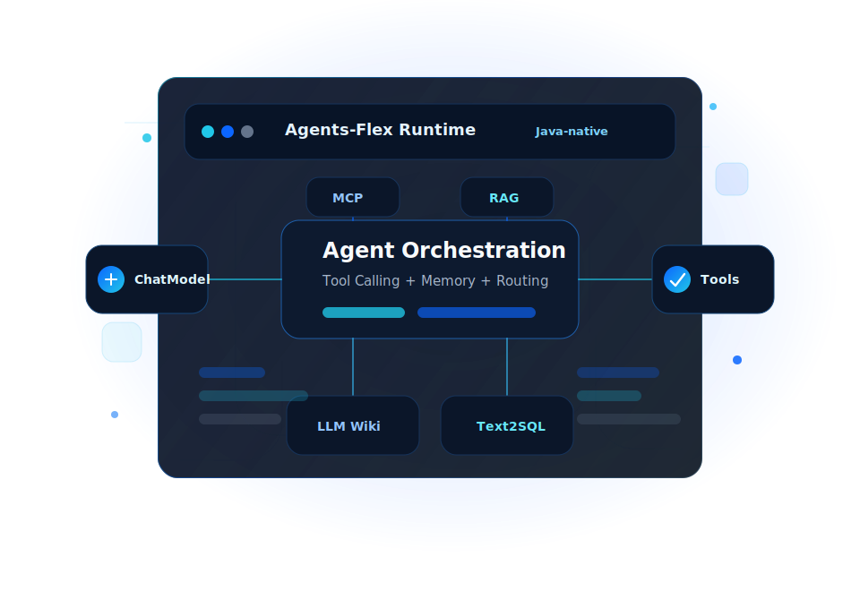

<main class="af-home">
  <section class="af-hero">
    

      
Java-native AI Agent Framework

      <h1>轻量级、高性能的Java  Agent 开发框架</h1>
      
Agents-Flex 为 Java 开发者统一模型调用、Tool Calling、RAG、MCP、Skills、Text2SQL、LLM Wiki 与可观测能力，帮助团队更快构建生产级 AI 应用。

      

        <a class="af-button af-button--primary" href="/zh/chat/getting-started">快速开始</a>
        <a class="af-button" href="/zh/intro/what-is-agentsflex">了解框架</a>
        <a class="af-button" href="/zh/intro/maven">Maven 依赖</a>
      

      

        
<strong>Java 8+</strong>核心模块兼容

        
<strong>20+</strong>模块化能力

        
<strong>Apache-2.0</strong>开源协议

      

    

    

      
    

  </section>
  <section class="af-section af-section--intro">
    

      
Capability Map

      <h2>从模型到生产落地的一套 Java AI 工程栈</h2>
      
不把 AI 应用拆成孤立功能点，而是按真实开发流程组织：先接模型，再接工具和知识，再处理多 Agent 协作、数据分析和生产可观测。

    

    

      <article class="af-capability">
        Model
        <h3>统一模型抽象</h3>
        
通过 ChatModel、EmbeddingModel、ImageModel、RerankModel 等接口接入 OpenAI、Qwen、DeepSeek、Ollama 与私有化模型服务。

        <ul>
          <li>同步与流式响应</li>
          <li>HTTP / SSE / WebSocket</li>
          <li>模型路由与标签选择</li>
        </ul>
      </article>
      <article class="af-capability">
        Agent
        <h3>工具与智能体编排</h3>
        
从 Java 方法到 MCP 工具，从 Skills 到 Subagent，让 Agent 能调用业务能力、拆解任务并处理复杂流程。

        <ul>
          <li>ToolScanner / Tool.Builder</li>
          <li>MCP Client / AI Skills</li>
          <li>ReAct / Routing / Subagent</li>
        </ul>
      </article>
      <article class="af-capability">
        Knowledge
        <h3>RAG 与结构化知识</h3>
        
覆盖文档处理、Embedding、向量存储、检索、重排与 LLM Wiki，让 Agent 能同时处理扁平语义检索和层级知识导航。

        <ul>
          <li>Loader / Parser / Splitter</li>
          <li>Vector Store / SearchWrapper</li>
          <li>WebSearch / LLM Wiki</li>
        </ul>
      </article>
      <article class="af-capability">
        Production
        <h3>生产级保障</h3>
        
面向真实服务运行，提供高可用路由、重试熔断、调用链追踪、指标采集和 Spring Boot 自动配置。

        <ul>
          <li>Load Balancing / Retry</li>
          <li>OpenTelemetry Observability</li>
          <li>Spring Boot Starter</li>
        </ul>
      </article>
    

  </section>
  <section class="af-section">
    

      
Development Flow

      <h2>一条更贴近工程实践的开发路径</h2>
    

    

      
01<strong>接入模型</strong>
配置 ChatModel，统一同步、流式和多模态调用入口。

      
02<strong>暴露工具</strong>
用注解或 Builder 将 Java 业务方法变成 Agent 可调用工具。

      
03<strong>接入知识</strong>
组合 RAG、WebSearch、LLM Wiki，为回答提供外部上下文。

      
04<strong>编排 Agent</strong>
用 ReAct、Routing、Subagent 处理多步骤和多角色任务。

      
05<strong>上线观测</strong>
接入路由、重试、熔断和 OpenTelemetry，稳定运行。

    

  </section>
  <section class="af-section af-section--split">
    

      
Use Cases

      <h2>适合这些 AI 应用场景</h2>
      
Agents-Flex 更偏向“可集成、可扩展、可上线”的 Java 框架，而不是只能演示单轮对话的样例工程。

    

    

      <a href="/zh/samples/chat">智能客服与聊天助手</a>
      <a href="/zh/samples/rag">企业知识库与 RAG 问答</a>
      <a href="/zh/chat/text2sql">智能问数与数据分析</a>
      <a href="/zh/chat/mcp">MCP 工具连接与自动化</a>
      <a href="/zh/chat/llm-wiki">层级文档导航与 LLM Wiki</a>
      <a href="/zh/intro/model-router">多模型网关与高可用路由</a>
    

  </section>
  <section class="af-section af-section--code">
    

      
Quick Start

      <h2>几行代码完成一次模型调用</h2>
      
Agents-Flex 不要求你重写现有应用结构。你可以先从一个 ChatModel 开始，再按需要加入工具、知识库、Agent 编排和可观测。

      

        <a class="af-button af-button--primary" href="/zh/chat/getting-started">查看快速开始</a>
        <a class="af-button" href="/zh/chat/tool-build">学习 Tool 构建</a>
      

    

    <pre class="af-code"><code>ChatModel model = OpenAIChatConfig.builder()&#10;    .endpoint("https://ai.gitee.com")&#10;    .provider("GiteeAI")&#10;    .model("Qwen3-32B")&#10;    .apiKey(System.getenv("GITEE_API_KEY"))&#10;    .buildModel();&#10;&#10;String answer = model.chat("介绍一下 Agents-Flex");&#10;System.out.println(answer);</code></pre>
  </section>
  <section class="af-section af-section--modules">
    

      
Ecosystem

      <h2>按需组合的模块生态</h2>
    

    

      <a href="/zh/chat/chat-model">Chat</a>
      <a href="/zh/chat/tool">Tool</a>
      <a href="/zh/chat/mcp">MCP</a>
      <a href="/zh/chat/skills">Skills</a>
      <a href="/zh/chat/subagent">Subagent</a>
      <a href="/zh/chat/text2sql">Text2SQL</a>
      <a href="/zh/chat/websearch">WebSearch</a>
      <a href="/zh/chat/llm-wiki">LLM Wiki</a>
      <a href="/zh/rag/vector-store">Vector Store</a>
      <a href="/zh/models/embedding">Embedding</a>
      <a href="/zh/models/rerank">Rerank</a>
      <a href="/zh/observability/observability">Observability</a>
    

  </section>
</main>
