<main class="af-home">
  <section class="af-hero">
    

      
 Java AI Agent Framework / Spatial Workspace

      <h1>
        Agents-flex
        轻量级、高性能的
        Java Agent 开发框架
      </h1>
      
Agents-Flex 为 Java 开发者统一大模型、图片生成、语音 TTS / STT、视频生成、Tool Calling、Skills、Sandbox、RAG 与 Agent 编排能力，帮助团队更快构建可上线的多模态 AI 应用。

      

        <a class="af-button af-button--primary" href="/zh/chat/getting-started">快速开始</a>
        <a class="af-button" href="/zh/intro/what-is-agentsflex">了解框架</a>
        <a class="af-button" href="/zh/intro/maven">Maven 依赖</a>
      

      

        
<strong>多模态</strong>统一对话、图片、语音与视频

        
<strong>隔离执行</strong>Skills 可运行于本机或远程 Sandbox

        
<strong>中国生态</strong>适配国产模型、云服务与私有化部署

      

    

    

      
    

  </section>
  <section class="af-stack-stage">
    

      

        

 Interactive Capability Map
<h2>从模型到生产落地的 <em>一套 Java AI 工程栈</em></h2>

        
不把 AI 应用拆成孤立功能点，而是按真实开发流程组织：接入模型，连接工具与知识，再完成 Agent 编排和生产可观测。

      

      

        <i></i>
        

        

        
AF<strong>Agents-Flex</strong><small>统一工程底座</small>

        <article class="af-stack-node af-stack-node--model">
          
01 / MODEL<i aria-hidden="true"></i>
<h3>统一模型抽象</h3>
          
统一接入对话、图片、视频、Embedding、Rerank 与语音模型。

          
流式响应模型路由多协议

        </article>
        <article class="af-stack-node af-stack-node--agent">
          
02 / AGENT<i aria-hidden="true"></i>
<h3>工具与智能体编排</h3>
          
连接 Java 方法、MCP、Skills 与 Subagent，组织复杂任务流程。

          
Tool CallingReActRouting

        </article>
        <article class="af-stack-node af-stack-node--knowledge">
          
03 / KNOWLEDGE<i aria-hidden="true"></i>
<h3>RAG 与结构化知识</h3>
          
覆盖文档处理、向量检索、重排、WebSearch 与层级知识导航。

          
Vector StoreRerankLLM Wiki

        </article>
        <article class="af-stack-node af-stack-node--production">
          
04 / PRODUCTION<i aria-hidden="true"></i>
<h3>生产级保障</h3>
          
提供路由、重试熔断、调用链追踪、指标采集与自动配置。

          
RetryOpenTelemetrySpring Boot

        </article>
      

      
<i></i>模型层<i></i>编排层<i></i>知识层<i></i>生产层<strong>四层能力协同</strong>

    

  </section>
  <section class="af-skills-stage">
    

      

        

          
 Skills / Sandbox

          <h2 class="af-skills-title">
            把能力装进 <em>Skill</em>
            把风险留在 <em>Sandbox</em>
          </h2>
        

        

          
操作说明、脚本、参考资料和模板组成可复用的 Skill。统一的 SkillRuntime 接管命令与文件能力，让同一套 Skill 可以在本机开发，也可以进入远程隔离环境运行。

          <a class="af-skills-link" href="/zh/chat/skills">阅读 Skills 与 Sandbox 指南 →</a>
        

      

      

        

        

          可复用能力包
          

            <i style="--packet: 0"></i><i style="--packet: 1"></i><i style="--packet: 2"></i><i style="--packet: 3"></i>
          

          <strong>Skill</strong>
          
说明 · 脚本 · 参考 · 模板

        

        
<i></i><i></i><i></i>

        

          <i></i><i></i><i></i>
          
          
<small>统一执行边界</small><strong>SkillRuntime</strong>

        

        
<i></i><i></i><i></i>

        

          
01<strong>本机运行</strong><small>可信开发任务</small>

          
02<strong>OpenSandbox</strong><small>远程容器隔离</small>

          
03<strong>AIO Sandbox</strong><small>连接隔离服务</small>

        

        

          READWRITEEDITBASH
          <i aria-hidden="true"></i>
          <strong>验证 · 下载 · 发布</strong>
        

      

      

        
01<strong>按需加载</strong>
选中后再读取完整 Skill，脚本和素材不挤占初始上下文。

        
02<strong>边界一致</strong>
命令与文件工具共享同一个 Runtime，执行不会意外越界。

        
03<strong>产物直达</strong>
生成文件可下载到本地，也可发布为用户可访问的 URL。

      

    

  </section>
  <section class="af-multimodal-stage">
    

      

        

          
 Multimodal Generation

          <h2 class="af-multimodal-title">不止文本统一构建 <em>图片</em>、<em>语音</em>与<em>视频</em></h2>
        

        
通过稳定的 Java 接口屏蔽不同服务商的请求与响应差异，让内容生成、实时语音交互和异步视频任务自然接入现有业务系统。

      

      

        

          
<strong>Agents-Flex</strong><small>多模态生成</small>

          <i aria-hidden="true"></i>模型已连接
        

        

          

            当前任务
            
为产品发布稿生成主视觉、中文旁白和 6 秒演示视频。

            

              
AF<strong>正在编排多模态任务</strong><i></i><i></i><i></i>

              <ol>
                <li>01提取视觉主题与镜头节奏</li>
                <li>02选择匹配的模型与生成参数</li>
                <li>03并行执行并统一返回结果</li>
              </ol>
            

            
统一请求自动路由流式返回

          

          

            

模型路由<strong>4 个任务并行执行</strong>
JAVA API

            

              <article class="af-ai-job">
                01
<small>IMAGE MODEL</small><h3>图片生成</h3>
文生图、图片编辑与变体

<i></i>已就绪<a href="/zh/core/image" aria-label="查看图片生成文档">→</a>
              </article>
              <article class="af-ai-job">
                02
<small>STREAMING TTS</small><h3>文字转语音</h3>
音色、语速与流式输出

<i></i>流式中<a href="/zh/audio/getting-started" aria-label="查看文字转语音文档">→</a>
              </article>
              <article class="af-ai-job">
                03
<small>SPEECH TO TEXT</small><h3>语音转文字</h3>
文件、URL 与音频流输入

<i></i>已识别<a href="/zh/audio/tts-stt" aria-label="查看语音转文字文档">→</a>
              </article>
              <article class="af-ai-job af-ai-job--active">
                04
<small>VIDEO MODEL</small><h3>视频生成</h3>
异步任务与状态追踪

<i></i>生成中<a href="/zh/video/getting-started" aria-label="查看视频生成文档">→</a>
              </article>
            

          

        

        
ChatModel<i></i>ImageModel<i></i>SpeechModel<i></i>VideoModel<strong>同一套 Java 接口</strong>

      

    

  </section>
  <section class="af-section">
    

      
Development Flow

      <h2>一条更贴近工程实践的开发路径</h2>
    

    

      
01<strong>接入模型</strong>
按场景配置 ChatModel、ImageModel、语音模型或 VideoModel。

      
02<strong>暴露工具</strong>
用注解或 Builder 将 Java 业务方法变成 Agent 可调用工具。

      
03<strong>接入知识</strong>
组合 RAG、WebSearch、LLM Wiki，为回答提供外部上下文。

      
04<strong>编排 Agent</strong>
用 ReAct、Routing、Subagent 处理多步骤和多角色任务。

      
05<strong>上线观测</strong>
接入路由、重试、熔断和 OpenTelemetry，稳定运行。

    

  </section>
  <section class="af-section af-section--split">
    

      
Use Cases

      <h2>适合这些 AI 应用场景</h2>
      
Agents-Flex 更偏向“可集成、可扩展、可上线”的 Java 框架，而不是只能演示单轮对话的样例工程。

    

    

      <a href="/zh/samples/chat">智能客服与聊天助手</a>
      <a href="/zh/samples/rag">企业知识库与 RAG 问答</a>
      <a href="/zh/chat/text2sql">智能问数与数据分析</a>
      <a href="/zh/chat/mcp">MCP 工具连接与自动化</a>
      <a href="/zh/chat/skills">Skills 与 Sandbox 隔离执行</a>
      <a href="/zh/core/image">营销素材与创意图片生成</a>
      <a href="/zh/audio/tts-stt">语音助手与音频转写</a>
      <a href="/zh/video/video-generation">短视频与动态内容生产</a>
      <a href="/zh/chat/llm-wiki">层级文档导航与 LLM Wiki</a>
      <a href="/zh/intro/model-router">多模型网关与高可用路由</a>
    

  </section>
  <section class="af-section af-section--code">
    

      
Quick Start

      <h2>几行代码完成一次模型调用</h2>
      
Agents-Flex 不要求你重写现有应用结构。你可以先从一个 ChatModel 开始，再按业务需要接入图片、语音、视频、工具和知识库。

      

        <a class="af-button af-button--primary" href="/zh/chat/getting-started">查看快速开始</a>
        <a class="af-button" href="#multimodal-examples">浏览多模态示例</a>
      

    

    <pre class="af-code"><code>ChatModel model = OpenAIChatConfig.builder()&#10;    .endpoint("https://ai.gitee.com")&#10;    .provider("GiteeAI")&#10;    .model("Qwen3-32B")&#10;    .apiKey(System.getenv("GITEE_API_KEY"))&#10;    .buildModel();&#10;&#10;String answer = model.chat("介绍一下 Agents-Flex");&#10;System.out.println(answer);</code></pre>
  </section>
  <section id="multimodal-examples" class="af-section af-section--examples">
    

      
Multimodal Examples

      <h2>用一致的 API 处理图片、语音与视频</h2>
      
以下代码展示每类能力的核心调用路径。服务商依赖、鉴权参数和完整异常处理请进入对应文档查看。

    

    

      <article class="af-example">
        

          
Image<h3>生成并保存图片</h3>

          <a class="af-example__link" href="/zh/core/image">图片文档</a>
        

        <pre class="af-code af-code--example"><code>OpenAIImageModelConfig config = new OpenAIImageModelConfig();&#10;config.setApiKey(System.getenv("OPENAI_API_KEY"));&#10;ImageModel model = new OpenAIImageModel(config);&#10;&#10;GenerateImageRequest request = new GenerateImageRequest();&#10;request.setPrompt("雨后的未来城市，电影感光影");&#10;request.setSize(1024, 1024);&#10;&#10;ImageResponse response = model.generate(request);&#10;response.getImages().get(0)&#10;    .writeToFile(new File("output/city.png"));</code></pre>
      </article>
      <article class="af-example">
        

          
TTS<h3>将文本合成为语音</h3>

          <a class="af-example__link" href="/zh/audio/getting-started">TTS 文档</a>
        

        <pre class="af-code af-code--example"><code>AliyunTextToSpeechConfig config = new AliyunTextToSpeechConfig();&#10;config.setAppKey(System.getenv("ALIYUN_APP_KEY"));&#10;config.setAccessKeyId(System.getenv("ALIYUN_ACCESS_KEY_ID"));&#10;config.setAccessKeySecret(System.getenv("ALIYUN_ACCESS_KEY_SECRET"));&#10;&#10;TextToSpeechModel model = new AliyunTextToSpeechModel(config);&#10;TextToSpeechRequest request = new TextToSpeechRequest(&#10;    "欢迎使用 Agents-Flex 多模态能力"&#10;);&#10;TextToSpeechResponse response = model.tts(request);&#10;response.writeTo(new File("output/reply.mp3"));</code></pre>
      </article>
      <article class="af-example">
        

          
STT<h3>将音频转写为文本</h3>

          <a class="af-example__link" href="/zh/audio/tts-stt">STT 文档</a>
        

        <pre class="af-code af-code--example"><code>AliyunSpeechToTextConfig config = new AliyunSpeechToTextConfig();&#10;config.setAppKey(System.getenv("ALIYUN_APP_KEY"));&#10;config.setAccessKeyId(System.getenv("ALIYUN_ACCESS_KEY_ID"));&#10;config.setAccessKeySecret(System.getenv("ALIYUN_ACCESS_KEY_SECRET"));&#10;&#10;SpeechToTextModel model = new AliyunSpeechToTextModel(config);&#10;SpeechToTextRequest request = new SpeechToTextRequest();&#10;request.setAudioFile(new File("meeting.mp3"));&#10;&#10;SpeechToTextResponse response = model.stt(request);&#10;System.out.println(response.getResult());</code></pre>
      </article>
      <article class="af-example">
        

          
Video<h3>视频生成并保存到本地</h3>

          <a class="af-example__link" href="/zh/video/getting-started">视频文档</a>
        

        <pre class="af-code af-code--example"><code>AliyunWanVideoModelConfig config = new AliyunWanVideoModelConfig();&#10;config.setApiKey(System.getenv("DASHSCOPE_API_KEY"));&#10;AliyunWanVideoModel model = new AliyunWanVideoModel(config);&#10;&#10;GenerateVideoRequest request = new GenerateVideoRequest();&#10;request.setPrompt("纸飞机飞过日出时的未来城市");&#10;request.setSize(1280, 720);&#10;request.setDuration(5);&#10;&#10;VideoResponse response = model.generateAndWait(request);&#10;response.getVideo().writeToFile(&#10;    new File("output/city.mp4")&#10;);</code></pre>
      </article>
    

  </section>
  <section class="af-ecosystem-stage">
    

      <header class="af-swiss-header">
        
AF / MODULES<strong>17</strong>

        

JAVA AI ECOSYSTEM / 2026
<h2>按需组合的 模块生态</h2>

        
从模型接入到隔离执行，每个模块保持清晰边界，并通过一致的 Java 接口组合成完整应用。

      </header>
      

        <a class="af-swiss-module" href="/zh/chat/chat-model"><b>01</b> MODEL<strong>Chat</strong><i aria-hidden="true">→</i></a>
        <a class="af-swiss-module" href="/zh/chat/tool"><b>02</b> AGENT<strong>Tool</strong><i aria-hidden="true">→</i></a>
        <a class="af-swiss-module" href="/zh/chat/mcp"><b>03</b> PROTOCOL<strong>MCP</strong><i aria-hidden="true">→</i></a>
        <a class="af-swiss-module" href="/zh/chat/skills"><b>04</b> RUNTIME<strong>Skills</strong><i aria-hidden="true">→</i></a>
        <a class="af-swiss-module" href="/zh/chat/skills"><b>05</b> ISOLATE<strong>OpenSandbox</strong><i aria-hidden="true">→</i></a>
        <a class="af-swiss-module" href="/zh/chat/skills"><b>06</b> ISOLATE<strong>AIO Sandbox</strong><i aria-hidden="true">→</i></a>
        <a class="af-swiss-module" href="/zh/chat/subagent"><b>07</b> AGENT<strong>Subagent</strong><i aria-hidden="true">→</i></a>
        <a class="af-swiss-module" href="/zh/chat/text2sql"><b>08</b> DATA<strong>Text2SQL</strong><i aria-hidden="true">→</i></a>
        <a class="af-swiss-module" href="/zh/chat/websearch"><b>09</b> SEARCH<strong>WebSearch</strong><i aria-hidden="true">→</i></a>
        <a class="af-swiss-module" href="/zh/chat/llm-wiki"><b>10</b> KNOWLEDGE<strong>LLM Wiki</strong><i aria-hidden="true">→</i></a>
        <a class="af-swiss-module" href="/zh/rag/vector-store"><b>11</b> RAG<strong>Vector Store</strong><i aria-hidden="true">→</i></a>
        <a class="af-swiss-module" href="/zh/models/embedding"><b>12</b> MODEL<strong>Embedding</strong><i aria-hidden="true">→</i></a>
        <a class="af-swiss-module" href="/zh/models/rerank"><b>13</b> MODEL<strong>Rerank</strong><i aria-hidden="true">→</i></a>
        <a class="af-swiss-module" href="/zh/core/image"><b>14</b> MEDIA<strong>Image</strong><i aria-hidden="true">→</i></a>
        <a class="af-swiss-module" href="/zh/audio/tts-stt"><b>15</b> MEDIA<strong>TTS / STT</strong><i aria-hidden="true">→</i></a>
        <a class="af-swiss-module" href="/zh/video/video-generation"><b>16</b> MEDIA<strong>Video</strong><i aria-hidden="true">→</i></a>
        <a class="af-swiss-module" href="/zh/observability/observability"><b>17</b> PRODUCTION<strong>Observability</strong><i aria-hidden="true">→</i></a>
      

    

  </section>
</main>
