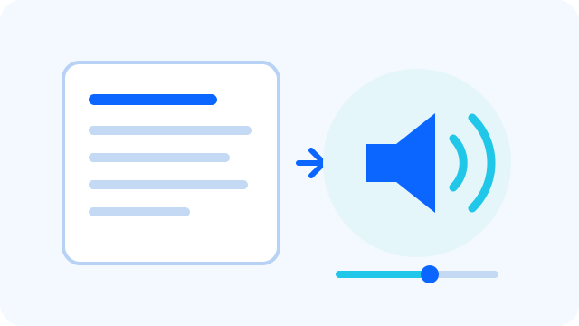
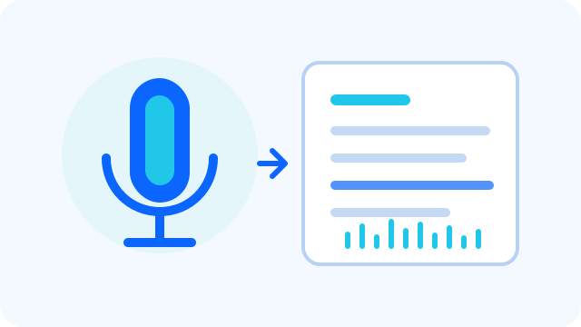

<main class="af-home">
  <section class="af-hero">
    

      
Java-native AI Agent Framework

      <h1>轻量级、高性能的Java  Agent 开发框架</h1>
      
Agents-Flex 为 Java 开发者统一大模型、图片生成、语音 TTS / STT、视频生成、Tool Calling、RAG 与 Agent 编排能力，帮助团队更快构建可上线的多模态 AI 应用。

      

        <a class="af-button af-button--primary" href="/zh/chat/getting-started">快速开始</a>
        <a class="af-button" href="/zh/intro/what-is-agentsflex">了解框架</a>
        <a class="af-button" href="/zh/intro/maven">Maven 依赖</a>
      

      

        
<strong>多模态</strong>统一对话、图片、语音与视频

        
<strong>生产就绪</strong>自动路由、重试熔断与全链路可观测

        
<strong>中国生态</strong>适配国产模型、云服务与私有化部署

      

    

    

      
    

  </section>
  <section class="af-section af-section--intro">
    

      
Capability Map

      <h2>从模型到生产落地的一套 Java AI 工程栈</h2>
      
不把 AI 应用拆成孤立功能点，而是按真实开发流程组织：先接模型，再接工具和知识，再处理多 Agent 协作、数据分析和生产可观测。

    

    

      <article class="af-capability">
        Model
        <h3>统一模型抽象</h3>
        
通过 ChatModel、ImageModel、VideoModel、EmbeddingModel、RerankModel 以及语音模型接口，统一接入不同厂商与私有化模型服务。

        <ul>
          <li>同步与流式响应</li>
          <li>HTTP / SSE / WebSocket</li>
          <li>模型路由与标签选择</li>
        </ul>
      </article>
      <article class="af-capability">
        Agent
        <h3>工具与智能体编排</h3>
        
从 Java 方法到 MCP 工具，从 Skills 到 Subagent，让 Agent 能调用业务能力、拆解任务并处理复杂流程。

        <ul>
          <li>ToolScanner / Tool.Builder</li>
          <li>MCP Client / AI Skills</li>
          <li>ReAct / Routing / Subagent</li>
        </ul>
      </article>
      <article class="af-capability">
        Knowledge
        <h3>RAG 与结构化知识</h3>
        
覆盖文档处理、Embedding、向量存储、检索、重排与 LLM Wiki，让 Agent 能同时处理扁平语义检索和层级知识导航。

        <ul>
          <li>Loader / Parser / Splitter</li>
          <li>Vector Store / SearchWrapper</li>
          <li>WebSearch / LLM Wiki</li>
        </ul>
      </article>
      <article class="af-capability">
        Production
        <h3>生产级保障</h3>
        
面向真实服务运行，提供高可用路由、重试熔断、调用链追踪、指标采集和 Spring Boot 自动配置。

        <ul>
          <li>Load Balancing / Retry</li>
          <li>OpenTelemetry Observability</li>
          <li>Spring Boot Starter</li>
        </ul>
      </article>
    

  </section>
  <section class="af-section">
    

      
Multimodal Generation

      <h2>不止文本，统一构建图片、语音与视频</h2>
      
通过稳定的 Java 接口屏蔽不同服务商的请求与响应差异，让内容生成、实时语音交互和异步视频任务能够自然接入现有业务系统。

    

    

      <article class="af-capability">
        
        Image
        <h3>图片生成</h3>
        
使用 ImageModel 统一处理文生图、图生图、图片编辑与变体生成，并将返回的图片直接保存为文件。

        <ul>
          <li>尺寸、提示词等生成参数</li>
          <li>OpenAI / Stability / Gitee AI 等实现</li>
          <li><a href="/zh/core/image">查看图片生成文档</a></li>
        </ul>
      </article>
      <article class="af-capability">
        
        TTS
        <h3>文字转语音</h3>
        
支持同步与流式 TTS，可调节音色、语速、音量和输出格式，适配大模型边生成文本边播放语音的低延迟体验。

        <ul>
          <li>TextToSpeechModel 统一接口</li>
          <li>StreamingTextToSpeechModel 流式合成</li>
          <li><a href="/zh/audio/getting-started">5 分钟接入 TTS</a></li>
        </ul>
      </article>
      <article class="af-capability">
        
        STT
        <h3>语音转文字</h3>
        
通过 SpeechToTextModel 将本地文件、网络 URL 或音频流转换为文本，并统一处理音频格式、采样率和识别结果。

        <ul>
          <li>文件 / URL / 数据流输入</li>
          <li>阿里云 / 腾讯云 / 火山引擎</li>
          <li><a href="/zh/audio/tts-stt">查看 TTS / STT 完整能力</a></li>
        </ul>
      </article>
      <article class="af-capability">
        
        Video
        <h3>视频生成</h3>
        
使用 VideoModel 统一提交文生视频、图生视频等任务，支持查询任务状态或等待生成完成，降低异步服务接入复杂度。

        <ul>
          <li>统一请求、任务状态与结果模型</li>
          <li>阿里云 / 火山引擎 / Gitee AI</li>
          <li><a href="/zh/video/getting-started">5 分钟生成第一个视频</a></li>
        </ul>
      </article>
    

  </section>
  <section class="af-section">
    

      
Development Flow

      <h2>一条更贴近工程实践的开发路径</h2>
    

    

      
01<strong>接入模型</strong>
按场景配置 ChatModel、ImageModel、语音模型或 VideoModel。

      
02<strong>暴露工具</strong>
用注解或 Builder 将 Java 业务方法变成 Agent 可调用工具。

      
03<strong>接入知识</strong>
组合 RAG、WebSearch、LLM Wiki，为回答提供外部上下文。

      
04<strong>编排 Agent</strong>
用 ReAct、Routing、Subagent 处理多步骤和多角色任务。

      
05<strong>上线观测</strong>
接入路由、重试、熔断和 OpenTelemetry，稳定运行。

    

  </section>
  <section class="af-section af-section--split">
    

      
Use Cases

      <h2>适合这些 AI 应用场景</h2>
      
Agents-Flex 更偏向“可集成、可扩展、可上线”的 Java 框架，而不是只能演示单轮对话的样例工程。

    

    

      <a href="/zh/samples/chat">智能客服与聊天助手</a>
      <a href="/zh/samples/rag">企业知识库与 RAG 问答</a>
      <a href="/zh/chat/text2sql">智能问数与数据分析</a>
      <a href="/zh/chat/mcp">MCP 工具连接与自动化</a>
      <a href="/zh/core/image">营销素材与创意图片生成</a>
      <a href="/zh/audio/tts-stt">语音助手与音频转写</a>
      <a href="/zh/video/video-generation">短视频与动态内容生产</a>
      <a href="/zh/chat/llm-wiki">层级文档导航与 LLM Wiki</a>
      <a href="/zh/intro/model-router">多模型网关与高可用路由</a>
    

  </section>
  <section class="af-section af-section--code">
    

      
Quick Start

      <h2>几行代码完成一次模型调用</h2>
      
Agents-Flex 不要求你重写现有应用结构。你可以先从一个 ChatModel 开始，再按业务需要接入图片、语音、视频、工具和知识库。

      

        <a class="af-button af-button--primary" href="/zh/chat/getting-started">查看快速开始</a>
        <a class="af-button" href="#multimodal-examples">浏览多模态示例</a>
      

    

    <pre class="af-code"><code>ChatModel model = OpenAIChatConfig.builder()&#10;    .endpoint("https://ai.gitee.com")&#10;    .provider("GiteeAI")&#10;    .model("Qwen3-32B")&#10;    .apiKey(System.getenv("GITEE_API_KEY"))&#10;    .buildModel();&#10;&#10;String answer = model.chat("介绍一下 Agents-Flex");&#10;System.out.println(answer);</code></pre>
  </section>
  <section id="multimodal-examples" class="af-section af-section--examples">
    

      
Multimodal Examples

      <h2>用一致的 API 处理图片、语音与视频</h2>
      
以下代码展示每类能力的核心调用路径。服务商依赖、鉴权参数和完整异常处理请进入对应文档查看。

    

    

      <article class="af-example">
        

          
Image<h3>生成并保存图片</h3>

          <a class="af-example__link" href="/zh/core/image">图片文档</a>
        

        <pre class="af-code af-code--example"><code>OpenAIImageModelConfig config = new OpenAIImageModelConfig();&#10;config.setApiKey(System.getenv("OPENAI_API_KEY"));&#10;ImageModel model = new OpenAIImageModel(config);&#10;&#10;GenerateImageRequest request = new GenerateImageRequest();&#10;request.setPrompt("雨后的未来城市，电影感光影");&#10;request.setSize(1024, 1024);&#10;&#10;ImageResponse response = model.generate(request);&#10;response.getImages().get(0)&#10;    .writeToFile(new File("output/city.png"));</code></pre>
      </article>
      <article class="af-example">
        

          
TTS<h3>将文本合成为语音</h3>

          <a class="af-example__link" href="/zh/audio/getting-started">TTS 文档</a>
        

        <pre class="af-code af-code--example"><code>AliyunTextToSpeechConfig config = new AliyunTextToSpeechConfig();&#10;config.setAppKey(System.getenv("ALIYUN_APP_KEY"));&#10;config.setAccessKeyId(System.getenv("ALIYUN_ACCESS_KEY_ID"));&#10;config.setAccessKeySecret(System.getenv("ALIYUN_ACCESS_KEY_SECRET"));&#10;&#10;TextToSpeechModel model = new AliyunTextToSpeechModel(config);&#10;TextToSpeechRequest request = new TextToSpeechRequest(&#10;    "欢迎使用 Agents-Flex 多模态能力"&#10;);&#10;TextToSpeechResponse response = model.tts(request);&#10;response.writeTo(new File("output/reply.mp3"));</code></pre>
      </article>
      <article class="af-example">
        

          
STT<h3>将音频转写为文本</h3>

          <a class="af-example__link" href="/zh/audio/tts-stt">STT 文档</a>
        

        <pre class="af-code af-code--example"><code>AliyunSpeechToTextConfig config = new AliyunSpeechToTextConfig();&#10;config.setAppKey(System.getenv("ALIYUN_APP_KEY"));&#10;config.setAccessKeyId(System.getenv("ALIYUN_ACCESS_KEY_ID"));&#10;config.setAccessKeySecret(System.getenv("ALIYUN_ACCESS_KEY_SECRET"));&#10;&#10;SpeechToTextModel model = new AliyunSpeechToTextModel(config);&#10;SpeechToTextRequest request = new SpeechToTextRequest();&#10;request.setAudioFile(new File("meeting.mp3"));&#10;&#10;SpeechToTextResponse response = model.stt(request);&#10;System.out.println(response.getResult());</code></pre>
      </article>
      <article class="af-example">
        

          
Video<h3>视频生成并保存到本地</h3>

          <a class="af-example__link" href="/zh/video/getting-started">视频文档</a>
        

        <pre class="af-code af-code--example"><code>AliyunWanVideoModelConfig config = new AliyunWanVideoModelConfig();&#10;config.setApiKey(System.getenv("DASHSCOPE_API_KEY"));&#10;AliyunWanVideoModel model = new AliyunWanVideoModel(config);&#10;&#10;GenerateVideoRequest request = new GenerateVideoRequest();&#10;request.setPrompt("纸飞机飞过日出时的未来城市");&#10;request.setSize(1280, 720);&#10;request.setDuration(5);&#10;&#10;VideoResponse response = model.generateAndWait(request);&#10;response.getVideo().writeToFile(&#10;    new File("output/city.mp4")&#10;);</code></pre>
      </article>
    

  </section>
  <section class="af-section af-section--modules">
    

      
Ecosystem

      <h2>按需组合的模块生态</h2>
    

    

      <a href="/zh/chat/chat-model">Chat</a>
      <a href="/zh/chat/tool">Tool</a>
      <a href="/zh/chat/mcp">MCP</a>
      <a href="/zh/chat/skills">Skills</a>
      <a href="/zh/chat/subagent">Subagent</a>
      <a href="/zh/chat/text2sql">Text2SQL</a>
      <a href="/zh/chat/websearch">WebSearch</a>
      <a href="/zh/chat/llm-wiki">LLM Wiki</a>
      <a href="/zh/rag/vector-store">Vector Store</a>
      <a href="/zh/models/embedding">Embedding</a>
      <a href="/zh/models/rerank">Rerank</a>
      <a href="/zh/core/image">Image</a>
      <a href="/zh/audio/tts-stt">TTS / STT</a>
      <a href="/zh/video/video-generation">Video</a>
      <a href="/zh/observability/observability">Observability</a>
    

  </section>
</main>
