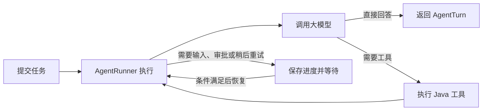

# AgentRunner

## 概述

`AgentRunner` 是 Agent 任务的执行器。

`Agent` 负责定义大模型、指令、工具和规则，`AgentTurn` 负责记录一次具体任务，而 `AgentRunner` 负责让这次任务真正运行起来。

它的主要职责包括：

- 创建 `AgentTurn`；
- 调用大模型；
- 执行模型选择的 Java 工具；
- 更新并保存任务进度；
- 处理暂停、恢复和取消；
- 检查执行次数、Token 和运行时间等限制。

业务代码通常只需要选择合适的 Runner 方法，然后根据返回的 `AgentTurn` 状态决定下一步操作。

## 与相关对象的关系

| 对象 | 职责 |
| --- | --- |
| `Agent` | 定义助手使用的模型、指令、工具和规则 |
| `AgentRunner` | 按照 Agent 配置执行任务 |
| `AgentTurn` | 保存一次任务的状态、消息和结果 |
| `AgentTurnStore` | 持久化任务进度，供 Runner 保存和恢复 |
| `AgentLoader` | 根据 Agent ID 和版本重新加载 Agent 配置 |
| `AgentWorker` | 在后台领取并执行 Runner 创建的任务 |

Runner 本身不是任务数据库。它可以在应用中重复使用，实际任务状态由 `AgentTurn` 表示，并通过 `AgentTurnStore` 保存。

## 简化执行流程

大多数业务只需要理解下面这条主线：



执行过程可以概括为：

1. Runner 创建一个 AgentTurn。
2. Runner 调用大模型，让模型判断下一步。
3. 如果模型选择工具，Runner 执行工具，并把结果交回模型。
4. 如果模型给出最终回答，任务完成。
5. 如果需要用户输入、人工审批或稍后重试，Runner 保存进度并返回，不会一直占用线程等待。

一次任务可能多次执行“调用模型和执行工具”的过程。调用结束时，返回的 AgentTurn 可能已经完成，也可能正在等待、已经失败或达到限制，因此业务代码需要检查任务状态。

## 创建 Runner

### 本地示例

最简单的创建方式如下：

```java
AgentRunner runner = new AgentRunner();
```

这种方式使用进程内的 Agent 配置和任务存储，适合快速开始与本地测试。应用重启后，内存中的任务无法恢复。

### 正式环境

需要持久化和恢复任务时，可以通过 Builder 配置依赖：

```java
AgentRunner runner = AgentRunner.builder()
    .turnStore(turnStore)
    .agentLoader(agentLoader)
    .chatMemoryProvider(chatMemoryProvider) // 可选
    .build();
```

| 配置 | 作用 | 是否必需 |
| --- | --- | --- |
| `turnStore(...)` | 保存和读取任务进度 | 正式环境建议配置 |
| `agentLoader(...)` | 恢复任务时加载对应版本的 Agent | 需要恢复或后台执行时配置 |
| `chatMemoryProvider(...)` | 根据会话 ID 读取和保存聊天记录 | 需要连续对话时配置 |

未显式配置时，Builder 会使用进程内实现。正式环境的持久化配置请查看 [任务快照持久化](./store)。

## 执行入口

AgentRunner 提供了多种方法，但日常使用主要关注以下几个：

| 方法 | 作用 | 适用场景 |
| --- | --- | --- |
| `run(...)` | 创建任务并在当前线程中执行 | 同步请求和短任务 |
| `start(...)` | 只创建任务，不立即执行 | 后台任务和长任务 |
| `restore(...)` | 从 Store 读取任务最新进度 | 查询或重新装配已有任务 |
| `resume(...)` | 提交外部结果，并在当前线程继续执行 | 审批或表单提交后立即继续 |
| `submitResume(...)` | 提交外部结果，但不在当前线程执行 | 交给后台 Worker 继续 |
| `cancel(...)` | 请求取消任务 | 用户停止任务 |

### 同步执行

```java
AgentTurn turn = runner.run(agent, "查询订单 A1001 的状态");

if (turn.getStatus() == AgentTurnStatus.COMPLETED) {
    System.out.println(turn.getFinalOutput());
} else {
    System.out.println("当前状态：" + turn.getStatus());
}
```

`run(...)` 会在当前线程持续执行，直到任务完成、失败或进入等待状态。它并不保证返回时状态一定是 `COMPLETED`。

### 后台执行

```java
AgentTurn turn = runner.start(agent, "生成本月销售报告");
System.out.println("任务 ID：" + turn.getId());
```

`start(...)` 只创建并保存状态为 `READY` 的任务，不会自动创建后台线程。需要由 `AgentWorker` 领取并执行，详见 [Worker](./worker)。

### 恢复等待中的任务

下面的示例提交工具审批结果，并立即继续执行：

```java
AgentTurn resumed = runner.resume(
    turnId,
    AgentResumeCommand.approveTool(toolCallId)
);
```

如果当前接口只负责接收审批结果，实际任务由后台 Worker 执行，可以使用：

```java
AgentTurn resumed = runner.submitResume(
    turnId,
    AgentResumeCommand.approveTool(toolCallId)
);
```

`resume(...)` 会在当前线程继续运行，`submitResume(...)` 只让任务恢复为可执行状态。两者都会继续原来的 AgentTurn，不会从头创建新任务。

表单输入、审批和外部工具结果使用不同的恢复命令，详见[挂起与恢复](./suspend-resume)。

## 恢复与取消

`restore(...)` 根据任务 ID 读取已保存的最新进度：

```java
AgentTurn restored = runner.restore(turnId);
```

该方法只恢复任务对象，不会自动继续执行。需要继续普通可运行任务时，可以调用 `runner.run(restored)`；处于等待状态的任务应先提交与等待原因匹配的恢复命令。

取消任务时使用：

```java
AgentTurn turn = runner.cancel(turnId);
```

取消采用协作方式。Runner 会记录取消请求，并在当前模型调用或工具调用结束后的安全位置停止继续执行。它不会强制中断已经发出的 HTTP 请求或正在运行的 Java 方法。

## 单步执行

绝大多数业务使用 `run(...)` 或 `start(...)` 即可。只有需要调试、自定义调度或逐步展示执行过程时，才需要以下方法：

```java
AgentStepResult result = runner.step(turn);
AgentTurn latest = runner.runUntilBlocked(turn);
```

- `step(...)` 只推进一个执行步骤；
- `runUntilBlocked(...)` 持续执行，直到任务结束或进入等待状态。

任务最终处于什么状态，应读取 `AgentTurn.getStatus()`；`AgentStepResult` 只描述当前步骤产生的模型响应、工具消息或错误。

## 连续对话

需要让多个 AgentTurn 共享聊天历史时，可以配置 `ChatMemoryProvider`：

```java
AgentRunner runner = AgentRunner.builder()
    .turnStore(turnStore)
    .agentLoader(agentLoader)
    .chatMemoryProvider(id -> chatMemoryRepository.load(id))
    .build();

AgentTurn turn = runner.run(
    agent,
    "conversation-1001",
    "继续查询上一笔订单"
);
```

Runner 会根据会话 ID 读取之前的聊天记录，并在任务进度保存后同步本轮新增消息。同一会话同时只能有一个未结束的 Turn；如果原任务正在等待审批或表单，应恢复原 Turn，而不是创建新的普通消息任务。

会话历史的管理方式请查看[上下文管理](./context-management)。

## 运行事件

可以通过事件监听器接收任务状态、模型增量输出和工具进度：

```java
runner.addEventListener(eventListener);
```

事件可用于更新页面、记录日志和采集监控指标。监听器应快速返回，不应在监听器中再次递归调用 Runner。事件只负责通知，不代替 AgentTurnStore 保存任务状态。

完整事件说明请查看 [AgentEventListener](./agent-event-listener)。

## 使用建议

1. 在应用中复用配置完整的 AgentRunner，不要为每个请求创建独立的内存 Store。
2. 短任务使用 `run(...)`，长任务使用 `start(...)` 配合 AgentWorker。
3. 每次调用后都检查 AgentTurn 状态，不要假设任务一定正常完成。
4. 等待审批或输入时恢复原 Turn，不要创建新 Turn。
5. 不要让两个线程同时直接执行同一个 AgentTurn。
6. 不要绕过 Runner 直接修改任务状态或覆盖已保存的任务进度。
7. 退款、扣款和发货等工具应在业务层做好权限校验和防重复执行。

## 下一步

- 了解一次任务保存的内容：[AgentTurn](./agent-turn)。
- 了解任务暂停和恢复：[挂起与恢复](./suspend-resume)。
- 配置任务持久化：[任务快照持久化](./store)。
- 执行后台长任务：[Worker](./worker)。
- 监听执行进度：[AgentEventListener](./agent-event-listener)。
