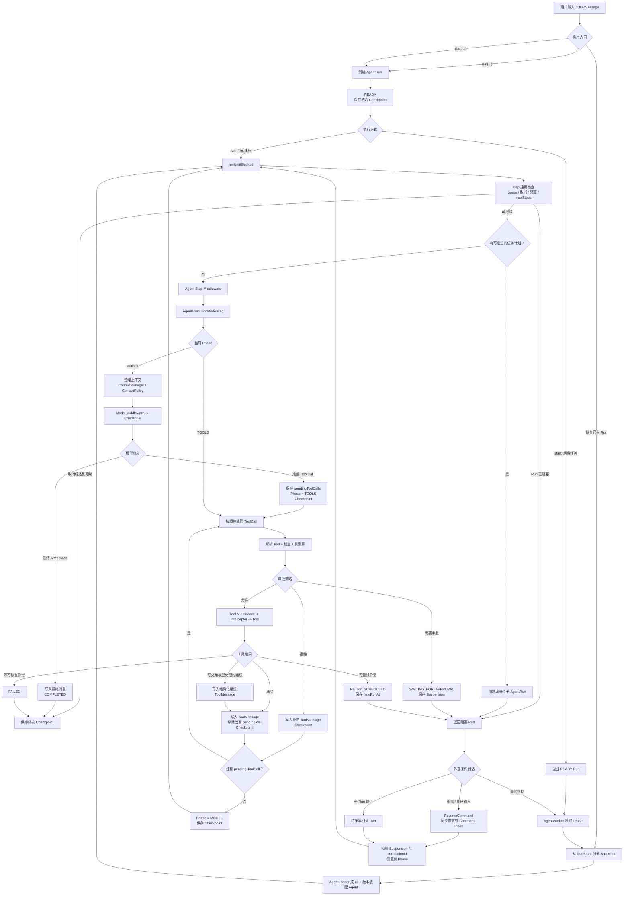

# AgentRunner

## 概述

`AgentRunner` 是 Agent 状态机执行器。它创建、推进、暂停和恢复 `AgentRun`，并统一处理 Checkpoint、预算、重试、规划、父子 Run、Middleware 与生命周期事件。

Runner 自身不把 Run 保存在实例字段中，适合作为应用级对象复用；真正的持久状态位于 `AgentRunStore`。同一个 `AgentRun` 对象不应由两个线程同时直接推进。

## 整体执行流程

下面的流程图覆盖默认 `ToolCallingAgentExecutionMode` 从创建 Run 到终止或阻塞的完整路径。图中的每个 Checkpoint 都是可跨线程、跨请求或跨进程恢复的稳定边界。



### 主路径说明

1. `run(...)` 与 `start(...)` 都先创建 `READY` Run 并保存初始 Checkpoint；区别在于前者立即进入循环，后者等待 Worker 领取。
2. 每次 `step` 都先检查 Lease、持久化取消信号、预算和 step 上限，再处理任务规划和 Middleware。
3. MODEL 阶段一次最多调用模型一次。模型直接回答时 Run 完成；模型返回 ToolCall 时，Runner 先保存全部待处理调用，再进入 TOOLS 阶段。
4. TOOLS 阶段按模型给出的顺序逐个处理调用。每个工具结果都单独写入 `ToolMessage` 并保存 Checkpoint，因此后续恢复能准确知道哪些调用已经确认。
5. 审批、用户输入、子 Run 和延迟重试都会返回阻塞 Run，不会占用线程等待。
6. 恢复命令必须匹配当前 Suspension。Runner 恢复其记录的 Phase，例如工具审批通过后回到 TOOLS，而不是重新请求模型生成参数。

### 异常与终止路径

模型、工具或自定义模式异常统一进入失败处理：可恢复异常保存为 `RETRY_SCHEDULED`，确定性错误进入 `FAILED`。取消、预算、最大模型迭代和最大 step 分别使用独立终态，调用方不需要从通用异常消息推断原因。

## 构建 Runner

```java
AgentRunner runner = AgentRunner.builder()
    .runStore(runStore)
    .agentLoader(agentLoader)
    .eventStore(eventStore)
    .commandStore(commandStore)
    .artifactStore(artifactStore)
    .build();
```

未提供的依赖使用内存实现。生产环境的替换要求见 [Store 持久化](./store)。

## 三组执行入口

### `run(...)`

创建 Run 并在当前线程持续执行到终止或阻塞：

```java
AgentRun run = runner.run(agent, "查询订单 1001");
```

适合同步请求和短任务。它不保证一定完成，审批、用户输入、子 Agent 或重试都会返回阻塞 Run。

### `start(...)`

只创建并保存 `READY` Checkpoint：

```java
AgentRun queued = runner.start(agent, "生成月度报告");
```

适合提交到后台，之后由 `AgentWorker` 领取。

### `step(...)` 与 `runUntilBlocked(...)`

```java
AgentStepResult oneStep = runner.step(run);
AgentRun blockedOrDone = runner.runUntilBlocked(run);
```

`step` 只推进一次执行模式，适合调试、外部调度或实现细粒度 UI。`runUntilBlocked` 会循环调用 step。

## 执行层次

一次标准推进包含三层：

1. `runUntilBlocked` 判断是否继续循环。
2. `step` 处理取消、Lease、预算、规划、上下文和 Middleware。
3. `AgentExecutionMode.step` 推进具体模式；默认模式进入 MODEL 或 TOOLS 阶段。

模型返回 ToolCall 时，Runner 先记录 `pendingToolCalls` 并保存 Checkpoint，随后才审批和执行。这个顺序是恢复一致性的关键。

## Step 结果

`AgentStepResult.getType()` 可能为：

| 类型 | 含义 |
| --- | --- |
| `PROGRESSED` | 自定义模式保存了中间状态 |
| `TOOLS_EXECUTED` | 工具已执行并写入结果 |
| `COMPLETED` | 已产生最终答案 |
| `BLOCKED` | 等待外部事件 |
| `FAILED`、`CANCELLED` | 失败或取消 |
| `MAX_ITERATIONS_REACHED` | 模型调用次数达到上限 |
| `MAX_STEPS_REACHED` | 模式推进次数达到上限 |
| `BUDGET_EXCEEDED` | 预算耗尽 |

累计状态仍以 `AgentRun` 为准。

## 恢复与取消

```java
AgentRun restored = runner.restore(runId);
AgentRun resumed = runner.resume(runId, AgentResumeCommand.approveTool(callId));
AgentRun cancelled = runner.requestCancellation(runId);
```

取消是协作式的：Store 先保存单调取消标志，Runner 在安全边界转换为 `CANCELLED`。它不保证立即中断已经发出的 HTTP 请求或工具函数。

跨请求恢复时，可使用 `restore(runId, invocationContext)` 重新附加不会持久化的租户身份与服务对象。

## Conversation 入口

```java
AgentRun run = runner.run(conversation, new UserMessage("继续上一个问题"));
```

Runner 会把本轮协议消息同步回 Conversation，并维护 `activeRunId`。当 Conversation 已有阻塞 Run 时，应调用 `resume(conversation, command)`，不能开始另一轮。

## 外部命令收件箱

同步 `resume(...)` 适合同一服务内立即恢复。跨服务回调应先可靠入箱：

```java
AgentRunCommand command = runner.submitCommand(
    "approval-20260802-1001",
    runId,
    AgentResumeCommand.approveTool(callId));
```

`commandId` 是调用方提供的幂等键。Worker 的 `processCommands(...)` 领取并应用命令，成功后确认；临时错误释放，确定性错误最终失败。

## 监听扩展

```java
runner.addListener(listener)
    .addRuntimeEventListener(runtimeListener)
    .addEventEnricher((run, type) -> Map.of("tenant", "acme"))
    .addWakeupListener(command -> scheduler.wakeup());
```

这些扩展分别面向粗粒度生命周期、低延迟实时事件、持久化审计增强和外部调度唤醒。监听器应快速返回，不能把业务主流程依赖在“监听一定成功”上。

## 自定义建议

- 应用层共享一个配置完整的 Runner，不要为每个请求创建一套内存 Store。
- 短任务使用 `run`，长任务使用 `start + AgentWorker`。
- 不要绕过 Runner 直接修改快照；状态转换、事件和版本更新必须保持一致。
- 工具副作用使用 `AgentToolInvocation` 中的稳定调用 ID 实现业务幂等。
