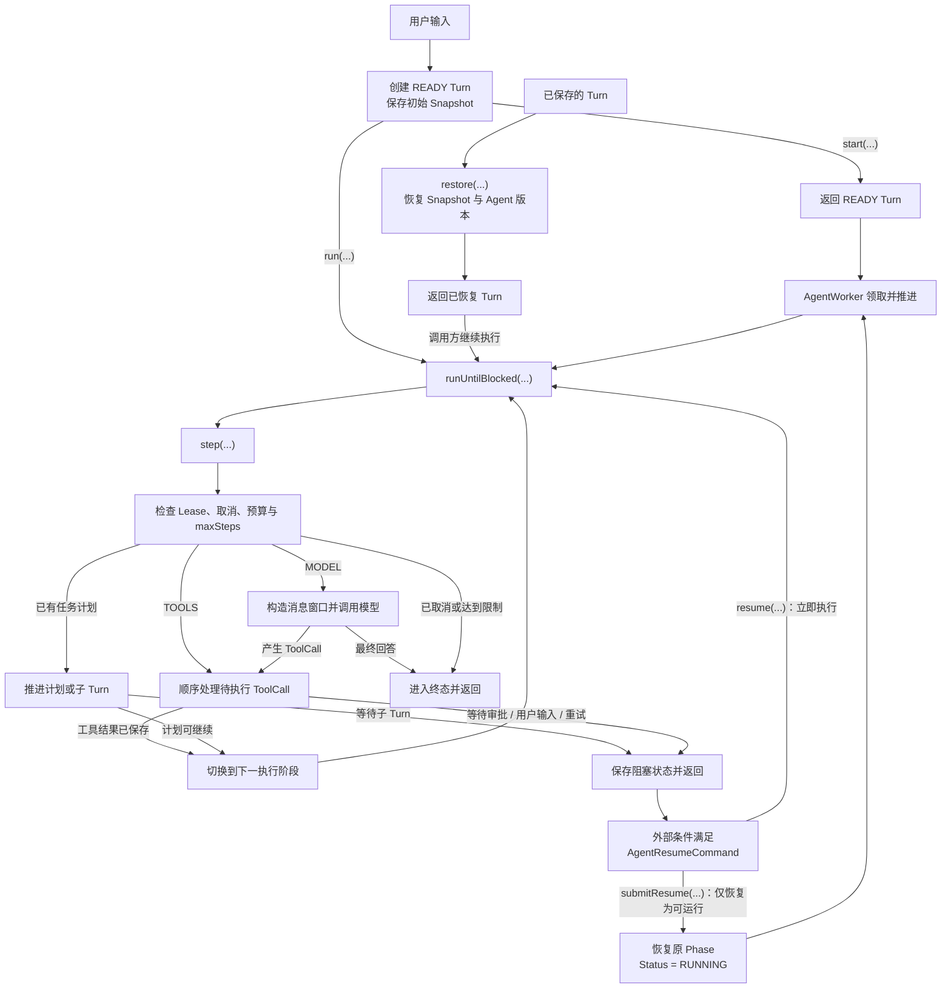

# AgentRunner

## 概述

`AgentRunner` 是 Agent 状态机执行器。它创建、推进、暂停和恢复 `AgentTurn`，并统一处理 Snapshot、预算、重试、规划、父子 Turn、Middleware 与生命周期事件。

Runner 自身不把 Turn 保存在实例字段中，适合作为应用级对象复用；真正的持久状态位于 `AgentTurnStore`。同一个 `AgentTurn` 对象不应由两个线程同时直接推进。

## 整体执行流程

下面的流程图只展示 Runner 的核心控制流：创建或恢复 Turn、持续推进、进入阻塞或终态，以及外部恢复。
Snapshot、事件和 Middleware 的具体触发位置属于实现细节，不在主流程中逐项展开。



### 主路径说明

1. `run(...)` 和 `start(...)` 都先创建 `READY` Turn 并保存初始 Snapshot。`run(...)` 随即进入执行循环；`start(...)` 只返回 Turn，不会自行创建后台线程。
2. `restore(...)` 只从 Store 恢复 Snapshot，并按其中的 Agent ID 与版本装配 Agent。恢复后可由调用方继续执行，也可由 `AgentWorker` 调度。
3. `runUntilBlocked(...)` 循环调用 `step(...)`。每一步先检查执行资格和限制，再优先推进已有任务计划，否则根据当前 Phase 调用模型或处理工具。
4. MODEL 阶段一次 Step 最多调用模型一次。最终回答会结束 Turn；ToolCall 会被记录并在 TOOLS 阶段按顺序处理。
5. 任务计划可能创建子 Turn。同步执行时 Runner 会递归推进子 Turn；Worker 模式下父 Turn 返回等待，由其他 Worker 推进子 Turn，完成后再把结果写回父 Turn。
6. 审批、用户输入、子 Turn 和延迟重试形成阻塞边界，不会占用线程等待。`resume(...)` 恢复后立即执行，`submitResume(...)` 只将 Turn 恢复为可运行状态。

Runner 会在创建、状态转换、工具结果和终止等稳定边界保存 Snapshot，使 Turn 能够跨请求或进程恢复；
Middleware 包围模型、工具和 Step 执行，但不会改变上图的主状态流转。

### 异常与终止路径

模型或工具异常统一进入失败处理：可恢复异常保存为 `RETRY_SCHEDULED`，确定性错误进入 `FAILED`。取消、预算、最大模型迭代和最大 Runner step 分别使用独立终态，调用方不需要从通用异常消息推断原因。

## 构建 Runner

```java
ChatMemoryProvider memoryProvider = conversationId -> loadChatMemory(conversationId);

AgentRunner runner = AgentRunner.builder()
    .turnStore(turnStore)
    .agentLoader(agentLoader)
    .chatMemoryProvider(memoryProvider) // 可选
    .build();
```

Turn Store 和 AgentLoader 未提供时使用内存实现。`ChatMemoryProvider` 只负责根据稳定的
conversationId 定位业务系统维护的 ChatMemory；`chatMemoryProvider` 是可选能力，不需要业务会话时
无需配置，原有 `run(agent, message)` 与显式传入历史消息的 API 保持不变。生产环境的 Store 替换要求
见 [Store 持久化](./store)。

## 三组执行入口

### `run(...)`

创建 Turn 并在当前线程持续执行到终止或阻塞：

```java
AgentTurn turn = runner.run(agent, "查询订单 1001");
```

适合同步请求和短任务。它不保证一定完成，审批、用户输入、子 Agent 或重试都会返回阻塞 Turn。

### `start(...)`

只创建并保存 `READY` Snapshot：

```java
AgentTurn queued = runner.start(agent, "生成月度报告");
```

适合提交到后台，之后由 `AgentWorker` 领取。

### `step(...)` 与 `runUntilBlocked(...)`

```java
AgentStepResult oneStep = runner.step(turn);
AgentTurn blockedOrDone = runner.runUntilBlocked(turn);
```

`step` 只推进一次稳定执行步骤，适合调试、外部调度或实现细粒度 UI。`runUntilBlocked` 会循环调用 step。

## 执行层次

一次标准推进包含三层：

1. `runUntilBlocked` 判断是否继续循环。
2. `step` 处理取消、Lease、预算、规划、上下文和 Middleware。
3. 内置 ToolCall 状态机根据 Phase 进入 MODEL 或 TOOLS 阶段。

模型返回 ToolCall 时，Runner 先记录 `pendingToolCalls` 并保存 Snapshot，随后才审批和执行。这个顺序是恢复一致性的关键。

## Step 结果

`AgentStepResult` 只返回本步骤直接产生的内容：

- `getResponse()`：本步骤调用模型得到的响应；未调用模型时为 `null`。
- `getToolMessages()`：本步骤执行工具后写入的结果消息；没有工具结果时为空列表。
- `getError()`：本步骤触发重试或失败时关联的异常；正常步骤通常为 `null`。

运行是否继续、阻塞或终止，以及是完成、取消、达到 `maxSteps` 还是预算耗尽，统一读取
`AgentTurn.getStatus()`。这样 Step 结果不会再维护一套与 `AgentTurnStatus` 重复的状态类型。

## 恢复与取消

```java
AgentTurn restored = runner.restore(turnId);
AgentTurn resumed = runner.resume(turnId, AgentResumeCommand.approveTool(callId));
AgentTurn cancelled = runner.requestCancellation(turnId);
```

取消是协作式的：Store 先保存单调取消标志，Runner 在安全边界转换为 `CANCELLED`。它不保证立即中断已经发出的 HTTP 请求或工具函数。

## 业务会话入口

需要让页面时间线与 Agent 长任务自动衔接时，可以配置 ChatMemory Provider：

```java
AgentRunner runner = AgentRunner.builder()
    .turnStore(turnStore)
    .agentLoader(agentLoader)
    .chatMemoryProvider(conversationId -> chatMemoryRepository.load(conversationId))
    .build();

AgentTurn turn = runner.run(agentId, conversationId,
    new UserMessage("继续上一个问题"));
```

Runner 会从 `ChatMemory.getModelMessages(agent.getMaxAttachedMessages())` 分页读取最近的模型可见历史，
不会把完整业务会话复制进 Turn。Snapshot 成功保存后，再把本轮新增消息幂等投影到 ChatMemory；恢复
Turn 时也会重试投影。ChatMemory 写入失败不会把已经正确保存的 Turn 改成失败，`AgentTurnStore` 始终是
执行状态的事实来源。

不配置 Provider 时，仍可显式传入历史：

```java
AgentTurn turn = runner.run(agent, history,
    new UserMessage("继续上一个问题"));
```

该入口只复制传入的历史，不会修改外部 ChatMemory。两种模式都由业务系统维护 conversationId、会话与
当前未结束 turnId 的关系，并防止同一会话并发开始互相冲突的 Turn。

## 外部恢复边界

同步 `resume(...)` 适合同一服务内立即恢复。只更新状态并交给 Worker 时使用：

```java
AgentTurn ready = runner.submitResume(
    turnId,
    AgentResumeCommand.approveTool(callId));
```

跨服务回调应先进入业务系统自己的数据库 Inbox 或消息队列。业务层完成幂等、重试和审计后调用 `submitResume`，Framework 不保存或消费外部恢复事件。

## 监听扩展

```java
runner.addEventListener(eventListener);
```

统一事件监听器覆盖生命周期、模型增量和工具进度；持久化审计由业务监听器自行实现。监听器应快速返回，不能把业务主流程依赖在“监听一定成功”上。

## 自定义建议

- 应用层共享一个配置完整的 Runner，不要为每个请求创建一套内存 Store。
- 短任务使用 `run`，长任务使用 `start + AgentWorker`。
- 不要绕过 Runner 直接修改快照；状态转换、事件和版本更新必须保持一致。
- 工具副作用使用 `AgentToolContext.current().getIdempotencyKey()` 返回的稳定调用 ID 实现业务幂等。
