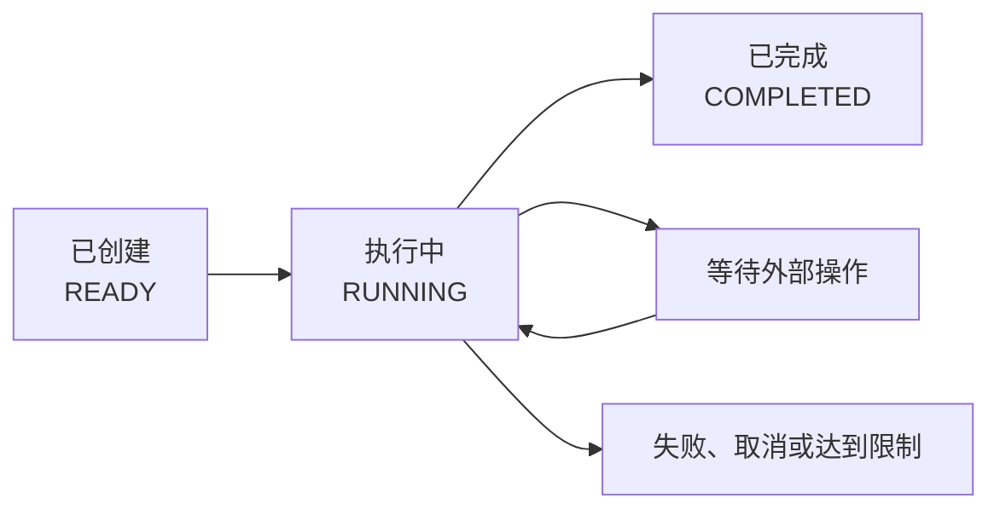

# AgentTurn

## 概述

`AgentTurn` 表示 Agent 执行的一次具体任务，负责保存该任务从创建到结束期间的状态、消息、工具调用、资源消耗和最终结果。

例如，用户对天气助手说：“查询上海天气，并告诉我是否需要带伞。”从收到这句话开始，到调用天气工具并给出最终回答为止，就是一个 AgentTurn。

一次任务不一定只调用一次大模型。它可能经历下面这些步骤：

1. 大模型理解用户的问题。
2. 大模型决定调用天气工具。
3. Java 工具返回天气数据。
4. 大模型根据工具结果生成答案。

这些步骤都属于同一个 AgentTurn。一次任务即使多次调用模型和工具，也不会因此拆分成多个 Turn。

从使用角度看，`AgentTurn` 相当于一张随执行过程不断更新的“任务工单”。

Agent 任务可能包含多次模型调用和工具执行，也可能暂停等待审批。如果只拿到最终的一段文字，业务系统无法知道任务当前发生了什么。

`AgentTurn` 主要提供以下信息：

- 任务是否已经完成；
- 当前是否在等待用户输入或人工审批；
- 任务的最终答案或失败原因；
- 模型和工具的调用次数；
- Token 等资源消耗；
- 任务保存和恢复所需的运行信息。

Token 是大模型统计文本用量的基本单位，也通常会影响调用费用。

任务的执行和状态变化由 `AgentRunner` 负责。业务代码通常只读取 `AgentTurn`，不应该自己把它改成“完成”或“失败”。

## 与 Agent 及聊天会话的关系

| 概念 | 定位 | 使用方式 |
| --- | --- | --- |
| `Agent` | 可复用的 AI 助手配置 | 配置一次，可以重复处理很多任务 |
| `AgentTurn` | 单次任务的运行记录 | 每个新任务创建一个 |
| 聊天会话 | 用户与 AI 的连续交互记录 | 可以包含多个 AgentTurn |

例如：

1. 用户问“上海天气怎么样”，创建第一个 AgentTurn。
2. 用户接着问“北京呢”，创建第二个 AgentTurn。
3. 两个 Turn 可以属于同一个聊天会话，共享之前的聊天记录。

已经完成的 AgentTurn 不应该重新打开处理新问题。新问题应创建新的 Turn；只有审批结果、表单输入等针对原任务的补充信息，才用于恢复原来的 Turn。

## 创建与执行

通常不需要自己创建 AgentTurn。把 Agent 和用户问题交给 `AgentRunner` 即可：

```java
AgentTurn turn = runner.run(
    agent,
    "查询上海天气，并告诉我是否需要带伞"
);
```

`run(...)` 会创建 Turn，并在当前线程中开始执行，直到任务完成、失败或暂停等待外部操作。

如果只想先创建任务，稍后交给 `AgentWorker`（后台任务执行器）执行，可以使用：

```java
AgentTurn turn = runner.start(agent, "生成本周销售分析报告");
```

`start(...)` 返回的任务初始状态是 `READY`。它只创建任务，不会自动启动新线程。要在后台真正执行，还需要配置 `AgentWorker`。

## 生命周期

最常见的过程可以简化成下面这张图：



任务可能一次就完成，也可能在“执行中”和“等待外部操作”之间往返多次。

### 状态说明

| 状态 | 通俗说明 |
| --- | --- |
| `READY` | 任务已经创建，还没有开始执行 |
| `RUNNING` | 正在调用模型、处理结果或执行工具 |
| `WAITING_FOR_USER` | 缺少必要信息，等待用户补充 |
| `WAITING_FOR_APPROVAL` | 某个工具需要人工同意后才能执行 |
| `WAITING_FOR_TOOL` | 工具在其他服务中执行，正在等待结果 |
| `RETRY_SCHEDULED` | 暂时失败，等待到指定时间后重试 |
| `COMPLETED` | 任务正常完成，已经产生最终答案 |
| `FAILED` | 发生无法继续的错误 |
| `CANCELLED` | 任务已被取消 |
| `MAX_ITERATIONS_REACHED` | 模型调用次数达到上限 |
| `MAX_STEPS_REACHED` | 整个任务的执行步骤达到上限 |
| `BUDGET_EXCEEDED` | 运行时间、Token 或工具调用次数超出预算 |

可以使用框架提供的方法判断状态属于哪一类：

```java
AgentTurnStatus status = turn.getStatus();

if (status.isBlocked()) {
    System.out.println("任务正在等待外部操作");
}

if (status.isTerminal()) {
    System.out.println("任务已经结束，不能继续执行");
}
```

`isBlocked()` 表示任务正在等待输入、审批、工具结果或重试时间，当前不能立即向下执行；`isTerminal()` 表示任务已经彻底结束。使用这两个方法比自己列举状态更可靠。

## 读取最终结果

只有状态为 `COMPLETED` 时，`getFinalOutput()` 才表示正常的最终答案：

```java
if (turn.getStatus() == AgentTurnStatus.COMPLETED) {
    String answer = turn.getFinalOutput();
    System.out.println(answer);
} else {
    System.out.println("任务未完成，当前状态：" + turn.getStatus());
}
```

如果任务失败，可以读取异常：

```java
if (turn.getStatus() == AgentTurnStatus.FAILED) {
    Throwable error = turn.getError();
    System.out.println(error == null ? "未知错误" : error.getMessage());
}
```

不要在任务处于 `READY`、`RUNNING` 或等待状态时，把 `getFinalOutput()` 的返回值当作最终答案。

## 执行进度与资源消耗

```java
System.out.println("任务 ID：" + turn.getId());
System.out.println("模型调用次数：" + turn.getIterationCount());
System.out.println("总执行步骤：" + turn.getStepCount());
System.out.println("工具调用次数：" + turn.getToolCallCount());
System.out.println("Token 用量：" + turn.getTotalTokens());
```

这些计数的含义如下：

| 方法 | 记录什么 |
| --- | --- |
| `getIterationCount()` | 调用了多少次大模型 |
| `getStepCount()` | `AgentRunner` 总共推进了多少个执行步骤 |
| `getToolCallCount()` | 已经开始执行多少次业务工具 |
| `getInputTokens()` | 发送给模型的累计 Token 数量 |
| `getOutputTokens()` | 模型生成的累计 Token 数量 |
| `getTotalTokens()` | 模型报告的累计总 Token 数量 |
| `getRetryCount()` | 已经安排了多少次自动重试 |

一次模型调用和一个执行步骤不是一回事，因此 `iterationCount` 和 `stepCount` 通常不会相等。

## 单次任务选项

Agent 中的配置会作为所有任务的默认值。如果某一次任务需要附加业务信息、开启流式调用或单独调整执行限制，可以使用 `AgentTurnOptions`：

```java
AgentTurnOptions options = AgentTurnOptions.builder()
    .metadata("businessOrderId", "O-1001")
    .metadata("userId", "U-1001")
    .streaming(true)
    .build();

AgentTurn turn = runner.run(agent, "查询订单状态", options);
```

`metadata` 可以理解为附加在任务上的业务信息。它适合保存订单号、用户 ID、租户 ID、任务类型等标识。这些信息会随任务进度一起保存，恢复任务后仍然可以读取。

`metadata` 中的值应当可以转换为数据并保存，例如字符串、数字和布尔值。不要放入密码、API Key、数据库连接、Spring 管理的对象或其他运行中的服务对象。

`streaming(true)` 表示大模型可以流式返回内容。要把增量内容实时显示到页面，还需要通过事件监听器接收模型
输出，详见 [AgentEventListener](./agent-event-listener)。

## 消息记录

```java
List<Message> history = turn.getConversationHistory();
```

`getConversationHistory()` 返回这次任务使用过的用户消息、模型消息和工具消息，可以交给业务系统保存，并用于下一轮对话。返回结果不包含 Agent 的系统指令。

如果需要把多个 Turn 组成连续聊天，应由业务系统保存会话 ID 和历史消息，或者接入 `ChatMemory`（聊天记录存储组件）。AgentTurn 本身不负责管理完整的会话列表。

具体做法请查看[上下文管理](./context-management)。

## 持久化与恢复

为了在审批等待或服务重启后继续任务，Agents-Flex 会把 AgentTurn 转换成任务快照。快照就是某一时刻的任务存档，其中包含状态、消息、计数和恢复所需的信息。

`AgentTurnStore` 是专门保存任务进度的组件。正常业务代码应让 `AgentRunner` 和 `AgentTurnStore` 负责保存：

```java
runner.saveSnapshot(turn);
```

虽然 `turn.toSnapshot()` 可以取得快照对象，但不建议绕过 Runner 直接覆盖 Store 中的数据，因为 Store 还需要处理版本和并发更新。

恢复任务时，也应通过 `AgentRunner` 进行。详见[任务快照](./snapshot)和[任务快照持久化](./store)。

## 使用约束

1. 一个 AgentTurn 只代表一次任务，新问题应创建新的 Turn。
2. 已经结束的 Turn 不能重新打开。
3. 等待审批或表单时，应恢复原 Turn，而不是创建新 Turn。
4. 不要让两个线程同时直接执行同一个 AgentTurn。
5. 不要由业务代码直接修改 Turn 状态，让 `AgentRunner` 负责状态变化。
6. 只有 `COMPLETED` 状态下的 `getFinalOutput()` 才是正常完成的最终答案。

## 下一步

- 了解谁负责创建和执行 Turn：[AgentRunner](./agent-runner)。
- 了解任务如何暂停后继续：[挂起与恢复](./suspend-resume)。
- 了解任务进度如何保存：[Snapshot](./snapshot)。
- 了解长任务如何在后台运行：[Worker](./worker)。
