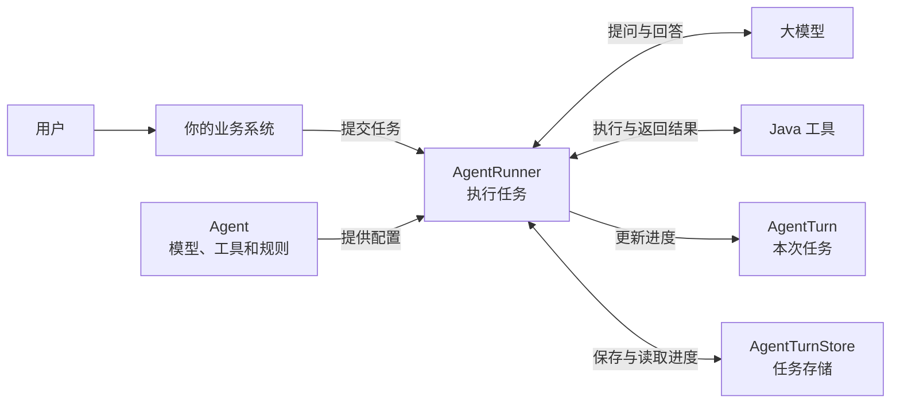

# 架构设计

## 为什么需要这些组件

普通的大模型调用通常是“发送问题，得到回答”。Agent 任务则可能多次调用模型和 Java 工具，还可能暂停等待审批，或者在服务重启后继续执行。

因此，Agents-Flex 把三件事分开处理：

- `Agent` 负责说明这个 AI 助手能做什么；
- `AgentRunner` 负责真正执行任务；
- `AgentTurn` 负责记录某一次任务执行到了哪里。

这样，一个 Agent 可以重复处理很多任务，每个任务的进度又能单独保存和恢复。

## 整体架构

读这张图时，只需要抓住一条主线：业务系统把任务交给 `AgentRunner`，`AgentRunner` 使用 `Agent` 中配置的模型和工具执行任务，并把进度记录到 `AgentTurn`。

## 每个对象是做什么的

| 对象 | 通俗理解 | 主要作用 |
| --- | --- | --- |
| `Agent` | AI 助手的岗位说明书 | 配置模型、指令、工具和执行规则 |
| `AgentRunner` | 任务执行者 | 调用模型、执行工具、暂停或继续任务 |
| `AgentTurn` | 某一次任务的工单 | 记录状态、消息、中间结果和最终答案 |
| `AgentTurnStore` | 工单存放处 | 保存任务进度，供后续恢复 |
| `ChatModel` | 大模型连接器 | 把问题发送给模型，并取得模型回复 |
| `Tool` | Agent 可以使用的工具 | 执行查询数据库、调用接口等 Java 逻辑 |

`Agent` 和 `AgentTurn` 最容易混淆。它们的区别是：

- 一个天气助手只需要创建一个 `Agent`；
- 每次用户查询天气，都会创建一个新的 `AgentTurn`。

## 一次任务怎样运行

以“查询上海天气并给出出行建议”为例：

1. 业务系统把用户问题交给 `AgentRunner`。
2. `AgentRunner` 根据 `Agent` 的配置调用大模型。
3. 大模型判断需要天气数据，选择 `get_weather` 工具并生成参数。
4. `AgentRunner` 执行对应的 Java 工具，再把结果交给大模型。
5. 大模型根据天气数据生成最终建议。
6. `AgentRunner` 把最终状态和答案记录到 `AgentTurn`。

大模型负责判断“下一步做什么”，但不会直接执行 Java 代码。工具查找、参数传递和任务状态管理都由 `AgentRunner` 负责。

## 任务为什么可以暂停和恢复

假设 Agent 准备执行退款，但业务要求先由用户确认：

1. `AgentRunner` 在退款前暂停任务。
2. `AgentTurn` 记录“正在等待审批”，并把进度保存到 `AgentTurnStore`。
3. 用户同意后，业务系统提交审批结果。
4. `AgentRunner` 读取原来的进度，从暂停的位置继续执行。

可以把 `AgentTurnStore` 理解为任务存档。默认 Runner 使用内存存储，适合本地测试；程序退出后，内存中的任务会丢失。正式环境应换成持久化存储，这样服务重启后还能继续任务。

等待审批不是程序异常，而是正常的任务状态。等待用户填写表单、等待外部工具结果和等待重试，也使用类似的处理方式。

详见[挂起与恢复](./suspend-resume)和[任务快照持久化](./store)。

## 其他组件什么时候需要

第一次运行 Agent 时，不需要把所有组件都配置好。出现对应需求后再接入即可。

| 需求 | 使用的组件 | 它解决什么问题 |
| --- | --- | --- |
| 连续多轮聊天 | `ChatMemory` | 保存这个会话之前聊过什么 |
| 在页面实时显示进度 | `AgentEventListener` | 把模型输出和状态变化通知给业务系统 |
| 在后台执行长任务 | `AgentWorker` | 从 Store 领取任务并执行 |
| 服务重启后继续任务 | 持久化 `AgentTurnStore` | 从已保存的进度恢复 |
| 按 ID 和版本恢复 Agent | `AgentLoader` | 找回任务创建时使用的 Agent 配置 |

其中，`ChatMemory` 和 `AgentTurnStore` 用途不同：前者保存聊天历史，后者保存任务执行进度，二者不能相互替代。

## 可以怎样部署

| 使用阶段 | 推荐方式 | 适合场景 |
| --- | --- | --- |
| 本地学习 | `new AgentRunner()`，使用默认内存存储 | 示例和功能验证 |
| 普通业务服务 | Runner 配合持久化 Store | 需要审批或重启恢复 |
| 后台长任务 | API 创建任务，Worker 负责执行 | 任务耗时较长，HTTP 请求不应一直等待 |
| 多实例服务 | 多个 Worker 共享同一个 Store | 任务量较大，或需要故障接管 |

`runner.run(...)` 会在当前线程中执行任务。`runner.start(...)` 只负责创建任务，不会自动启动后台线程；需要后台运行时，应使用 `AgentWorker`。

多个 Worker 同时运行时，Store 会控制任务由谁领取。某个 Worker 意外退出后，其他 Worker 可以在执行权到期后接手。具体配置请查看 [Worker](./worker)。

## 接入时记住这几点

1. `Agent` 是可复用配置，`AgentTurn` 才是某一次任务。
2. `AgentRunner` 负责执行，`AgentTurnStore` 负责保存进度。
3. `ChatMemory` 保存聊天历史，不能代替任务存储。
4. 不要让两个线程同时直接执行同一个 `AgentTurn`。
5. 退款、扣款、发货等工具必须由业务系统做好权限检查和防重复执行。

## 下一步

- 第一次使用 Agent：阅读[快速开始](./getting-started)。
- 了解任务状态：阅读 [AgentTurn](./agent-turn)。
- 保存和恢复任务：阅读[任务快照](./snapshot)与[任务快照持久化](./store)。
- 接入后台执行：阅读 [Worker](./worker)。
- 处理审批和用户输入：阅读[挂起与恢复](./suspend-resume)。
