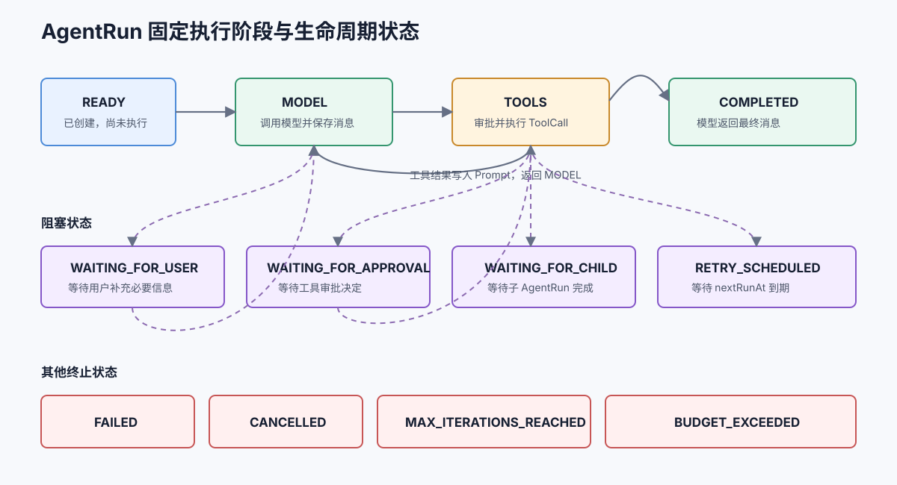

# 执行循环与生命周期

<div v-pre>

## 默认模式的固定阶段

AgentRun 只包含三个执行阶段：

| 阶段 | 含义 |
| --- | --- |
| `MODEL` | 调用模型，让模型生成最终回答或 ToolCall |
| `TOOLS` | 执行已经持久化的 pending ToolCall |
| `FINISHED` | Run 已终止，不再推进 |



默认模式围绕模型原生 ToolCall 形成确定的执行循环，每个阶段都具有明确的持久化与恢复语义。跨系统流程可以在工作流模块中编排，并把 AgentRun 作为执行节点接入。

## 自定义执行模式

平台需要规划、反思或领域专用运行逻辑时，可以实现：

```java
public final class ReviewMode implements AgentExecutionMode {
    public String getId() { return "review"; }
    public String getVersion() { return "1"; }

    public AgentStepResult step(AgentExecutionContext context) {
        AgentRun run = context.getRun();
        if (!run.getModeState().containsKey("prepared")) {
            run.putModeState("prepared", true);
            return context.checkpointAndContinue();
        }
        if (requiresUserInput(run)) {
            return context.suspend(AgentSuspension.userInput("请补充审核依据"));
        }
        return context.executeToolCallingStep();
    }
}
```

模式可以：

- 复用默认 ToolCall 步骤；
- 保存自定义 `modeState`；
- 保存 Checkpoint 后继续；
- 暂停等待外部事件；
- 正常完成或按统一策略失败。

模式 ID 和版本会进入 Snapshot。恢复时如果 Agent 上的模式实现不匹配，框架会拒绝恢复，避免静默改变运行语义。

`context.suspend(...)` 会同时保存 Checkpoint 并返回 `BLOCKED`。模式不需要、也不应该自行修改 Run status。

## 一次 step 做什么

```java
AgentStepResult result = runner.step(run);
```

当阶段是 MODEL：

1. 检查取消、预算和迭代次数；
2. 调用 ChatModel；
3. 保存 AiMessage 和 Token Usage；
4. 没有 ToolCall 时完成 Run；
5. 有 ToolCall 时保存 pending ToolCalls，并冻结对应的 `AgentToolReference`；
6. 进入 TOOLS 并处理工具。

Runner 会在模型调用前后读取持久化取消信号。取消发生在模型请求期间时，本次响应会被丢弃，Run 进入 `CANCELLED`，不会继续执行响应中的 ToolCall。

当阶段是 TOOLS：

1. 从 pending 列表取第一个 ToolCall；
2. 解析 Tool；
3. 判断审批策略；
4. 执行 Tool；
5. 写入 ToolMessage；
6. 从 pending 列表移除并保存 Checkpoint；
7. 全部工具完成后回到 MODEL。

## runUntilBlocked

```java
AgentRun result = runner.runUntilBlocked(run);
```

它会循环调用 `step()`，直到：

- Run 进入终止状态；
- Run 进入阻塞状态。

对阻塞 Run 再次调用不会重复请求模型：

```java
AgentRun waiting = runner.runUntilBlocked(runId);
// waiting 仍处于原等待状态，不会越过外部审批或用户输入。
```

## 阻塞状态

| 状态 | Suspension 类型 | 恢复命令 |
| --- | --- | --- |
| `WAITING_FOR_USER` | `USER_INPUT` | `userInput(...)` |
| `WAITING_FOR_APPROVAL` | `TOOL_APPROVAL` | `approveTool(...)` / `rejectTool(...)` |
| `WAITING_FOR_CHILD` | `CHILD_AGENT` | 子 Run 完成通知 |
| `RETRY_SCHEDULED` | `RETRY` | 到期后 `retry()` 或显式继续 |

`AgentSuspension` 保存：

- 暂停原因；
- correlationId；
- 给调用方展示的消息；
- 恢复后的 AgentRunPhase；
- 与暂停原因相关的 metadata。

## submitResume 与 resume

两者语义不同。

### submitResume

```java
AgentRun runnable = runner.submitResume(runId, command);
```

只接受命令、清除 Suspension、保存为可运行状态，不在当前线程继续执行。适合 HTTP 审批接口接收命令后，由 Worker 稍后领取。

### resume

```java
AgentRun result = runner.resume(runId, command);
```

内部先 `submitResume`，随后立即 `runUntilBlocked`。适合同步接口中直接恢复并等待新的结果。

## Correlation ID

工具审批和子 Agent 完成命令必须带匹配的 correlationId：

```java
String callId = waiting.getSuspension().getCorrelationId();
runner.resume(waiting.getId(), AgentResumeCommand.approveTool(callId));
```

它可以防止迟到审批、重复回调或其他任务的命令恢复错误 Run。

## 终止状态

终止后不能再次 `step()`：

```java
if (run.getStatus().isTerminal()) {
    // 只读取结果，不再推进
}
```

| 状态 | 处理建议 |
| --- | --- |
| `COMPLETED` | 返回 `getFinalOutput()` |
| `FAILED` | 记录 `getError()`，判断是否由业务重新创建 Run |
| `CANCELLED` | 返回取消结果，清理外部资源 |
| `MAX_ITERATIONS_REACHED` | 检查提示词、工具设计和循环 |
| `MAX_STEPS_REACHED` | 检查自定义模式是否持续推进但没有完成或阻塞 |
| `BUDGET_EXCEEDED` | 根据 `getBudgetExceededReason()` 调整预算或任务粒度 |

## 下一步

- [工具执行与审批](./tools-and-approval.md)
- [Checkpoint 与中断恢复](./checkpoint-resume.md)
- [Human-in-the-loop 场景](./scenarios/human-in-the-loop.md)

</div>
