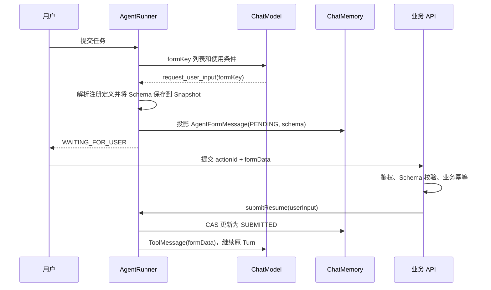

# 表单输入

## 概述

表单输入适用于 Agent 执行到一半、缺少结构化业务信息的场景，例如创建工单、预订会议室或补充退款
资料。业务代码在 `AgentUserInputTool` 上注册表单定义；模型只能选择稳定的 `formKey`，看不到完整
JSON Schema，也不能生成任意表单结构。

模型调用 `request_user_input` 后，Runner 将选中表单的 Schema 保存到 Suspension 和 Snapshot，Turn
进入 `WAITING_FOR_USER`。配置 ChatMemory 后，同一份 Schema 会通过 `AgentFormMessage` 直接提供给前端。
用户提交后，Runner 把数据作为匹配原 ToolCall 的 ToolMessage 返回给模型。

## 快速开始

### 1. 定义并注册表单

`AgentFormDefinition` 只包含 `formKey`、`whenToUse` 和标准 JSON Schema：

```java
Map<String, Object> affectedSystem = new LinkedHashMap<>();
affectedSystem.put("type", "string");
affectedSystem.put("title", "受影响系统");

Map<String, Object> impactScope = new LinkedHashMap<>();
impactScope.put("type", "string");
impactScope.put("title", "影响范围");
impactScope.put("enum", Arrays.asList(
    "ONE_USER", "PARTIAL_USERS", "ALL_USERS"));

Map<String, Object> properties = new LinkedHashMap<>();
properties.put("affectedSystem", affectedSystem);
properties.put("impactScope", impactScope);

Map<String, Object> schema = new LinkedHashMap<>();
schema.put("type", "object");
schema.put("title", "补充故障信息");
schema.put("properties", properties);
schema.put("required", Arrays.asList("affectedSystem", "impactScope"));

AgentFormDefinition form = AgentFormDefinition
    .builder("support_ticket_details")
    .whenToUse("创建故障工单缺少受影响系统或影响范围时使用")
    .schema(schema)
    .build();

Agent agent = Agent.builder("support-agent")
    .instructions("创建故障工单缺少必要信息时调用 request_user_input；不要猜测缺失字段。")
    .chatModel(chatModel)
    .tool(AgentUserInputTool.builder().form(form).build())
    .tool(createTicketTool)
    .build();
```

`whenToUse` 会连同 `formKey` 出现在 Tool description 中，帮助模型选择。Schema 保存在 Tool metadata，
不会进入模型可见的参数定义。模型只会产生类似调用：

```json
{
  "name": "request_user_input",
  "arguments": {
    "formKey": "support_ticket_details"
  }
}
```

`formKey` 参数使用枚举约束，Runner 还会再次校验该 key 是否已经注册。

### 2. 执行到表单等待点

```java
AgentTurn waiting = runner.run(
    agent, "conversation-1", "创建一个高优先级登录故障工单");

if (waiting.getStatus() != AgentTurnStatus.WAITING_FOR_USER) {
    throw new IllegalStateException("expected user input");
}

AgentSuspension suspension = waiting.getSuspension();
String turnId = waiting.getId();
String actionId = suspension.getCorrelationId();
String formKey = String.valueOf(suspension.getMetadata().get("formKey"));
Map<String, Object> savedSchema =
    (Map<String, Object>) suspension.getMetadata().get("schema");
```

此时原 ToolCall 仍在 `pendingToolCalls`，Phase 为 `TOOLS`。Snapshot 保存的是当次请求选中的完整 Schema；
之后修改 Agent 上的表单定义，只影响新 Turn，不会改变已经等待中的页面。

### 3. 校验并提交表单

业务 API 使用 Suspension 中固化的 Schema 校验提交数据，再恢复原 Turn：

```java
Map<String, Object> formData = new LinkedHashMap<>();
formData.put("affectedSystem", "登录系统");
formData.put("impactScope", "ALL_USERS");

// 先完成登录校验、权限校验、JSON Schema 校验和业务幂等处理。
AgentTurn runnable = runner.submitResume(
    turnId,
    AgentResumeCommand.userInput(actionId, formData)
        .withMetadata("submittedBy", "user-1001")
        .withMetadata("requestId", "request-789"));
```

`submitResume(...)` 只保存为可运行状态，适合交给 Worker；需要在当前线程立即继续时使用
`resume(...)`。两者都会校验 actionId，错误或迟到的提交不能恢复其他请求。

## 完整场景：创建故障工单

假设用户输入：

> 帮我创建一个高优先级的登录故障工单。

创建工单还需要“受影响系统”和“影响范围”，但用户没有提供。整个过程如下。

### 1. 模型选择业务表单

模型能看到 `request_user_input`、允许选择的 formKey 及其 `whenToUse`，但看不到 Schema。它判断当前
信息不足后产生 ToolCall：

```json
{
  "id": "call-456",
  "name": "request_user_input",
  "arguments": {
    "formKey": "support_ticket_details"
  }
}
```

`request_user_input` 是控制工具，它的 Java function 不会执行。Runner 识别该 ToolCall 后接管流程，
使用 `formKey` 找到已注册的 `AgentFormDefinition`。

### 2. Runner 建立等待点

Runner 保留原 ToolCall，创建 `USER_INPUT` Suspension，并把完整 Schema 保存到 Snapshot。Turn 随后
进入：

```text
status = WAITING_FOR_USER
phase  = TOOLS
correlationId = call-456
```

配置 `chatMemoryProvider` 后，Runner 同时向当前会话投影一条状态为 `PENDING` 的
`AgentFormMessage`。该消息直接携带 Schema，且 `modelVisible=false`，因此用于页面展示但不会进入模型
上下文。

Runner 还会发布 `TURN_SUSPENDED` 等生命周期事件。业务系统可以通过 `AgentEventListener` 将“会话已
更新”通知推送给前端；事件本身不是表单数据来源，前端应从 ChatMemory 读取 `AgentFormMessage`。

### 3. 前端渲染并提交

前端根据 `AgentFormMessage.schema` 渲染文本框、选择框和必填校验。用户填写：

```json
{
  "affectedSystem": "统一登录系统",
  "impactScope": "ALL_USERS"
}
```

业务接口根据 Suspension 中固化的同一份 Schema 校验数据，并使用消息的 `actionId` 恢复原 Turn：

```java
runner.submitResume(
    "turn-123",
    AgentResumeCommand.userInput("call-456", submittedValues)
        .withMetadata("submittedBy", "user-1001"));
```

提交成功后，ChatMemory 中原来的 `AgentFormMessage` 会通过 CAS 更新为 `SUBMITTED`，页面据此隐藏提交
按钮并显示已提交内容。

### 4. 表单内容成为工具结果

Runner 不会把表单提交当成新的 UserMessage。它会生成一条与原 ToolCall ID 匹配的 ToolMessage：

```json
{
  "toolCallId": "call-456",
  "content": {
    "status": "submitted",
    "formKey": "support_ticket_details",
    "data": {
      "affectedSystem": "统一登录系统",
      "impactScope": "ALL_USERS"
    }
  }
}
```

因此，从模型协议看，这是 `request_user_input(call-456)` 的执行结果；只是结果来自用户填写，而不是
Java Tool function。

### 5. 模型继续业务任务

Runner 从原暂停位置继续调用模型。模型读取表单结果后，已经具备创建工单所需的信息，可以调用真正的
业务工具：

```json
{
  "name": "create_support_ticket",
  "arguments": {
    "title": "登录故障",
    "priority": "HIGH",
    "affectedSystem": "统一登录系统",
    "impactScope": "ALL_USERS"
  }
}
```

如果该工具具有外部写入等副作用，还可以继续进入[人工审批](./human-approval)流程。表单输入负责收集
执行所需信息，人工审批负责决定已经确定的 ToolCall 是否允许执行，两者职责不同。

## 工具执行时动态请求表单

前面的流程由模型主动调用 `request_user_input`，适合模型在执行工具前就能判断缺少哪些信息的场景。
如果只有进入业务工具、查询业务规则后才能确定所需字段，可以让工具抛出
`AgentFormRequiredException`：

```java
Tool createTicketTool = Tool.builder("create_support_ticket")
    .description("创建故障工单")
    .function(arguments -> {
        AgentToolContext context = AgentToolContext.current();
        Map<String, Object> submitted = context.getSubmittedFormData();

        if (submitted.isEmpty()) {
            throw new AgentFormRequiredException(
                AgentFormDefinition.builder("support_ticket_details")
                    .whenToUse("工具发现缺少受影响系统或影响范围")
                    .schema(supportTicketSchema)
                    .build());
        }

        return createSupportTicket(
            String.valueOf(submitted.get("affectedSystem")),
            String.valueOf(submitted.get("impactScope")),
            context.getIdempotencyKey());
    })
    .build();
```

Runner 将该异常作为执行控制信号，而不是工具失败：

```text
第一次执行 create_support_ticket
→ 抛出 AgentFormRequiredException
→ 保留原 create_support_ticket ToolCall
→ 保存 Schema，进入 WAITING_FOR_USER
→ 前端提交 formData
→ formData 保存进 AgentTurnSnapshot
→ 从头重新执行 create_support_ticket
→ AgentToolContext.getSubmittedFormData() 返回提交内容
→ 工具完成并生成 create_support_ticket 的 ToolMessage
```

这个入口不需要模型再调用 `request_user_input`，但它与模型入口使用相同的 `AgentFormMessage`、前端
渲染和提交 API。两种入口的恢复语义不同：

| 表单入口 | 提交数据的去向 | 恢复动作 |
| --- | --- | --- |
| 模型调用 `request_user_input` | 形成控制 ToolCall 的 ToolMessage | 回到 MODEL 阶段 |
| 业务工具抛出输入异常 | 保存为原业务 ToolCall 的恢复数据 | 从头重新执行原工具 |

工具输入异常必须在产生外部副作用之前抛出，因为 Framework 不会恢复 Java 调用栈，只会重放整个工具
函数。工具应使用 `AgentToolContext.getIdempotencyKey()` 保证外部写入幂等；同一个 ToolCall 在已经获得
提交数据后再次抛出输入异常会被视为协议错误。首次无副作用的中断和恢复后的执行按同一个逻辑
ToolCall 计算，不会因为表单交互额外消耗 `maxToolCalls` 配额。

## 前端渲染

配置 `chatMemoryProvider` 后，Runner 会把等待状态投影为 `AgentFormMessage`。消息直接携带 Schema：

```json
{
  "type": "agent_form",
  "messageId": "turn-123:input:call-456",
  "turnId": "turn-123",
  "actionId": "call-456",
  "formKey": "support_ticket_details",
  "schema": {
    "type": "object",
    "title": "补充故障信息",
    "properties": {
      "affectedSystem": {
        "type": "string",
        "title": "受影响系统"
      },
      "impactScope": {
        "type": "string",
        "title": "影响范围",
        "enum": ["ONE_USER", "PARTIAL_USERS", "ALL_USERS"]
      }
    },
    "required": ["affectedSystem", "impactScope"]
  },
  "status": "PENDING",
  "actions": ["SUBMIT"]
}
```

前端直接使用消息中的标准 JSON Schema 渲染表单，不需要再通过 `formKey` 查询另一套注册中心。Schema
只能描述数据结构和校验规则，不应包含 HTML、JavaScript 或可执行表达式。

## 消息状态

| 状态 | 页面行为 |
| --- | --- |
| `PENDING` | 渲染表单并允许提交，`getActions()` 返回 `SUBMIT` |
| `SUBMITTED` | 展示已提交结果，不再显示提交按钮 |
| `CANCELLED` | Turn 已取消或终止，表单只读 |

提交成功后，Runner 使用 expectedVersion CAS 将原 `AgentFormMessage` 更新为 `SUBMITTED`，不会追加
另一条表单结果消息。`submittedValues` 可用于回显，`submittedBy` 和 `submittedAt` 用于展示当前状态。

`AgentFormMessage.modelVisible=false`，Schema 和页面状态不会占用模型上下文。模型读取的是恢复时生成的
ToolMessage：

```json
{
  "status": "submitted",
  "formKey": "support_ticket_details",
  "data": {
    "affectedSystem": "登录系统",
    "impactScope": "ALL_USERS"
  }
}
```

## 执行流程



## 纯文本输入

底层主动挂起机制仍支持简单文本提交：

```java
AgentTurn waiting = runner.suspend(
    turn, AgentSuspension.userInput("请提供订单号"));
runner.submitResume(
    waiting.getId(), AgentResumeCommand.userInput("订单号是 O-1001"));
```

这条兼容路径不使用 `request_user_input`，也不会生成 `AgentFormMessage`。普通多轮聊天追问则无需挂起：
让当前 Turn 正常回答，下一条 UserMessage 创建新的 Turn 即可。

## 安全与一致性

- 模型只能看到 formKey 和使用条件，不能定义或修改 Schema。
- 前端使用消息中的 Schema 渲染；后端必须使用同一份 Schema 重新校验，不能信任前端隐藏字段。
- formData 属于输入正文；提交人、渠道和请求 ID 等审计属性放入 command metadata。
- 外部请求先按 requestId 幂等保存，再调用 `submitResume(...)`。
- ChatMemory 是页面投影，执行状态以 AgentTurnStore 中的 Snapshot 为准。
- Schema 变化只影响新 Turn；等待中的 Turn 使用 Snapshot 已固化的定义。

通用 Suspension、同步与异步恢复语义见 [挂起和恢复](./suspend-resume)。
