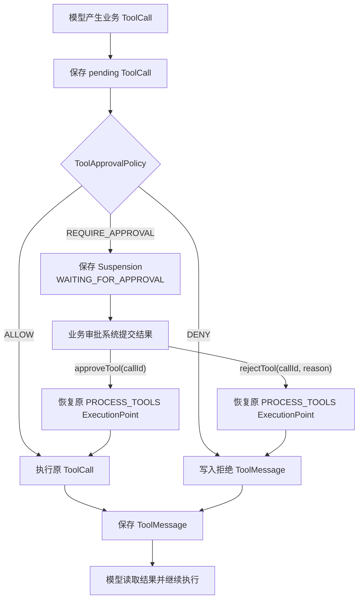

# 人工审批

## 概述

人工审批用于保护会产生外部副作用的业务工具，例如退款、转账、发布、删除和发送通知。
`ToolApprovalPolicy` 在工具函数执行前返回结构化决策；需要审批时，Runner 保存原 ToolCall 和
`AgentSuspension`，将 Turn 转为 `WAITING_FOR_APPROVAL` 后返回，不会占用线程等待。

审批机制只控制 Tool 的执行授权。它不会审查模型输出，也不会替代业务系统的身份认证、权限校验和
合规审计。未配置策略时默认使用 `ToolApprovalPolicy.allowAll()`。

## 快速开始

为有副作用的工具配置审批策略：

```java
Tool refundOrderTool = Tool.builder("refund_order", "退款并修改订单资金状态")
    .addParameter(Parameter.builder()
        .name("orderId").type("string").required(true).build())
    .function(args -> refundService.refund(String.valueOf(args.get("orderId"))))
    .build();

Agent agent = Agent.builder("order-agent")
    .instructions("退款必须调用 refund_order，不要声称已经退款。")
    .chatModel(chatModel)
    .tool(refundOrderTool)
    .toolApprovalPolicy((turn, call, tool) ->
        "refund_order".equals(tool.getName())
            ? ToolApprovalDecision.requireApproval()
                .code("REFUND_APPROVAL")
                .message("是否允许执行退款？")
                .build()
            : ToolApprovalDecision.ALLOW)
    .build();
```

执行到审批点并提交决定：

```java
AgentTurn waiting = runner.run(agent, "请退款订单 O-1001");

if (waiting.getStatus() == AgentTurnStatus.WAITING_FOR_APPROVAL) {
    String callId = waiting.getSuspension().getCorrelationId();
    AgentTurn result = runner.resume(
        waiting.getId(),
        AgentResumeCommand.approveTool(callId)
            .withMetadata("approverId", "user-1001"));
}
```

审批前工具函数不会执行。`resume(...)` 会立即继续原 Turn；Web 审批接口通常改用
`submitResume(...)`，只保存决定，再由 `AgentWorker` 执行。

## 与等待用户输入的区别

本文所说的“人工审批”特指 `AgentSuspensionType.TOOL_APPROVAL`。`USER_INPUT` 也是一种需要人与
Agent 交互的暂停类型，但解决的是信息缺失问题，不代表执行授权。

| 暂停类型 | 使用场景 | Turn 状态 | 恢复命令 |
| --- | --- | --- | --- |
| `USER_INPUT` | 缺少订单号、时间范围等继续执行所需的信息 | `WAITING_FOR_USER` | `userInput(callId, data)` |
| `TOOL_APPROVAL` | ToolCall 已经确定，执行外部副作用前需要批准或拒绝 | `WAITING_FOR_APPROVAL` | `approveTool(callId)` / `rejectTool(callId, reason)` |

需要让模型在信息不足时自然进入等待状态，应注册 `request_user_input` 控制工具：

```java
Agent agent = Agent.builder("order-agent")
    .instructions("缺少退款信息时调用 request_user_input，不要猜测缺失字段。")
    .chatModel(chatModel)
    .tool(AgentUserInputTool.builder()
        .form(AgentFormDefinition.builder("refund_details")
            .description("退款缺少订单号或退款原因时使用")
            .schema(refundDetailsSchema)
            .build())
        .build())
    .build();

Map<String, Object> values = new LinkedHashMap<>();
values.put("orderId", "O-1001");
runner.submitResume(turnId, AgentResumeCommand.userInput(callId, values));
```

Runner 会把提交数据写成匹配原控制 ToolCall 的 ToolMessage，再继续原 Turn。普通文本回复“请提供订单
号”仍只会形成正常回答，不会自动进入 `WAITING_FOR_USER`。完整表单协议见
[表单输入](./form-input)。

## 配置审批策略

审批策略配置在 `Agent` 上，并对当前 Agent 的业务 ToolCall 生效：

```java
Agent agent = Agent.builder("order-agent")
    .instructions("查询订单可以直接执行；退款必须调用 refund_order。")
    .chatModel(chatModel)
    .tool(queryOrderTool)
    .tool(refundOrderTool)
    .toolApprovalPolicy((turn, call, tool) -> {
        if (!"refund_order".equals(tool.getName())) {
            return ToolApprovalDecision.ALLOW;
        }
        return ToolApprovalDecision.requireApproval()
            .code("REFUND_APPROVAL")
            .message("退款操作需要人工审批")
            .reason("该工具会修改订单和资金状态")
            .metadata("riskLevel", "HIGH")
            .build();
    })
    .build();
```

策略应根据已经解析出的 Tool、Tool metadata、Turn metadata 和参数摘要进行确定性判断，不应在其中
修改 Turn 或执行外部副作用。

## 审批决定

`ToolApprovalDecision` 有三种结果：

| Outcome | Runner 行为 |
| --- | --- |
| `ALLOW` | 立即执行工具 |
| `REQUIRE_APPROVAL` | 保存暂停点并进入 `WAITING_FOR_APPROVAL` |
| `DENY` | 不执行工具，写入结构化拒绝结果供模型继续处理 |

`code` 是供程序判断的稳定策略代码，`message` 面向审批人展示，`reason` 用于审计和问题定位，
`metadata` 可携带风险等级等可序列化信息。不要把密钥、完整支付信息等敏感数据放入这些字段。

## 执行流程



原 ToolCall 会先于审批请求写入 Snapshot。批准后 Runner 从 `PROCESS_TOOLS` ExecutionPoint 继续执行已经保存的调用，
不会让模型重新生成工具名称或参数。拒绝不是运行时失败；Runner 会生成与原调用关联的 ToolMessage，
模型可以据此解释拒绝结果或选择其他方案。

## 读取待审批信息

同步执行遇到审批时会正常返回阻塞 Turn：

```java
AgentTurn waiting = runner.run(agent, "请退款订单 O-1001");

if (waiting.getStatus() == AgentTurnStatus.WAITING_FOR_APPROVAL) {
    AgentSuspension suspension = waiting.getSuspension();
    String turnId = waiting.getId();
    String callId = suspension.getCorrelationId();
    String message = suspension.getMessage();
    Map<String, Object> metadata = suspension.getMetadata();
}
```

`correlationId` 是当前待审批 ToolCall 的稳定 ID，也是后续恢复命令必须携带的 `callId`。页面展示工具
参数时应从待执行调用中选择白名单字段并脱敏，不要直接回显模型生成的全部参数。

## 提交审批结果

批准并在当前线程立即继续执行：

```java
AgentResumeCommand approval = AgentResumeCommand.approveTool(callId)
    .withMetadata("approverId", "user-1001")
    .withMetadata("approvalSource", "admin-console");

AgentTurn result = runner.resume(turnId, approval);
```

拒绝时可以同时提交原因：

```java
AgentTurn result = runner.resume(
    turnId,
    AgentResumeCommand.rejectTool(callId, "退款金额超过当前审批额度")
        .withMetadata("approverId", "user-1001"));
```

审批 HTTP 请求不适合直接执行长任务时，使用异步恢复：

```java
runner.submitResume(turnId, approval);
```

`submitResume(...)` 只校验命令并把 Turn 保存为可运行的 `RUNNING` 状态，保留 Suspension 记录的
`PROCESS_TOOLS` ExecutionPoint；随后由 `AgentWorker` 领取。`resume(...)` 则会在当前线程继续推进，直到再次阻塞或终止。

Runner 会校验当前 Turn 确实处于等待审批状态，并要求命令中的 callId 与 Suspension 的
`correlationId` 完全匹配。迟到或错误的审批结果不能恢复其他 ToolCall。

## 页面集成

配置 `chatMemoryProvider` 后，Runner 会把待审批操作投影为 `AgentActionMessage`：

- `turnId` 指向真实执行状态所在的 Turn。
- `actionId` 与 Suspension 的 `correlationId` 相同。
- `status=PENDING` 时，`getActions()` 返回 `APPROVE` 和 `REJECT`。
- 批准或拒绝后，原消息通过 expectedVersion CAS 更新为 `APPROVED` 或 `REJECTED`。
- `modelVisible=false`，审批 UI 消息不会发送给模型。

页面可以通过 `ChatMemory.getMessages(...)` 渲染完整时间线。按钮是否可点击由
`AgentActionMessage.getStatus()` 决定，但真正提交时仍必须调用审批 API；不能仅凭页面消息修改状态或
直接执行工具。

ChatMemory 是可补偿的展示投影，`AgentTurnStore` 中的 Snapshot 才是执行状态的事实来源。未配置
ChatMemory 时，业务 API 也可以直接根据 Turn 的 status 和 Suspension 构建审批页面。

## 事件与审计

审批流程会产生以下关键事件：

| 事件 | 含义 |
| --- | --- |
| `TOOL_APPROVAL_REQUESTED` | 审批策略要求外部决定，data 包含工具、策略代码、说明和元数据 |
| `TURN_SUSPENDED` | Turn 已持久化为等待审批状态 |
| `TURN_RESUMED` | 匹配的批准或拒绝命令已经应用 |
| `TOOL_STARTED` | 工具已经获得授权并即将执行；拒绝时不会产生 |

`AgentEventListener` 只能观察这些事实，不能返回审批决定。Framework 不保存审批事件历史；可靠审批应由
业务系统先写入自己的数据库、Inbox 或 Outbox，再调用 `submitResume(...)`。审批记录至少应包含业务
事件 ID、turnId、callId、决定、审批人、时间、理由和策略代码。

ChatMemory 中的 `AgentActionMessage` 只表示页面当前状态，不保留所有并发提交和状态变化，不能替代
合规审计。

## 安全与幂等

- 审批 API 必须校验用户身份、租户、权限、Turn 状态和 callId。
- 多个审批人竞争时，由业务审批系统以唯一事件或 CAS 决定唯一结果。
- 重复回调应先在业务侧按事件 ID 幂等，再调用一次 `submitResume(...)`。
- 审批只减少“未经授权执行”的风险，不能消除“工具成功但 Snapshot 保存失败”的故障窗口。
- 有外部副作用的工具应使用 `AgentToolContext.current().getIdempotencyKey()` 在业务系统建立幂等记录。
- Agent 新版本必须保留仍可能恢复的历史工具名称和参数契约，或让 `AgentLoader` 能加载原版本。

完整的跨请求审批与 Worker 示例见 [Demo：人工审批](./demo-human-approval)，通用暂停类型和恢复语义见
[挂起和恢复](./suspend-resume)。
