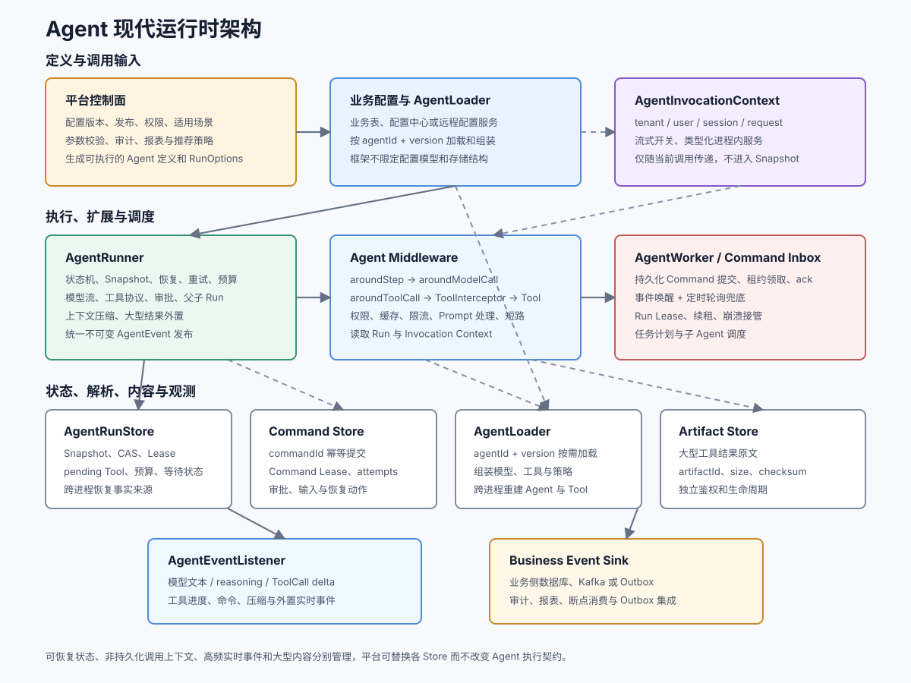

# Agent 智能体概述

<div v-pre>

## Agent 是什么

Agent 是一个可持久化、可恢复、可扩展的智能任务运行时。它围绕用户目标组织模型决策、工具执行、外部等待、状态保存和后台调度，并把整个过程统一到一个可追踪的 `AgentRun` 生命周期中。

默认的 `ToolCallingAgentExecutionMode` 使用模型原生 `ToolCall` 协议推进任务：

```text
用户目标
  → 模型判断是否调用工具
  → AgentRunner 执行 ToolCall
  → ToolMessage 返回模型
  → 模型继续判断
  → 得到最终回答或进入等待状态
```

模型负责基于上下文选择下一步行动，`AgentRunner` 负责可靠地推进运行状态。每次模型响应、工具结果、暂停原因、预算用量和恢复动作都可以保存，并在当前请求或后续 Worker 中继续执行。

## 与普通 ChatModel 的区别

| 能力 | ChatModel | Agent |
| --- | --- | --- |
| 单次模型调用 | 支持 | 支持 |
| 多轮模型与工具闭环 | 业务代码自行编写 | `AgentRunner` 自动推进 |
| 工具调用结果回传 | 业务代码自行执行 | 自动生成 `ToolMessage` |
| 中断后恢复 | 由业务维护上下文 | `AgentRunSnapshot` + `AgentRunStore` |
| 工具审批 | 由业务组织 | `ToolApprovalPolicy` + Resume Command |
| 自动重试调度 | 请求级重试 | Run 级持久化重试 |
| 时间与 Token 预算 | 请求参数 | AgentRun 硬性预算 |
| Worker 与 Lease | 由业务实现调度 | 支持后台领取和租约 |
| 子 Agent | 业务自行编排 | 父子 AgentRun |
| 任务拆分与进度 | 由业务自行建模 | Task Planner + Plan Executor |
| 持久化事件 | 使用外部观测机制 | `AgentRunEventStore` |
| 实时增量事件 | 使用模型回调 | `AgentRuntimeEventStream` 统一模型、工具和运行事件 |
| 调用上下文与横切策略 | 业务自行传递 | `AgentInvocationContext` + `AgentMiddleware` |
| 大型结果处理 | 业务自行截断 | Context Manager + Artifact Store |

::: tip 如何选择
只需要一次问答、摘要、分类或结构化抽取时，直接使用 `ChatModel`。需要工具闭环、暂停恢复、长任务或任务列表时，再使用 Agent。
:::

## 核心能力

### 模型原生工具闭环

默认 `ToolCallingAgentExecutionMode` 在固定的 `MODEL` 和 `TOOLS` 阶段之间推进。模型返回普通消息时结束；返回 ToolCall 时执行工具，再把结果交回模型。平台也可以通过 `AgentExecutionMode` 扩展其他运行模式，而不需要修改 Runner 的生命周期、Checkpoint 和 Worker 机制。

### 可持久化运行状态

每次执行对应一个 `AgentRun`。稳定状态会转换成 `AgentRunSnapshot` 保存到 `AgentRunStore`，其中包含消息、待执行工具、暂停原因、Token 用量、重试次数、父子关系和乐观锁版本。

### 中断与恢复

Run 可以等待用户输入、工具审批、子 Agent 或重试时间。外部系统通过 `AgentResumeCommand` 恢复，不需要重新播放此前所有业务逻辑。

### 长任务调度

`AgentWorker` 从 Store 原子领取可执行 Run，并写入 Worker Lease。租约未过期时其他 Worker 不能重复执行；租约过期后任务可以被重新接管。

### 子 Agent 与任务规划

复杂目标可以通过 `AgentTaskPlanner` 拆成任务列表。`AgentPlanExecutor` 为每个任务创建子 AgentRun，支持指定不同 Agent，并通过 `AgentTaskProgress` 查询当前任务、已完成任务和待执行任务。

### 事件与审计

运行开始、模型调用、工具调用、Checkpoint、暂停、恢复、重试、预算耗尽和最终状态都会写入
`AgentRunEventStore`，消费者可以按 sequence 增量读取。模型文本、推理内容、ToolCall delta、工具进度和
命令消费等高频数据由 `AgentRuntimeEventStream` 实时发布。

### 调用上下文与 Middleware

`AgentInvocationContext` 在一次请求或 Worker 执行期间携带租户、用户、会话、请求 ID 和进程内服务，
但不进入 Checkpoint。`AgentMiddleware` 可以按洋葱模型包装 step、模型和工具调用，用于权限、Prompt
处理、缓存、限流、观测和策略短路，而 `AgentListener` 保持只观察、不改变执行结果。

### 上下文压缩与大型结果外置

`AgentContextManager` 在模型调用前整理持久化消息，内置的按消息数压缩实现会保留最近历史和完整工具
协议。`ToolResultOffloadPolicy` 可以把大型 ToolMessage 原文保存到 `AgentArtifactStore`，消息中只留下
artifactId、大小和校验和，避免 Prompt 和 Snapshot 无限制膨胀。

### 持久化控制与安全执行

取消、审批和恢复不是当前 Java 对象上的临时标记。取消请求写入 `AgentRunStore`，审批命令携带 correlationId 和审计 metadata，Worker 可以领取等待中的已取消 Run 并把它推进到 `CANCELLED`。Tool 执行期间可以通过 `AgentToolInvocation` 读取 Run ID、ToolCall ID 和稳定幂等键。

## 运行时保证与边界

| 能力 | 框架保证 | 应用仍需负责 |
| --- | --- | --- |
| 状态恢复 | Snapshot 保存阶段、消息、策略和待执行工具引用 | 提供持久化 Store 和版本化 Registry |
| 并发推进 | CAS 防止旧 Checkpoint 覆盖，Lease 限制 Worker 执行权 | 数据库实现原子领取、续租和事务 |
| 工具执行 | ToolCall 决策先持久化，逐个结果 Checkpoint | 使用 `AgentToolInvocation.getIdempotencyKey()` 控制外部副作用幂等 |
| 取消 | Store 保存单调取消信号，Runner 在安全边界终止 | 为模型 HTTP 和 Tool 配置底层超时或主动取消 |
| Human-in-the-loop | 暂停原因、correlationId、命令 metadata 可恢复 | 校验审批人权限并选择性写入审计字段 |
| 事件 | 生命周期事件追加、排序和断点读取 | 需要严格一致性时使用事务或 Outbox |
| 调用上下文 | 不写入 Snapshot，避免持久化运行时对象 | 恢复时重新附加租户服务和认证信息 |
| Command Inbox | 命令幂等提交、租约领取、处理标记 | 提供共享 Store，并用通知系统降低唤醒延迟 |
| 大型结果 | Artifact 引用进入 ToolMessage 和 Checkpoint | 提供持久化对象存储并制定保留、鉴权策略 |

Agent 模块提供可靠的智能执行单元，但不声称把外部写操作变成 exactly-once，也不承担跨系统流程图、分布式事务或业务权限系统。

## 架构总览



各组件通过清晰的状态边界协作：

| 组件 | 核心职责 | 主要协作对象 |
| --- | --- | --- |
| `Agent` | 定义模型、指令、工具、策略和扩展模式 | Registry、Runner |
| `AgentRun` | 表示一次任务的消息、阶段、等待和预算状态 | Snapshot、Runner |
| `AgentExecutionMode` | 定义单个 step 的决策与推进逻辑 | ExecutionContext、Runner |
| `AgentRunner` | 管理运行生命周期、Checkpoint、恢复、重试和预算 | Store、Registry、EventStore |
| `AgentInvocationContext` | 携带单次调用身份和进程内依赖，不参与持久化 | Middleware、Tool、ExecutionContext |
| `AgentMiddleware` | 包装 step、模型和工具调用，可转换或短路 | Runner、InvocationContext |
| `AgentRunCommandStore` | 持久化审批、输入和恢复命令 | API、Worker、Runner |
| `AgentArtifactStore` | 保存大型工具结果并返回稳定引用 | Runner、对象存储实现 |
| `AgentRunStore` | 持久化 Snapshot，提供 CAS、任务领取和 Lease | Runner、Worker |
| `AgentRegistry` | 按稳定 ID 和版本解析 Agent 定义 | Runner、PlanExecutor |
| `AgentToolRegistry` | 创建 `AgentToolReference` 并跨进程绑定可执行工具 | Runner、RunStore |
| `AgentWorker` | 从共享 Store 领取并推进后台 Run | RunStore、Runner |
| `AgentPlanExecutor` | 管理任务列表、子 Run 和计划进度 | TaskStore、Runner |

## 适用场景

- 需要查订单、改工单、发邮件等工具闭环的业务助手；
- 工具具有副作用，需要人工审批后才能执行；
- 模型或工具可能暂时失败，需要稍后自动重试；
- 任务可能跨进程、跨分钟或跨小时执行；
- 一个复杂目标需要拆成多个可查看进度的任务；
- 需要多个专业 Agent 分工执行并由根 Agent 汇总；
- 需要审计每次模型调用、工具调用和恢复动作。

## 运行模型与业务协作

默认模式按 `MODEL → TOOLS → MODEL` 推进模型与工具的闭环。平台可以实现 `AgentExecutionMode` 承载规划、反思、监督者或领域专用的 Agent 决策逻辑，并通过 `modeState` 保存可恢复的模式状态。

`AgentTaskPlanner` 和 `AgentPlanExecutor` 提供有序任务列表、任务层级、专业子 Agent 分派和进度查询。跨系统业务流程、并行分支与流程治理可以由工作流模块编排，并将 AgentRun 作为可暂停、可恢复的智能执行单元接入。

## 学习路径

建议按以下顺序阅读：

1. [快速开始](./getting-started.md)：运行第一个工具 Agent。
2. [架构与核心组件](./architecture.md)：理解定义、运行时和 Store 的边界。
3. [Agent 与 AgentRun](./agent-and-run.md)：掌握静态定义和动态状态。
4. [执行循环与状态](./execution-lifecycle.md)：理解阶段、阻塞和终止。
5. [Checkpoint 与恢复](./checkpoint-resume.md)：实现跨请求继续执行。
6. [Worker 与 Lease](./worker-lease.md)：实现后台长任务。
7. [任务规划与进度](./task-planning.md)：拆解任务并查看进度。
8. [生产实践](./production.md)：处理幂等、事务、权限和容量问题。
9. [平台集成与扩展](./platform-integration.md)：建设模式配置、版本、审计、报表和模拟平台。
10. [可运行 Demo](./demos/)：离线运行工具调用、人工审批、Worker 重试和任务规划场景。

</div>
