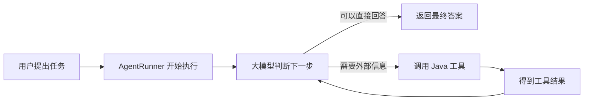

# Agent 概述

## 先用一句话理解 Agent

Agent（智能体）可以理解为一个**会自己判断下一步该做什么的 AI 助手**。

普通的大模型通常只负责“根据问题生成回答”。Agent 除了能回答问题，还可以调用你提供的 Java 方法去查询数据、发送请求或执行操作，并根据执行结果继续思考，直到任务完成。

例如，用户问：

> 帮我查一下上海今天的天气，如果下雨就提醒我带伞。

一个 Agent 大致会这样工作：

1. 大模型发现自己不知道实时天气，决定调用“天气查询”工具。
2. Agents-Flex 执行对应的 Java 方法，把“上海”作为参数传进去。
3. 工具返回天气数据。
4. 大模型根据数据组织答案，并提醒用户是否需要带伞。

这里，大模型负责“做决定”，Java 工具负责“真正做事”，Agents-Flex Agent 负责把整个过程可靠地串起来。

## 它和普通聊天有什么不同

| 对比项 | 普通大模型聊天 | Agent |
| --- | --- | --- |
| 主要能力 | 根据已有知识生成文字 | 生成文字，也能调用工具完成任务 |
| 执行步骤 | 通常是一问一答 | 可以经过多次“思考、调用工具、继续回答” |
| 实时数据 | 不能凭空知道 | 可以通过工具查询数据库或第三方接口 |
| 敏感操作 | 通常不涉及实际操作 | 可以在执行前要求人工确认 |
| 长任务 | 请求中断后较难继续 | 可以保存进度，之后恢复 |

如果你只需要让模型写一段文字、做摘要或翻译，直接使用 `ChatModel` 就够了。如果任务需要模型自己选择工具、根据中间结果调整下一步，Agent 会更合适。

## 一次任务是怎样完成的

下面这张图展示了最常见的执行过程：



大模型可能调用一次工具，也可能连续调用多个工具。`AgentRunner` 会不断推进这个过程，直到出现以下情况之一：

- 任务完成，得到最终答案；
- 需要用户补充信息；
- 某个操作需要人工审批；
- 发生无法继续的错误；
- 达到你设置的次数、时间或 Token 上限。Token 是大模型统计文本用量的基本单位，也通常会影响调用费用。

因此，调用 `run(...)` 后不能假定任务一定成功完成，还需要查看返回的状态。

## 先认识 4 个核心对象

初次使用时，只需要先记住下面 4 个名字：

| 对象 | 可以把它理解为 | 主要作用 |
| --- | --- | --- |
| `Agent` | AI 助手的岗位说明书 | 配置模型、系统指令、工具和执行规则 |
| `Tool` | AI 助手可以使用的工具 | 把 Java 方法提供给大模型调用 |
| `AgentRunner` | 任务执行器 | 调用模型、执行工具并推动任务继续进行 |
| `AgentTurn` | 某一次具体任务 | 保存这次任务的状态、消息、结果和统计信息 |

它们之间的关系是：一个 `Agent` 可以重复处理很多任务；每收到一个新任务，就创建一个新的 `AgentTurn`；`AgentRunner` 负责执行它。

::: tip 一个容易混淆的地方
`Agent` 不是某一次对话本身。它更像一份可重复使用的配置，而 `AgentTurn` 才代表“用户这一次交代的任务”。
:::

## 最小使用示例

下面省略了 `ChatModel` 和天气工具的具体创建代码，只展示 Agent 的基本用法：

```java
Agent agent = Agent.builder("weather-assistant")
    .instructions("回答天气问题时，先调用天气查询工具，不要猜测实时天气。")
    .chatModel(chatModel)
    .tool(weatherTool)
    .build();

AgentRunner runner = new AgentRunner();
AgentTurn turn = runner.run(agent, "上海今天天气怎么样？");

if (turn.getStatus() == AgentTurnStatus.COMPLETED) {
    System.out.println(turn.getFinalOutput());
} else {
    System.out.println("任务当前状态：" + turn.getStatus());
}
```

这段代码做了三件事：

1. 创建一个 Agent，并告诉它能使用哪个模型和工具。
2. 使用 `AgentRunner` 执行用户任务。
3. 根据 `AgentTurn` 的状态读取结果或进行后续处理。

完整可运行的依赖、模型和工具代码，请直接查看[快速开始](./getting-started)。

## Agent 能处理哪些场景

### 调用业务工具

你可以把查询天气、搜索商品、读取订单、生成文件等 Java 能力包装成 `Tool`。大模型会根据工具名称、说明和参数定义，判断何时调用它。

工具描述要尽量清楚。大模型并不知道 Java 方法内部做了什么，它只能根据你提供的名称和描述来选择工具、填写参数。

### 执行前让人确认

退款、删除数据、发送通知等操作有实际影响，不应该让模型直接执行。你可以为这些工具配置人工审批：Agent 会先暂停，等用户同意后再继续。

详见[人工审批](./human-approval)。

### 等待用户补充信息

当任务缺少必要参数时，Agent 可以暂停并向用户展示表单。用户填写后，原任务从暂停的位置继续，不需要从头执行。

详见[表单输入](./form-input)和[挂起与恢复](./suspend-resume)。

### 保存进度并恢复

长任务可能遇到服务重启、网络错误，或者需要等待几小时后审批。Agents-Flex 可以把 `AgentTurn` 保存成 Snapshot（任务快照），稍后从原来的进度继续。

可以把 Snapshot 理解为游戏存档：它记录任务执行到了哪里，但真正继续执行任务的仍然是 `AgentRunner`。

详见[Snapshot 持久化](./snapshot)。

### 控制成本和执行风险

Agent 可能连续多次调用模型或工具。你可以限制：

- 最多调用模型多少次；
- 最多执行多少个步骤；
- 最多调用多少次工具；
- 最多消耗多少 Token；
- 最长运行多长时间；
- 失败后是否自动重试。

这些限制可以防止任务因为模型判断不理想而长时间循环，也方便控制成本。详见[运行限制与预算](./budget)、[超时与过期](./timeouts)和[错误处理与重试](./retry)。

## 应该选择哪个运行入口

刚开始接入时，通常从 `run(...)` 开始。等需要长任务或后台任务时，再使用 `start(...)` 和 `AgentWorker`。

| 你的需求 | 推荐方式 | 简单说明 |
| --- | --- | --- |
| 在当前请求中执行一个短任务 | `runner.run(...)` | 立即开始，并运行到完成、失败或暂停 |
| 先创建任务，稍后在后台执行 | `runner.start(...)` | 只创建任务，不会自动启动新线程 |
| 用户提交了审批或表单 | `runner.resume(...)` | 恢复原来的暂停任务并立即继续 |
| 由后台 Worker 恢复任务 | `runner.submitResume(...)` | 把任务变回可执行状态，交给 Worker 处理 |

`start(...)` 的含义只是“创建并保存任务”。要让它在后台真正运行，还需要配置 `AgentWorker`。

## 一次任务和一段对话的区别

在 Agents-Flex 中，一个 `AgentTurn` 只代表一次用户任务。例如：

1. 用户问“上海天气怎么样？”，这是第一个 Turn。
2. 用户接着问“那北京呢？”，这是第二个 Turn。

如果希望第二个问题能看到前面的聊天记录，需要由业务系统使用同一个会话 ID，并通过 `ChatMemory` 保存和读取历史消息。

如果某个 Turn 正在等待审批或用户输入，应该恢复这个 Turn，而不是把审批结果当成一个新的聊天问题。

## 什么时候适合使用 Agent

适合使用 Agent 的场景：

- 下一步做什么需要大模型根据当前情况判断；
- 一个任务可能调用多个工具；
- 工具结果会影响后续步骤；
- 任务可能暂停、审批、重试或跨进程恢复；
- 需要限制模型和工具的调用次数与成本。

不一定需要 Agent 的场景：

- 只需要生成一次文本：直接使用 `ChatModel` 更简单；
- 每一步都固定且可预先写好：普通 Java 代码或工作流引擎更清晰；
- 操作不能接受模型判断的不确定性：应由确定性的业务规则控制。

## 从本地示例到生产环境

`new AgentRunner()` 使用的是进程内配置，适合本地学习和简单测试。服务一旦重启，未持久化的任务状态就无法恢复。

正式环境通常还需要配置：

- `AgentTurnStore`：把任务快照保存到持久化存储中；
- `AgentLoader`：根据 Agent 的 ID 和版本重新加载配置；
- `ChatMemory`：保存多轮会话消息；
- `AgentEventListener`：记录日志、监控状态，或向前端推送进度；
- `AgentWorker`：在后台领取并执行长任务。

不需要一开始就把这些组件全部接上。建议先让一个简单的 Agent 成功调用工具，再根据实际业务逐步加入持久化、审批和后台执行。

## 推荐阅读顺序

如果你是第一次接触 Agent，建议按下面的顺序阅读：

1. [快速开始](./getting-started)：运行第一个可以调用工具的 Agent。
2. [Agent 配置](./agent)：了解怎样配置模型、指令和工具。
3. [AgentRunner](./agent-runner)：了解任务如何被创建和执行。
4. [AgentTurn](./agent-turn)：认识任务状态和运行结果。
5. [挂起与恢复](./suspend-resume)：让任务等待审批或用户输入。
6. [任务快照持久化](./store)：让任务在服务重启后仍能继续。
7. [Worker](./worker)：把长任务放到后台执行。

遇到问题时，可以查看[常见问题](./faq)。如果需要了解完整的内部设计，再阅读[架构设计](./architecture)。
