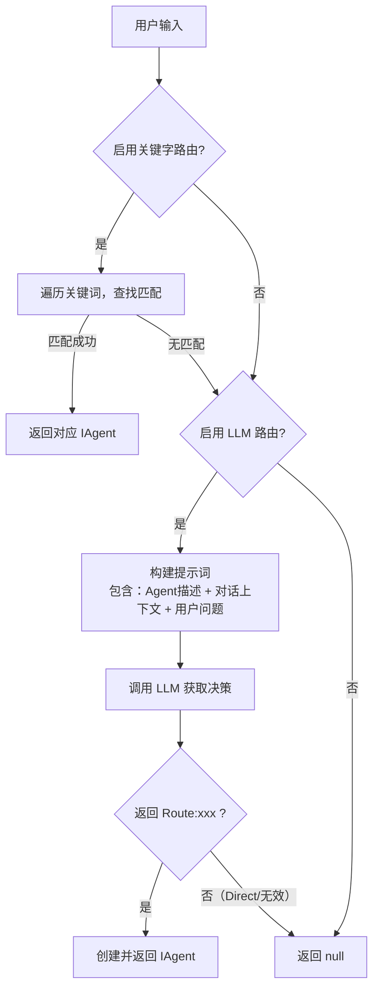

# Routing Agent 智能体路由
<div v-pre>


## 一、概述

`RoutingAgent` 是 Agents-Flex 框架中的**智能路由核心组件**，用于根据用户输入自动选择最合适的处理逻辑（即 `IAgent` 实例）。它支持**关键字快速匹配**与**大语言模型（LLM）智能路由**两种机制，适用于构建多智能体协作系统（如智能体中台、多插件问答系统等）。

> 📌 **核心原则**：
> - **只返回 Agent 或 null**：若用户问题需直接回答（如问候语），RoutingAgent 返回 `null`，由上层逻辑处理。
> - **可扩展、可配置、低耦合**：支持灵活注册、自定义提示词、开关路由策略。


## 二、核心类介绍

### 1. `RoutingAgent`
入口类，执行路由决策逻辑。

- **输入**：用户查询、对话历史、可用 Agent 列表、LLM 模型
- **输出**：匹配的 `IAgent` 实例，或 `null`
- **路由策略**：
    - 关键字匹配（快速、低开销）
    - LLM 智能路由（灵活、语义理解强）

### 2. `RoutingAgentRegistry`
Agent 注册中心，管理所有可路由的 Agent。

- 注册 Agent 名称、描述、工厂、关键词
- 提供描述列表（用于 LLM 提示）
- 支持关键字快速查找

### 3. `RoutingAgentFactory`
函数式接口，用于动态创建 `IAgent` 实例。

- 接收 `chatModel`、`userQuery`、`memoryPrompt` 作为上下文
- 允许每个 Agent 按需初始化（如加载不同工具、记忆等）


## 三、快速入门

### 步骤 1：定义你的 Agent 工厂

```java
RoutingAgentFactory weatherFactory = (chatModel, userQuery, memoryPrompt) ->
    new ReActAgent(userQuery);
```

### 步骤 2：注册到 RoutingAgentRegistry

```java
RoutingAgentRegistry registry = new RoutingAgentRegistry();
registry.register(
    "weather",
    "处理天气查询，如‘今天北京天气如何？’",
    Arrays.asList("天气", "气温", "预报"),
    weatherFactory
);
```

### 步骤 3：创建并使用 RoutingAgent

```java
ChatModel chatModel = ...; // 你的 LLM 模型
String userQuery = "明天下雨吗？";
MemoryPrompt history = ...; // 对话历史

RoutingAgent router = new RoutingAgent(chatModel, registry, userQuery, history);
IAgent agent = router.route(); // 返回 WeatherAgent 实例
```

> ✅ 若用户输入含“天气”、“下雨”等关键词，将**直接命中** WeatherAgent，无需调用 LLM。


## 四、进阶用法

### 1. 自定义路由提示模板

默认提示要求 LLM 严格输出 `Route:xxx` 或 `Direct:xxx`。你可覆盖默认模板：

```java
String customPrompt = """
你是一个路由专家。可用模块：
{agent_descriptions}

请仅输出：Route:[模块名] 或 Direct:[回答]
上下文：
{conversation_context}
用户问题：
{user_input}
""";

router.setRoutingPromptTemplate(customPrompt);
```

> ⚠️ 注意：**必须保留 `{agent_descriptions}`、`{conversation_context}`、`{user_input}` 三个占位符**。

### 2. 控制路由策略开关

```java
// 仅用关键字匹配（关闭 LLM 调用，节省成本）
router.setEnableLlmRouting(false);

// 仅用 LLM 路由（关闭关键字，避免误匹配）
router.setEnableKeywordRouting(false);
```

### 3. 设置 LLM 调用参数

```java
ChatOptions options = new ChatOptions();
options.setTemperature(0.0); // 确定性路由
options.setMaxTokens(50);
router.setChatOptions(options);
```

### 4. 多关键词与描述优化

- 关键词不区分大小写，支持部分匹配（`contains`）
- 描述应**具体、无歧义**，便于 LLM 理解能力边界

```java
registry.register("order",
    "处理订单查询、取消、物流跟踪，例如‘查一下我的订单号123’",
    List.of("订单", "物流", "发货", "取消订单"),
    orderFactory
);
```

---

## 五、路由决策流程详解



> 📝 **上下文摘要**：默认取最近 4 轮对话（User + AI），避免提示词过长。

---

## 六、注意事项与最佳实践

### ✅ 推荐做法

- **关键词尽量具体**：避免“查询”、“帮助”等泛词，防止误匹配。
- **描述清晰聚焦**：每个 Agent 职责单一，描述体现其能力边界。
- **LLM 提示模板保持简洁**：强调格式约束（`Route:` / `Direct:`），减少自由发挥。
- **关闭 Direct 回答处理**：RoutingAgent 不处理 `Direct:`，由上层统一兜底（如通用对话 Agent）。

### ⚠️ 常见陷阱

- **Agent 名称不一致**：注册名与 LLM 输出名必须完全一致（大小写敏感）。
- **未注册 Agent 导致 null**：若 LLM 返回未注册的 Agent 名，`createAgent` 返回 `null`。
- **对话历史为空**：确保 `MemoryPrompt` 已正确注入历史消息。
- **LLM 输出格式错误**：若模型输出“我认为应该路由到 weather”，将被当作无效，返回 `null`。

### 🔒 异常处理

- 所有异常被捕获并记录，**始终安全返回 `null`**，不影响主流程。
- 建议上层在 `route() == null` 时启用默认响应逻辑（如通用对话或提示“无法理解”）。


## 七、扩展建议

- **增加缓存层**：对高频查询缓存路由结果。
- **引入置信度评分**：解析 LLM 输出时加入置信度，低于阈值转人工。
- **支持正则表达式关键词**：增强关键字匹配能力（需改造 `findAgentByKeyword`）。
- **Agent 描述动态生成**：根据用户角色/权限动态调整可用 Agent 列表。

</div>
