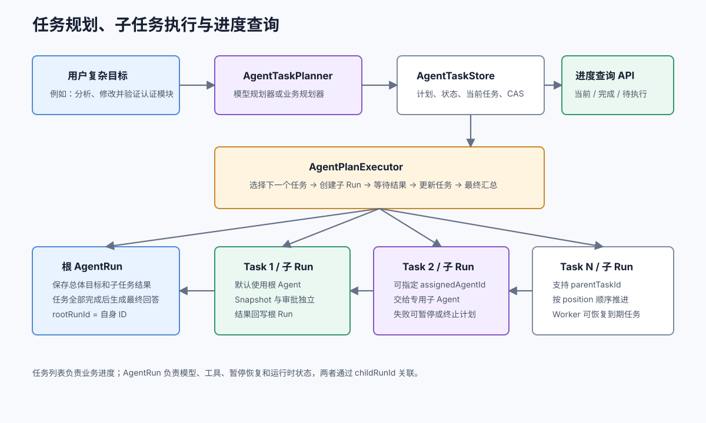

# 任务规划与进度

<div v-pre>

## 什么时候需要任务计划

普通工具闭环不一定需要任务列表。以下情况适合启用：

- 目标需要多个可独立验证的步骤；
- 用户需要看到“正在做什么、完成了什么”；
- 不同任务要交给不同专业 Agent；
- 某个任务可能审批、重试或长时间等待；
- 希望任务完成后由根 Agent 统一汇总。



## 组件职责

| 组件 | 职责 |
| --- | --- |
| `AgentTaskPlanner` | 根据目标生成结构化任务列表 |
| `AgentTask` | 单个任务、父任务、负责人和执行结果 |
| `AgentTaskPlanSnapshot` | 整个计划的持久化状态 |
| `AgentTaskStore` | 保存计划并通过 version 防止覆盖 |
| `AgentPlanExecutor` | 选择任务、创建子 Run、更新进度、最终汇总 |
| `AgentTaskProgress` | 面向 API/UI 的任务进度视图 |

## 使用模型规划器

```java
Agent agent = Agent.builder("coding-agent")
    .instructions("你是代码分析与修复助手")
    .chatModel(chatModel)
    .tools(tools)
    .taskPlanner(new ModelAgentTaskPlanner(10))
    .build();
```

`ModelAgentTaskPlanner` 要求模型输出结构化 JSON：

```json
{
  "tasks": [
    {
      "id": "inspect",
      "title": "分析认证模块",
      "description": "定位入口、状态和 Token 刷新逻辑"
    },
    {
      "id": "implement",
      "parentTaskId": "inspect",
      "title": "修改实现",
      "description": "修复并保持现有 API 兼容"
    },
    {
      "id": "test",
      "title": "运行测试",
      "assignedAgentId": "testing-agent"
    }
  ]
}
```

执行前会校验任务 ID 唯一、父任务存在且不能引用自身。`parentTaskId` 表示任务层级，`position` 决定任务的执行顺序。

## 自定义业务规划器

固定流程或强业务约束不应该完全交给模型：

```java
AgentTaskPlanner planner = (definition, context) ->
    new AgentTaskPlan(context.getGoal(), Arrays.asList(
        AgentTask.builder("校验申请数据")
            .id("validate")
            .position(0)
            .build(),
        AgentTask.builder("执行审批")
            .id("approve")
            .parentTaskId("validate")
            .assignedAgentId("approval-agent")
            .position(1)
            .build()
    ));
```

## 创建执行器

```java
AgentPlanExecutor executor = new AgentPlanExecutor(
    agentRunner,
    new InMemoryAgentTaskStore()
);
```

生产环境应替换成数据库 Task Store。

## 三种执行方式

### 创建并自动执行

```java
AgentPlanRun result = executor.run(agent, goal);
```

会持续执行任务，最后让根 Agent 汇总，直到完成或阻塞。

### 只创建计划

```java
AgentTaskPlanSnapshot plan = executor.start(agent, goal);
```

适合先展示计划，让用户确认后再执行。

### 每次推进一个任务

```java
AgentPlanRun result = executor.runNext(plan.getPlanId());
```

一个任务内部仍会执行到终止或阻塞，但不会自动开始下一个任务。

## 查询任务列表

```java
AgentTaskProgress progress = executor.getProgress(planId);

System.out.println(progress.getStatus());
System.out.println(progress.getCurrentTask());
System.out.println(progress.getCompletedTaskCount());
System.out.println(progress.getFailedTaskCount());

for (AgentTask task : progress.getTasks()) {
    System.out.println(task.getPosition()
        + " " + task.getTitle()
        + " " + task.getStatus());
}
```

也可以通过根 Run 查询：

```java
executor.getProgressByRootRunId(rootRunId);
```

UI 可以展示：

```text
[COMPLETED] 分析认证模块
[RUNNING]   修改 Token 刷新逻辑
[PENDING]   增加异常场景测试
[PENDING]   运行完整测试
```

## Task 状态

| 状态 | 含义 |
| --- | --- |
| `PENDING` | 尚未选择 |
| `READY` | 可以执行 |
| `RUNNING` | 子 Run 正在执行 |
| `WAITING` | 子 Run 等待审批、用户或重试 |
| `COMPLETED` | 子 Run 成功完成 |
| `FAILED` | 子 Run 失败 |
| `SKIPPED` | 被策略跳过 |
| `CANCELLED` | 子 Run 被取消 |

具体等待原因读取 `AgentTaskProgress.getActiveRunStatus()` 和 `getActiveSuspension()`，避免 Task 再复制一套 Run 状态。

## 指定子 Agent

```java
AgentTask task = AgentTask.builder("执行安全审计")
    .assignedAgentId("security-agent")
    .position(2)
    .build();
```

未指定时使用根 Agent。指定后，Executor 通过 `AgentRegistry.resolveLatest(assignedAgentId)` 为新子任务选择最新注册的 Agent 定义；子 Run 创建后会冻结实际的 `agentId + agentVersion`。

## 恢复计划中的阻塞任务

```java
AgentPlanRun waiting = executor.run(agent, goal);

AgentTaskProgress progress = executor.getProgress(
    waiting.getPlan().getPlanId()
);

String callId = progress.getActiveSuspension().getCorrelationId();

AgentPlanRun completed = executor.resume(
    progress.getPlanId(),
    AgentResumeCommand.approveTool(callId)
);
```

恢复命令先作用于当前 activeRun，然后 Executor 更新任务状态并继续后续任务。

## Worker 完成任务后的继续推进

Worker 可能在后台完成一个到期重试子 Run。计划仍保存 activeRunId，随后调用：

```java
executor.runUntilBlocked(planId);
```

Executor 会读取已经终止的子 Run，更新当前任务并继续计划。

## 执行特性

- 当前按 `position` 顺序执行，不并行调度任务；
- `parentTaskId` 表达任务层级，跨任务流程依赖可以由外部工作流模块协调；
- 一个失败任务默认终止计划；
- 规划模型调用本身由 Planner 执行，不属于根 AgentRun 的模型循环；
- 生产环境应让 TaskStore 和 RunStore 使用协调事务或可靠事件处理关键跨 Store 状态。

## 下一步

- [自动任务规划 Demo](./demos/planned-agent.md)
- [长任务恢复场景](./scenarios/long-running-task.md)
- [生产实践](./production.md)

</div>
