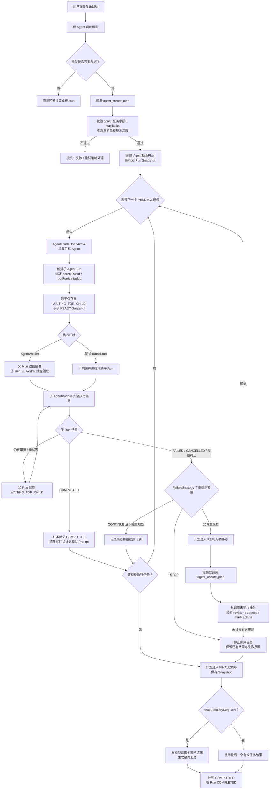

# 任务规划

## 概述

任务规划让模型在同一个 Agent 入口中自行判断是否拆解复杂目标。简单问题仍可直接回答；复杂问题可调用框架内置规划工具，创建按顺序执行的任务列表。每个任务由独立子 `AgentRun` 执行，因此继续继承审批、重试、预算、Worker 和事件能力。

规划不是通用 DAG 引擎：当前计划按任务顺序推进，一次只维护一个活动任务。它适合动态拆解、委派和最终汇总；固定并行编排应由上层调度系统处理。

## 整体执行流程

任务规划仍运行在普通 `AgentRunner` step 循环中。规划工具负责建立或调整计划，真正的任务则由独立子 `AgentRun` 执行。



### 主路径说明

1. 根模型可以直接回答，也可以调用 `agent_create_plan`。调用方始终使用同一个 Runner 入口，不需要预先选择“普通模式”或“规划模式”。
2. Runner 接受计划后，只选择一个 `PENDING` 任务，并通过 `AgentLoader.loadActive` 装配目标 Agent。
3. 父 Run 的等待状态与子 Run 的初始状态通过 `saveParentAndChild` 原子保存，避免出现孤儿子任务或永久等待的父任务。
4. 同步调用会递归推进子 Run；Worker 模式只推进当前持有 Lease 的 Run，子 Run 留给后续 Worker 独立领取。
5. 子 Run 终止后，`resumeParentFromChild` 幂等地更新任务状态、累计子任务用量，并把受长度限制的结果写回父 Prompt。
6. 所有任务结束后进入 `FINALIZING`。默认再次调用根模型汇总；关闭最终汇总时直接使用最后一个有效任务结果。

### 失败与重规划路径

子 Run 非正常终止时，`FailureStrategy.STOP` 会停止剩余任务；`CONTINUE` 会在有额度且允许修改或追加任务时进入 `REPLANNING`，否则记录失败后继续原计划。重规划只能修改尚未执行的任务，且受 `maxReplans`、`taskRevisionAllowed`、`taskAppendAllowed` 和 `maxTasks` 共同约束。

## 开启规划

```java
Agent root = Agent.builder("delivery-agent")
    .description("负责分析、验证并汇总交付结论")
    .instructions("复杂目标可以创建少量任务，简单问题直接回答。")
    .chatModel(rootModel)
    .planningPolicy(AgentPlanningPolicy.builder()
        .enabled(true)
        .allowAgent("analysis-agent")
        .allowAgent("test-agent")
        .maxTasks(6)
        .maxDepth(2)
        .maxReplans(1)
        .build())
    .build();

AgentRunner runner = new AgentRunner(runStore,
    new InMemoryAgentLoader(root, analyst, tester));
```

委派白名单必须与 Loader 中可加载的 Agent ID 对应。允许列表是授权边界，不只是给模型的提示。

## 内置规划工具

开启后，Runner 向模型注入：

- `agent_create_plan`：提交 goal 和 tasks。
- `agent_update_plan`：在允许重规划时更新尚未执行的任务。

每个任务至少包含稳定 `id`、`title` 和 `description`，可带 `expectedOutput` 与 `assignedAgentId`。Runner 校验任务数量、委派目标和修改规则后才接受计划。

## 执行过程

1. 根模型创建 `AgentTaskPlan`。
2. Runner 选择下一个 `PENDING` 任务。
3. 创建子 Run，父 Run 进入 `WAITING_FOR_CHILD`。
4. 子 Run 完成后，结果写回任务和父 Prompt。
5. 子 Run 失败时，按策略停止或进入 `REPLANNING`。
6. 所有任务结束后，根模型生成最终汇总；也可配置不要求汇总，使用最后任务结果结束。

父计划和父 Snapshot 同版本保存，避免独立计划存储与 Run 状态不一致。

## 查询进度

```java
AgentTaskProgress progress = runner.getTaskProgress(rootRunId);
System.out.printf("%d/%d%n",
    progress.getCompletedTaskCount(), progress.getTotalTaskCount());

for (AgentTask task : progress.getTasks()) {
    System.out.println(task.getStatus() + " " + task.getTitle());
}
```

`AgentTaskProgress` 是查询时的不可变视图，适合任务列表、进度条和审批页面。持续更新 UI 时应重新查询或订阅事件，不要期待旧对象自动变化。

## 规划约束

策略可控制：最大任务数、最大规划深度、重规划次数、是否允许修改已有待办、是否允许追加任务、子结果写回父级的最大长度，以及是否需要最终摘要。

限制深度和任务数可以防止模型产生无界任务树。即使允许 Agent 委派给自身，也会创建新的子 Run 并增加 planning depth。

## 重规划

当任务失败且策略允许时，计划进入 `REPLANNING`，模型可调整尚未执行部分。已完成任务不会被重新定义，避免已经产生副作用的步骤被模型任意改写。达到 `maxReplans` 后不再接受更新。

## 提示词建议

根 Agent 指令应说明何时值得规划、每个任务的粒度和最终输出要求；子 Agent 描述应明确能力边界。不要要求模型为问候等简单请求强制规划，这会增加延迟与成本。

## 自定义与限制

当前 Runner 识别固定规划工具并负责调度，不应自行创建同名业务工具。需要并行任务、依赖图或人工修改计划时，可以把 `AgentTaskPlan` 作为领域参考，在外部编排层实现，并继续使用普通子 Run 作为可靠执行单元。
