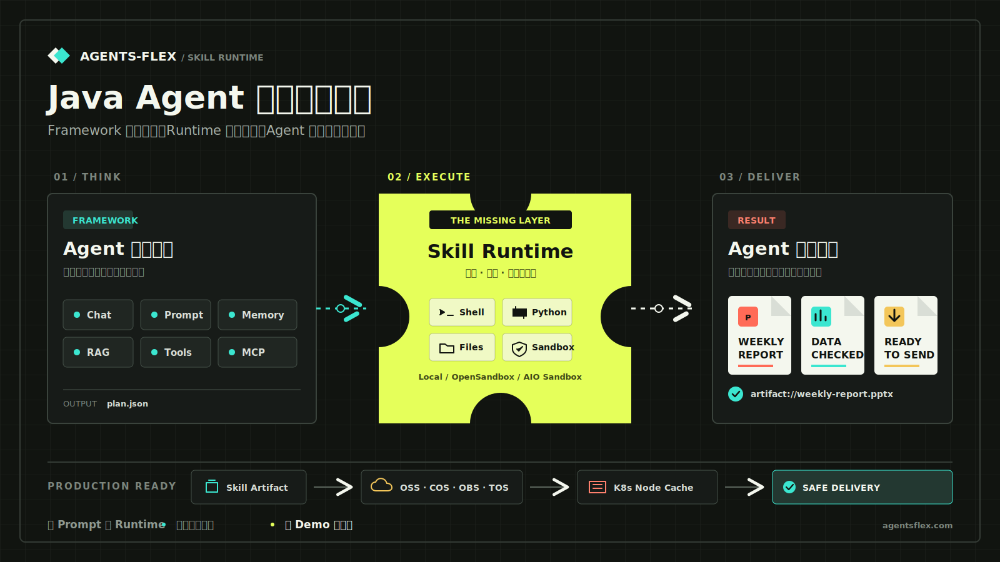
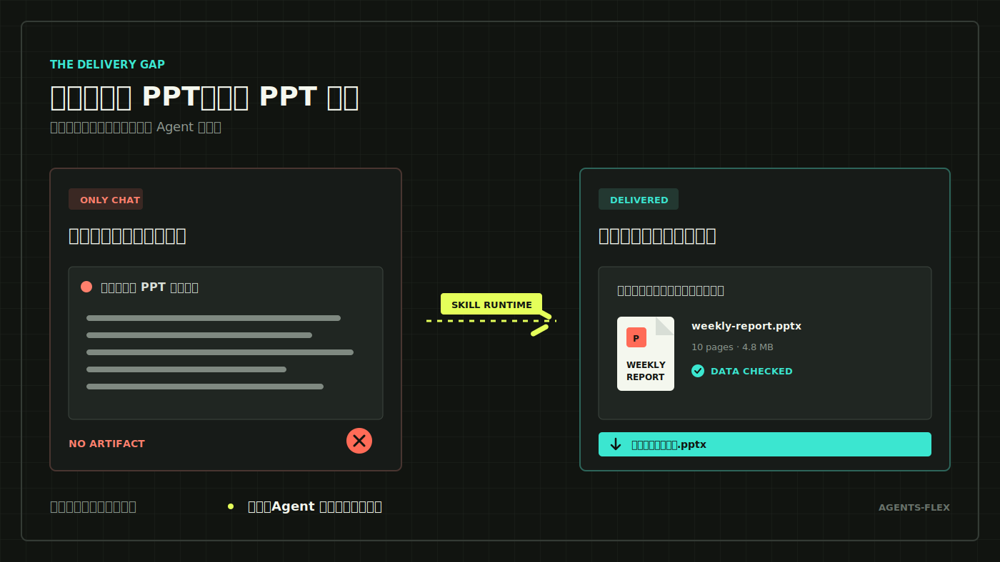
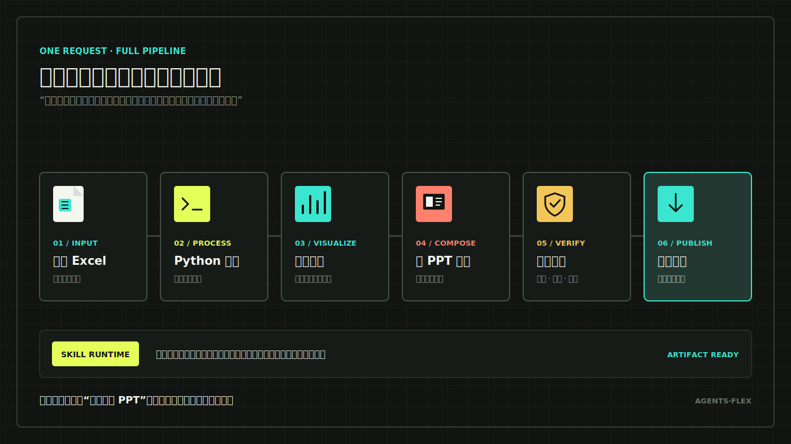
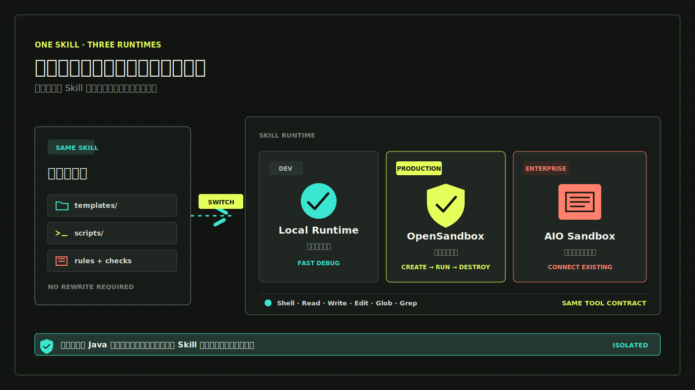
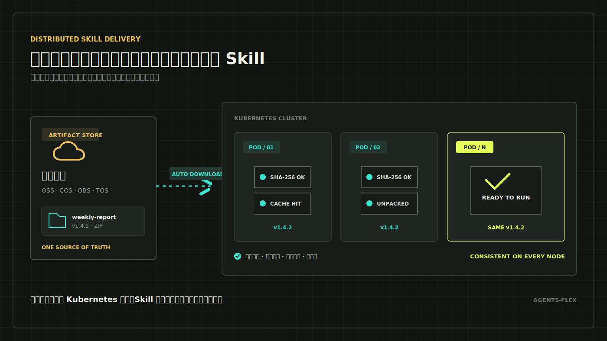

# 牛牛牛，Agent-flex Skill 运行时发布了！！！

是的，终于来了。

**Agents-Flex Skill Runtime 正式发布！**



*Framework 负责思考，Runtime 负责执行，Agent 最终交付成品。*

这次发布的，不是又给 Agent 增加了一段 Prompt，也不是简单地把 `SKILL.md` 读进上下文。

我们真正补上的是一整套 Skill 运行时：从本地执行到 Sandbox 隔离，从文件读写、Shell 命令到最终产物发布，再到分布式部署下的对象存储和节点缓存，一条链路全部打通。

简单说，以前的 Agent 是“知道该怎么做”；有了 Skill Runtime，它终于可以在一个真正可控的环境里，把事情做完。

这件事为什么值得连说三声“牛”？

因为很多团队做 Agent，都经历过下面这个尴尬时刻。

老板说：“把这份销售数据做成一份周报，套用公司的 PPT 模板，图表用品牌色，最后把文件发给我。”

Agent 很快回复了几千字，还贴心地告诉你：“你可以按照以下步骤制作 PPT……”

但老板要的不是步骤，他要的是一个能直接下载、打开、汇报的 PPTX 文件。

这就是今天很多 Agent 的真实处境：**看起来什么都会，真正交付的时候，总差最后一公里。**



*用户要的是能打开、能汇报、能直接发送的文件，而不是一篇制作教程。*

而这次发布的 Agents-Flex Skill Runtime，就是来打通这最后一公里的。

它让 Java Agent 可以使用团队现成的模板和脚本，在安全环境里执行任务，检查生成结果，再把最终文件交到用户手上。

## 先看效果：老板要 PPT，Agent 就真的交付 PPT

我们先看一个最常见的场景。

运营同学上传一份 Excel，然后对 Agent 说：

> 帮我做一份本周经营分析。使用公司的汇报模板，重点分析销售额、转化率和区域排名。控制在 10 页以内，生成后检查数字是否正确，最后给我下载链接。

这个任务听起来简单，实际上包含了一长串工作：

- 读取和清洗 Excel；
- 按照公司口径计算指标；
- 生成图表；
- 套用指定 PPT 模板；
- 检查页数、标题、关键数字和文件格式；
- 上传文件并返回下载地址。



*一句“帮我生成本周经营分析”，背后是一整条由 Skill Runtime 驱动的生产链路。*

如果只靠一段 Prompt，模型很容易在某一步“自由发挥”。模板可能用错，脚本可能临时乱写，结果生成了却没有检查，最后甚至只返回一个服务器上的文件路径，用户根本打不开。

使用 Agents-Flex Skills 后，这套工作可以直接沉淀为团队的“经营周报能力”。公司模板、指标口径、生成脚本、品牌规范和验收程序都放在一起，Agent 接到任务后，按照团队已经验证过的流程去执行。

这里最重要的变化是：

**以前是让模型现场想办法，现在是让模型调用团队已经打磨好的办法。**

生成完成后，Agent 还可以继续检查：PPT 能不能正常打开，页数对不对，关键指标有没有遗漏，文件大小是否合理。配置 `PublishFile` 后，最终产物可以直接变成用户可访问的 URL。

用户拿到的是结果，不是一篇教程。

这类场景不只适用于 PPT。合同 PDF、财务 Excel、项目 Word、数据分析报告、营销图片、代码扫描报告，都可以用同样的方式交付。

## 真正的重头戏：Agent 能运行脚本，但不会直接祸害服务器

一旦 Agent 开始“干活”，就绕不开执行脚本。

比如生成 PPT 要运行 Python，分析数据要处理文件，研发 Agent 要执行构建和测试，内容 Agent 可能还要转换图片、压缩文件。

开发环境里，直接在本机运行当然方便。但到了生产环境，事情就完全不同了。

假设用户上传了一份文件，Agent 根据文件内容拼出一条命令；或者团队接入了一个第三方能力包，其中带有你并不完全熟悉的脚本。这个脚本如果直接继承 Java 服务的权限，就可能读取服务器文件、访问内网、占满 CPU，甚至影响同一台机器上的其他业务。

所以，生产级 Agent 不能只有“执行能力”，还必须有“执行边界”。

这正是这次发布的核心：`SkillRuntime`。

你可以把 Runtime 理解成 Agent 的工作间。Agent 需要读文件、写文件、查内容、跑命令，都在这个工作间里完成。至于这个工作间是在开发者电脑上，还是在一个隔离的 Sandbox 里，由项目自己选择。

而且我们没有只做一个接口就宣布完工。这次直接提供了三种可用方式：

| 使用阶段 | 推荐 Runtime | 来源与特点 |
| --- | --- | --- |
| 本地开发和调试 | `LocalSkillRuntime` | 直接在当前机器执行，上手最快 |
| 生产任务、按需隔离 | `OpenSandboxSkillRuntime` | 对接阿里开源的 OpenSandbox，按任务创建独立 Sandbox |
| 已有常驻沙箱服务 | `AioSandboxSkillRuntime` | 对接字节跳动开源的 AIO Sandbox，连接已经运行的 All-in-One 沙箱 |



*开发时本机快速调试，上线后隔离执行；切换 Runtime，不重写 Skill。*

### 阿里 OpenSandbox：一个任务，一个独立工作间

OpenSandbox 是阿里开源的通用 Sandbox 平台。它把“管理沙箱”和“在沙箱里执行任务”拆开：OpenSandbox Server 负责创建、管理和回收实例，真正的脚本则在隔离的运行环境中执行。

Agents-Flex 接入 OpenSandbox 后，可以在任务开始时创建一个独立 Sandbox，把当前任务需要的能力文件自动上传进去，然后让 Agent 在里面执行命令、读写文件。任务结束后，Runtime 会关闭并销毁本次创建的实例。

这种方式很适合生产环境：不同任务之间相互隔离，Sandbox 的镜像、CPU、内存、超时时间、环境变量和网络策略也可以按部署要求控制。尤其是需要执行第三方脚本或处理用户文件时，按任务创建、用完回收，会让安全边界清楚很多。

### 字节 AIO Sandbox：一个容器，把常用开发环境都装进去

AIO Sandbox 是字节跳动开源的 All-in-One Sandbox。顾名思义，它把 Shell、文件操作、浏览器、Jupyter、VNC、终端和 Code Server 等能力放进同一个沙箱服务中。

Agents-Flex 当前主要使用它的 Shell 和文件 API。Java 应用连接一个已经运行的 AIO Sandbox，把能力文件上传进去，再通过 HTTP API 执行命令和读写文件。Runtime 关闭时只清理本地状态，不会替你停止这个常驻服务。

如果团队希望快速搭建一套功能完整、长期运行的沙箱环境，或者已经部署了 AIO Sandbox，直接接入会很方便。它也很适合开发测试、内部环境和固定沙箱服务模式。

最让开发者省心的一点是，切换 Runtime 不需要重写那套业务能力。

开发时，团队可以先用 Local Runtime 快速调试。准备上线时，把 Runtime 换成 OpenSandbox 或 AIO Sandbox，Agent 仍然使用同样的 `Bash`、`Read`、`Write`、`Edit`、`Glob`、`Grep` 工具，原来的模板、脚本和操作流程也不用跟着改。

也就是说：

**本地跑得快，线上隔离跑；开发体验和生产安全，不必二选一。**

远程模式下，Agents-Flex 会把任务需要的能力文件上传到 Sandbox，并把路径自动换成沙箱里的可访问路径。脚本在沙箱里执行，文件在沙箱里读写，生成的 PDF、PPTX、图片或压缩包再下载回来或发布出去。

对于企业来说，这一点很关键。因为只有把执行边界管住，Agent 才有机会从“内部 Demo”走向真正的生产系统。

## 不只单机能跑：Java 服务部署十几个 Pod，照样稳

这个问题更偏程序员，也很现实。

本地开发时，把能力目录放在磁盘上就够了。可应用一旦部署到 Kubernetes，后面挂着十几个 Pod，本地目录就不再可靠：新节点可能没有文件，不同节点可能拿到不同版本，容器重建后文件也可能直接消失。

所以这次我们还一起发布了 `SkillArtifactStore`，专门解决这个分布式存储问题。



*无论请求落到哪个 Java 节点，都能稳定获得同一版本的 Skill。*

做法并不复杂：把能力打成 ZIP 存进对象存储，Java 节点使用时再下载到本地缓存。Artifact 用名称、版本、内容摘要和存储 Key 指向一份确定内容，通用实现负责 SHA-256 校验、安全解压、节点缓存和并发锁，避免多个请求同时下载、解压出半成品。

Agents-Flex 已经适配阿里云 OSS、腾讯云 COS、华为云 OBS 和火山引擎 TOS。要接 S3、MinIO 或其他对象存储，只需要实现 `put`、`get`、`delete` 三个操作。

它不负责业务层的版本启停、灰度和引用关系，只负责一件基础但关键的事：**无论请求落到哪个 Java 节点，都能把指定的那一版能力稳定地准备好。**

## 一套能力，从开发电脑一路跑到生产集群

实际接入并不复杂。

开发阶段，先加载团队的能力目录，并使用本地 Runtime：

```java
try (LocalSkillRuntime runtime = new LocalSkillRuntime()) {
    List<Tool> tools = SkillsTool.builder()
        .addSkillsDirectory(
            "/path/to/company-skills",
            "weekly-report",
            "contract-review",
            "data-analysis"
        )
        .runtime(runtime)
        .buildTools();

    prompt.addTools(tools);
}
```

需要上线时，把 `LocalSkillRuntime` 替换为 OpenSandbox 或 AIO Sandbox 的 Runtime 实现即可。上层加载方式不变，模型看到的操作方式不变，业务能力本身也不变。

应用需要多节点部署时，再把目录加载换成 Artifact 加载：

```java
List<Tool> tools = SkillsTool.builder()
    .addSkillArtifact(artifactStore, weeklyReportArtifact)
    .runtime(runtime)
    .buildTools();
```

这样就形成了一条很清晰的演进路线：

```text
本地目录调试
    ↓
Sandbox 隔离执行
    ↓
Artifact 对象存储与节点缓存
    ↓
多节点稳定部署
```

不需要第一天就建设一个庞大的平台。先把最有价值的一项业务流程跑通，再逐步增加隔离执行和分布式存储，成本可控，路径也足够清晰。

## 所以，我们为什么敢说“牛牛牛”？

因为企业真正愿意买单的，从来不是“模型回答得像不像人”，而是下面这些结果：

- 运营能不能少花两小时做周报；
- 财务能不能一键拿到格式统一的分析文件；
- 研发能不能自动完成检查并给出可验证的报告；
- 法务能不能把团队规则稳定地应用到每一份合同；
- Java 服务的每个节点能不能稳定加载指定版本的能力；
- 安全团队能不能确认脚本没有直接跑在核心业务服务器上。

因为这一次，Agents-Flex 把过去散落在 Prompt、脚本、模板、服务器和对象存储里的问题，真正放进了一条完整链路：

**业务流程有人沉淀，执行环境有人兜底，最终结果能够交付，多节点部署也能保持一致。**

这不是又多了一个“能跑起来”的 Demo，而是 Java Agent 走向真实业务需要的运行底座。

会聊天的 Agent 已经很多了。接下来真正拉开差距的，是谁能把事情稳定、安全、可重复地做完。

如果你正在用 Java 构建 Agent，不妨先挑一个团队每天都在重复的任务：一份周报、一次数据分析、一套代码检查，或者一份标准化文档。把模板、脚本、规则和验收流程交给 Agents-Flex Skills，让 Agent 第一次真正把成品交到用户手上。

**本地能快速开发，线上能隔离执行，多节点能稳定加载，最终产物还能真正交到用户手上。**

所以，这一次我们就大胆一点：

**牛牛牛，Agents-Flex Skill Runtime 真的发布了！**

从“回答问题”到“交付结果”，现在就让你的 Java Agent 把活真正干起来。

项目地址：<https://github.com/agents-flex/agents-flex>

使用文档：<https://agentsflex.com/zh/chat/skills.html>
