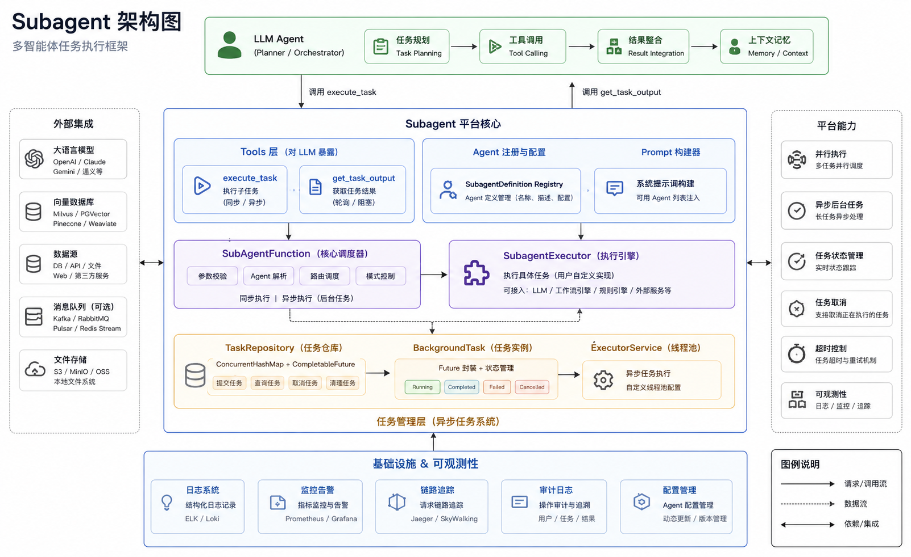

# Subagent 开发文档


## 1. 概述

Subagent 模块是 Agents-Flex 框架中用于实现**智能体嵌套调用**和**异步任务处理的核心组件**。它允许主 Agent（Parent Agent）将复杂的、多步骤的任务委托给专门的子 Agent（Subagent）执行，支持同步阻塞调用和异步后台执行两种模式。

通过 Subagent 机制，可以实现：
- **任务分解**：将复杂任务拆解为多个子任务，由不同特性的子 Agent 并行或串行处理。
- **并发优化**：支持同时启动多个后台子 Agent，最大化利用 LLM 并发能力。
- **状态管理**：提供完整的任务生命周期管理（运行中、完成、失败、取消）。
- **上下文隔离与继承**：子 Agent 可以独立运行，也可以继承主对话上下文。

该模块主要包含两个核心工具函数：
1. `execute_task`：启动子 Agent 执行任务。
2. `get_task_output`：获取后台子 Agent 的执行结果。


## 2. 核心架构

### 2.1 架构图




### 2.2 核心组件说明

| 组件 | 说明 |
|------|------|
| `SubagentTools` | 工厂类，负责构建 `execute_task` 和 `get_task_output` 两个 Tool 对象。通过 Builder 模式配置子 Agent 定义、执行器和任务仓库。 |
| `SubagentDefinition` | 子 Agent 的定义元数据，包含名称、描述和前端元数据（Front Matter），用于生成 Prompt 中的可用 Agent 列表。 |
| `SubagentExecutor` | 执行器接口，开发者需实现此接口以定义子 Agent的具体执行逻辑（如调用哪个 LLM、使用什么 System Prompt 等）。 |
| `TaskRepository` | 任务仓库，基于 `ConcurrentHashMap` 和 `ExecutorService` 管理后台任务的 lifecycle。默认使用 Cached Thread Pool。 |
| `BackgroundTask` | 后台任务封装类，基于 `CompletableFuture` 实现非阻塞异步执行，提供状态查询、结果获取、超时等待和取消功能。 |
| `SubagentArgs` | `execute_task` 工具的输入参数对象。 |
| `OutputArgs` | `get_task_output` 工具的输入参数对象。 |


## 3. 快速开始

### 3.1 添加依赖

确保项目中已引入 Agents-Flex 核心依赖。

### 3.2 定义子 Agent

首先，定义一个或多个子 Agent。每个子 Agent 需要指定名称、描述以及可选的元数据。

```java
import com.agentsflex.subagent.SubagentDefinition;

// 定义一个代码审查子 Agent
SubagentDefinition codeReviewer = SubagentDefinition.builder()
    .name("code-reviewer")
    .description("Use this agent after you are done writing a significant piece of code to review it for bugs and best practices.")
    .frontMatter("role", "Senior Java Developer")
    .build();

// 定义一个文档生成子 Agent
SubagentDefinition docGenerator = SubagentDefinition.builder()
    .name("doc-generator")
    .description("Use this agent to generate API documentation from code snippets.")
    .build();
```

### 3.3 实现 SubagentExecutor

实现 `SubagentExecutor` 接口，定义子 Agent 的实际执行逻辑。通常在这里调用 LLM 并返回结果。

```java
import com.agentsflex.subagent.SubagentExecutor;
import com.agentsflex.subagent.SubagentArgs;
import com.agentsflex.subagent.SubagentDefinition;
import com.agentsflex.core.llm.Llm;
import com.agentsflex.core.llm.chat.ChatRequest;
import com.agentsflex.core.llm.chat.ChatResponse;

public class MySubagentExecutor implements SubagentExecutor {

    private final ChatModel chatModel;

    public MySubagentExecutor(ChatModel chatModel) {
        this.chatModel = chatModel;
    }

    @Override
    public String execute(SubagentArgs args, SubagentDefinition definition) {
        String response = chatModel.chat(args.getPrompt());
        return response;
    }
}
```

### 3.4 构建 Subagent Tools

使用 `SubagentTools.builder()` 构建工具列表，并将其注册到主 Agent 的工具集中。

```java
import com.agentsflex.subagent.SubagentTools;
import com.agentsflex.core.model.chat.tool.Tool;
import java.util.List;

// 创建执行器
MySubagentExecutor executor = new MySubagentExecutor(myLlm);

// 构建工具
List<Tool> subagentTools = SubagentTools.builder()
    .addDefinition(codeReviewer)
    .addDefinition(docGenerator)
    .subagentExecutor(executor)
    .build();

// 将 subagentTools 添加到主 Agent 的工具列表中
// agent.addTools(subagentTools);
```

### 3.5 在主 Agent 中使用

当主 Agent 接收到用户请求时，它可以自动决定是否需要调用子 Agent。

**场景示例：**

用户：“请帮我写一个判断素数的函数，然后审查一下代码。”

1. 主 Agent 调用 `Write` 工具生成代码。
2. 主 Agent 识别到代码已生成，根据 Prompt 指引，调用 `execute_task` 工具，选择 `code-reviewer` 子 Agent。
3. `code-reviewer` 子 Agent 在后台或同步执行代码审查。
4. 主 Agent 获取审查结果，并总结回复给用户。


## 4. 详细设计

### 4.1 SubagentDefinition 设计

`SubagentDefinition` 继承自 `Metadata`，允许携带任意键值对元数据。

- **name**: 子 Agent 的唯一标识符，必须在所有定义的子 Agent 中唯一。
- **description**: 详细描述子 Agent 的能力和适用场景。这段描述会被注入到 `execute_task` 的 Prompt 中，供主 Agent 决策使用。
- **frontMatter**: 前端元数据，可用于传递额外的配置信息（如角色设定、温度参数、模型类型等）。在 `toXml()` 方法中，这些数据会被转换为 XML 格式嵌入到 Prompt 中。

**XML 输出示例：**

```xml
<task_agent>
  <name>code-reviewer</name>
  <description>Use this agent to review code...</description>
  <role>Senior Java Developer</role>
</task_agent>
```

### 4.2 SubagentExecutor 接口

```java
public interface SubagentExecutor {
     String execute(SubagentArgs args, SubagentDefinition definition);
}
```

- **args**: 包含主 Agent 传递的参数，如 `prompt`（任务描述）、`resume`（恢复 ID）等。
- **definition**: 当前被调用的子 Agent 的定义，可从中获取元数据。
- **返回值**: 子 Agent 执行后的文本结果。如果执行出错，建议抛出异常或返回错误信息字符串。

**注意**：
- 如果 `args.getRun_in_background()` 为 `true`，`SubagentExecutor` 仍然同步执行，但 `SubAgentFunction` 会将其包装到 `TaskRepository` 中异步运行。因此，`execute` 方法本身无需关心异步逻辑，只需关注业务执行。

### 4.3 TaskRepository 与 BackgroundTask

#### TaskRepository

`TaskRepository` 负责管理所有后台任务。

- **线程安全**：内部使用 `ConcurrentHashMap` 存储任务。
- **线程池管理**：默认创建一个 Daemon 线程池 (`Executors.newCachedThreadPool`)，线程命名为 `background-task-{id}`。
- **资源清理**：提供 `shutdown()` 方法，在应用关闭时应调用此方法以优雅地终止线程池。

**关键方法：**

- `putTask(String taskId, Supplier<String> taskExecution)`: 提交一个任务到线程池，返回 `BackgroundTask` 对象。
- `getTasks(String taskId)`: 根据 ID 获取任务对象。
- `removeTask(String taskId)`: 移除任务记录。
- `clearCompletedTasks()`: 清理已完成的任务，防止内存泄漏。

#### BackgroundTask

`BackgroundTask` 是对 `CompletableFuture<String>` 的封装，提供友好的 API。

- **状态查询**：
    - `isCompleted()`: 是否完成（成功或失败）。
    - `getStatus()`: 返回人类可读的状态字符串（"Running", "Completed", "Failed: ..."）。
    - `hasError()`: 是否发生异常。

- **结果获取**：
    - `getResult()`: 获取结果，若未完成或出错则返回 `null`。
    - `getError()`: 获取异常对象。
    - `waitForCompletion(long timeoutMs)`: 阻塞等待任务完成，支持超时。

- **取消任务**：
    - `cancel(boolean mayInterruptIfRunning)`: 尝试取消任务。

### 4.4 工具函数详解

#### 4.4.1 execute_task

**功能**：启动一个新的子 Agent 来处理复杂的多步骤任务。

**输入参数 (SubagentArgs)**：

| 参数 | 类型 | 必填 | 说明 |
|------|------|------|------|
| `name` | String | 是 | 要使用的子 Agent 名称，必须存在于已注册的 definitions 中。 |
| `description` | String | 是 | 简短描述（3-5 个词），概括该子任务的目的。 |
| `prompt` | String | 是 | 发送给子 Agent 的具体指令。应清晰、详细，明确期望的输出格式。 |
| `resume` | String | 否 | 可选的子 Agent ID，用于从之前的执行中恢复上下文。若不提供，则启动全新的子 Agent。 |
| `run_in_background` | Boolean | 否 | 是否后台运行。若为 `true`，立即返回 `task_id`；若为 `false` 或未设置，则阻塞直到子 Agent 完成并返回结果。 |

**行为逻辑**：

1. **验证名称**：检查 `name` 是否在已注册的 `SubagentDefinition` 列表中。若不存在，返回错误信息。
2. **后台模式**：
    - 若 `run_in_background == true`：
        - 生成唯一的 `task_id`。
        - 将执行逻辑包装为 `Supplier` 提交到 `TaskRepository`。
        - 立即返回包含 `task_id` 的提示信息，告知主 Agent 使用 `get_task_output` 获取结果。
3. **同步模式**：
    - 直接调用 `subagentExecutor.execute()`。
    - 阻塞等待执行完成。
    - 返回子 Agent 的执行结果。

**Prompt 模板**：

`SubagentTools` 内置了详细的 `EXECUTE_TASK_PROMPT_TEMPLATE`，指导主 Agent 如何正确使用该工具。模板中会动态插入所有可用子 Agent 的 XML 描述。

#### 4.4.2 get_task_output

**功能**：检索正在运行或已完成的后台任务（子 Agent）的输出。

**输入参数 (OutputArgs)**：

| 参数 | 类型 | 必填 | 说明 |
|------|------|------|------|
| `task_id` | String | 是 | 要检索输出的任务 ID。 |
| `block` | Boolean | 否 | 是否阻塞等待任务完成。默认为 `true`。若设为 `false`，则立即返回当前状态。 |
| `timeout` | Long | 否 | 阻塞等待的最大超时时间（毫秒）。默认 30000ms，最大限制为 600000ms。 |

**行为逻辑**：

1. **查找任务**：从 `TaskRepository` 中根据 `task_id` 获取 `BackgroundTask`。若不存在，返回错误。
2. **阻塞等待**：
    - 若 `block == true` 且任务未完成，调用 `waitForCompletion(timeoutMs)`。
    - 若超时或被中断，返回相应错误信息。
3. **构建结果**：
    - 返回包含 `Task ID`、`Status` 和 `Result/Error` 的结构化文本。
    - 若任务仍在运行且 `block == false`，返回 "Task still running..."。

**Prompt 模板**：

内置 `GET_TASK_OUTPUT_PROMPT_TEMPLATE`，简要说明工具用途和参数含义。


## 5. 最佳实践

### 5.1 并行执行子 Agent

为了最大化性能，当需要启动多个独立的子 Agent 时，**必须在单个消息中发出多个 `execute_task` 工具调用**，而不是分多条消息发送。

**错误示例**：
```text
Assistant: 我先启动 Agent A...
(调用 execute_task for A)
Assistant: 我再启动 Agent B...
(调用 execute_task for B)
```

**正确示例**：
```text
Assistant: 我将同时启动代码审查和测试运行 Agent。
(单条消息中包含两个 tool_use 块：execute_task for A 和 execute_task for B)
```

### 5.2 清晰的 Prompt 设计

子 Agent 无法看到主 Agent 与用户的完整对话历史（除非特别设计上下文传递机制）。因此，在 `prompt` 参数中必须包含**所有必要的上下文信息**。

**建议**：
- 明确指定子 Agent 的角色和任务目标。
- 如果需要子 Agent 编写代码，明确说明语言、框架和风格要求。
- 如果只需要研究或搜索，明确告知“不要编写代码，只做调研”。

### 5.3 背景任务的管理

- **及时获取结果**：启动后台任务后，主 Agent 应在适当时机调用 `get_task_output` 获取结果，避免任务长期占用资源。
- **清理已完成任务**：定期调用 `taskRepository.clearCompletedTasks()` 清理内存中的已完成任务记录，防止内存泄漏。
- **优雅关闭**：在应用 shutdown hook 中调用 `taskRepository.shutdown()`，确保线程池正确关闭。

### 5.4 错误处理

- **子 Agent 异常**：`SubagentExecutor` 中抛出的异常会被 `CompletableFuture` 捕获，并通过 `BackgroundTask.getError()` 暴露。主 Agent 应检查返回结果中的 "Error:" 前缀，并进行相应处理。
- **任务超时**：`get_task_output` 支持超时控制，避免因某个子 Agent 卡死而导致主 Agent 无限等待。

### 5.5 上下文恢复 (Resume)

若子 Agent 支持断点续传或长对话记忆，可通过 `resume` 参数传递之前的 `agent ID`（注意：当前实现中，`resume` 参数传递给 `SubagentExecutor`，具体如何实现上下文恢复取决于 `SubagentExecutor` 的实现者）。


## 6. 扩展与定制

### 6.1 自定义 Prompt 模板

可以通过 Builder 自定义 `execute_task` 和 `get_task_output` 的 Prompt 模板，以适应不同的业务场景或语言需求。

```java
SubagentTools.builder()
    .executeTaskPromptTemplate("我的自定义模板...")
    .getTaskOutputPromptTemplate("我的自定义输出模板...")
    // ... 其他配置
    .build();
```

### 6.2 自定义 TaskRepository

若需要使用自定义的线程池或持久化任务状态，可以注入自定义的 `TaskRepository`。

```java
ExecutorService customExecutor = Executors.newFixedThreadPool(10);
TaskRepository customRepo = new TaskRepository(customExecutor);

SubagentTools.builder()
    .taskRepository(customRepo)
    // ...
    .build();
```

**注意**：若使用自定义 Executor，需自行管理其生命周期，`TaskRepository` 不会自动关闭非自身拥有的 Executor。


## 7. 常见问题 (FAQ)

**Q1: 子 Agent 能看到主 Agent 的对话历史吗？**
A: 默认情况下，子 Agent 只接收 `prompt` 参数中的内容。若需要传递上下文，需在 `prompt` 中手动拼接相关历史信息，或在 `SubagentExecutor` 实现中从外部存储加载上下文。

**Q2: 如何限制子 Agent 的执行时间？**
A: 在调用 `get_task_output` 时设置 `timeout` 参数。此外，建议在 `SubagentExecutor` 内部实现超时控制（如使用 LLM 客户端的超时设置）。

**Q3: 子 Agent 可以再次调用其他子 Agent 吗？**
A: 可以。只要子 Agent 所使用的 LLM 客户端也配备了相同的 `execute_task` 工具，就可以实现嵌套调用。但需注意避免无限递归。

**Q4: 如何调试子 Agent 的执行过程？**
A: 可以在 `SubagentExecutor` 中添加日志记录，打印输入的 `args` 和 `definition`，以及 LLM 的原始响应。对于后台任务，可通过 `TaskRepository` 监控任务状态。

