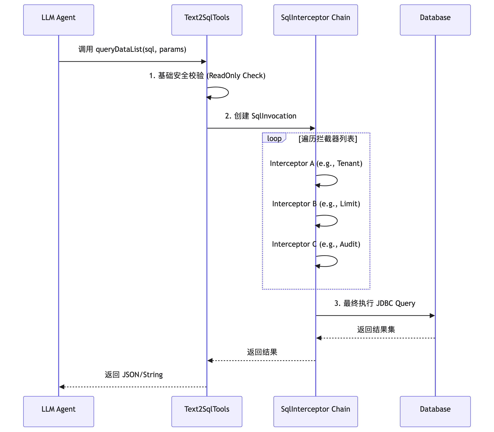

# 智能问数（text2sql）拦截器 (进阶篇)


## 1. 拦截器机制概述 (Interceptor Mechanism)

在 Agents-Flex 的 Text2SQL 模块中，**拦截器（SqlInterceptor）** 是核心扩展点。它基于**责任链模式（Chain of Responsibility）**，允许开发者在 SQL 执行的生命周期中插入自定义逻辑。

### 1.1 为什么需要拦截器？

LLM 生成的 SQL 往往是“裸”的，直接执行存在以下风险或缺陷：
1.  **安全性不足**：虽然内置了只读验证，但缺乏业务级的数据权限控制。
2.  **性能隐患**：LLM 可能忘记加 `LIMIT`，导致全表扫描。
3.  **多租户缺失**：SaaS 应用中，必须强制隔离不同租户的数据。
4.  **可观测性差**：需要记录谁、在什么时间、查了什么数据、耗时多少。
5.  **SQL 增强**：自动添加审计字段、默认排序、方言转换等。

### 1.2 执行生命周期




## 2. 如何自定义拦截器 (How to Customize)

### 2.1 核心接口

所有拦截器必须实现 `com.agentsflex.text2sql.core.SqlInterceptor` 接口：

```java
package com.agentsflex.text2sql.core;

public interface SqlInterceptor {
    /**
     * 拦截处理
     * @param invocation 调用上下文对象，包含当前 SQL、参数、数据源等信息
     * @return 执行结果
     * @throws Exception 异常将中断执行并返回给 LLM
     */
    Object intercept(SqlInvocation invocation) throws Exception;
}
```

### 2.2 关键对象：SqlInvocation & SqlExecuteContext

*   **`SqlInvocation`**: 代表一次完整的调用链。
    *   `proceed()`: **必须调用**此方法以进入下一个拦截器或最终执行器。如果不调用，链条断裂，SQL 不会执行。
*   **`SqlExecuteContext`**: 携带执行状态的可变对象。
    *   `getSql()` / `setSql()`: 获取或修改即将执行的 SQL。
    *   `getParameters()` / `setParameters()`: 获取或修改参数列表。
    *   `getAttribute(key)` / `addAttribute(key, value)`: 在拦截器之间传递临时数据（如用户ID、追踪ID）。
    *   `getDataSource()`: 获取当前数据源信息。

### 2.3 开发步骤

1.  **创建类**：实现 `SqlInterceptor` 接口。
2.  **编写逻辑**：在 `intercept` 方法中读取 Context，修改 SQL/Params，或记录日志。
3.  **调用链**：在处理完逻辑后，务必调用 `invocation.proceed()`。
4.  **注册**：在构建 `Text2SqlTools` 时，通过 `builder.addSqlInterceptor()` 加入链表。


## 3. 常见应用场景与代码实现 (Scenarios & Implementations)

### 场景一：多租户数据隔离 (Multi-Tenancy)

**背景**：在 SaaS 系统中，不同租户只能查询自己的数据。通常表中有一个 `tenant_id` 字段。
**策略**：自动在 `WHERE` 子句后追加 `AND tenant_id = ?`，并将租户ID加入参数列表。

```java
package com.agentsflex.text2sql.interceptor;

import com.agentsflex.text2sql.core.SqlExecuteContext;
import com.agentsflex.text2sql.core.SqlInterceptor;
import com.agentsflex.text2sql.core.SqlInvocation;
import java.util.ArrayList;
import java.util.List;

public class TenantIsolationInterceptor implements SqlInterceptor {

    // 假设从 ThreadLocal 或 SecurityContext 获取当前租户ID
    private Long getCurrentTenantId() {
        // 实际项目中请替换为真实的获取逻辑
        return 1001L;
    }

    @Override
    public Object intercept(SqlInvocation invocation) throws Exception {
        SqlExecuteContext ctx = invocation.getContext();
        Long tenantId = getCurrentTenantId();

        if (tenantId != null) {
            String originalSql = ctx.getSql();

            // 1. 修改 SQL：追加条件
            // 注意：简单拼接仅适用于演示，生产环境建议解析 SQL AST 或使用更严谨的正则
            // 这里假设 LLM 生成的 SQL 已经包含 WHERE 或者我们统一追加
            String newSql = originalSql + " AND tenant_id = ?";
            ctx.setSql(newSql);

            // 2. 修改参数：将 tenantId 添加到参数列表末尾
            List<Object> params = ctx.getParameters();
            if (params == null) {
                params = new ArrayList<>();
                ctx.setParameters(params);
            }
            params.add(tenantId);
        }

        // 继续执行下一个拦截器
        return invocation.proceed();
    }
}
```

### 场景二：动态数据脱敏 (Dynamic Data Masking)

**背景**：查询结果中包含手机号、身份证等敏感信息，需要根据用户权限进行脱敏。
**策略**：在执行后，对结果集进行处理。

```java
package com.agentsflex.text2sql.interceptor;

import com.agentsflex.text2sql.core.SqlInterceptor;
import com.agentsflex.text2sql.core.SqlInvocation;
import com.alibaba.fastjson2.JSON;
import java.util.List;
import java.util.Map;

public class DataMaskingInterceptor implements SqlInterceptor {

    @Override
    public Object intercept(SqlInvocation invocation) throws Exception {
        // 1. 先执行后续链条，获取原始结果
        Object result = invocation.proceed();

        // 2. 判断是否需要脱敏 (例如：当前用户不是管理员)
        if (!isUserAdmin()) {
            if (result instanceof String) {
                try {
                    // 尝试解析 JSON (queryDataList 返回的是 JSON 字符串)
                    Object parsed = JSON.parse((String) result);
                    Object masked = maskSensitiveData(parsed);
                    return JSON.toJSONString(masked);
                } catch (Exception e) {
                    // 如果解析失败，返回原始结果，避免破坏非 JSON 返回
                }
            }
        }

        return result;
    }

    private boolean isUserAdmin() {
        return false; // 模拟非管理员
    }

    private Object maskSensitiveData(Object data) {
        // 递归遍历 List<Map> 或 Map，对特定 key (phone, id_card) 进行 *** 替换
        // 此处省略具体递归实现
        return data;
    }
}
```

### 场景三：慢查询监控与告警 (Slow Query Monitoring)

**背景**：需要识别执行时间过长的 SQL，以便优化数据库索引或提示 LLM 简化查询。
**策略**：记录开始时间，执行后计算耗时，超过阈值则记录警告。

```java
package com.agentsflex.text2sql.interceptor;

import com.agentsflex.text2sql.core.SqlInterceptor;
import com.agentsflex.text2sql.core.SqlInvocation;
import org.slf4j.Logger;
import org.slf4j.LoggerFactory;

public class SlowQueryInterceptor implements SqlInterceptor {

    private static final Logger log = LoggerFactory.getLogger(SlowQueryInterceptor.class);
    private static final long SLOW_THRESHOLD_MS = 1000; // 1秒

    @Override
    public Object intercept(SqlInvocation invocation) throws Exception {
        long startTime = System.currentTimeMillis();

        try {
            return invocation.proceed();
        } finally {
            long cost = System.currentTimeMillis() - startTime;
            if (cost > SLOW_THRESHOLD_MS) {
                log.warn("⚠️ Slow SQL Detected! Cost: {}ms, SQL: {}",
                    cost,
                    invocation.getContext().getSql()
                );
                // 可选：将耗时写入 Context，供 LLM 感知
                invocation.getContext().addAttribute("query_cost_ms", cost);
            }
        }
    }
}
```

### 场景四：SQL 方言转换/兼容 (Dialect Adaptation)

**背景**：底层数据库可能是 MySQL，但 LLM 可能生成了 PostgreSQL 特有的语法（或者反之）。
**策略**：在執行前替换特定关键字。

```java
package com.agentsflex.text2sql.interceptor;

import com.agentsflex.text2sql.core.SqlInterceptor;
import com.agentsflex.text2sql.core.SqlInvocation;

public class DialectAdapterInterceptor implements SqlInterceptor {

    @Override
    public Object intercept(SqlInvocation invocation) throws Exception {
        String sql = invocation.getContext().getSql();

        // 示例：将 LIMIT offset, count (MySQL) 转换为 OFFSET offset ROWS FETCH NEXT count ROWS ONLY (Standard/PG)
        // 注意：这只是一个简单示例，生产环境建议使用 JSqlParser 等工具库

        if (isTargetDatabaseOracle()) {
             // 简单的 ROWNUM 替换逻辑...
        }

        invocation.getContext().setSql(sql);
        return invocation.proceed();
    }

    private boolean isTargetDatabaseOracle() {
        return false;
    }
}
```

### 场景五：查询缓存 (Query Caching)

**背景**：相同的自然语言问题或 SQL 在短时间内被重复查询。
**策略**：在拦截器中检查缓存，命中则直接返回，不执行 DB。

```java
package com.agentsflex.text2sql.interceptor;

import com.agentsflex.text2sql.core.SqlInterceptor;
import com.agentsflex.text2sql.core.SqlInvocation;
import java.util.concurrent.ConcurrentHashMap;

public class QueryCacheInterceptor implements SqlInterceptor {

    private final ConcurrentHashMap<String, Object> cache = new ConcurrentHashMap<>();

    @Override
    public Object intercept(SqlInvocation invocation) throws Exception {
        String sql = invocation.getContext().getSql();
        String paramsKey = invocation.getContext().getParameters().toString();
        String cacheKey = sql + "::" + paramsKey;

        // 1. 查缓存
        if (cache.containsKey(cacheKey)) {
            return cache.get(cacheKey);
        }

        // 2. 执行
        Object result = invocation.proceed();

        // 3. 写缓存 (仅缓存成功结果，且非空)
        if (result != null) {
            cache.put(cacheKey, result);
            // 实际项目中应设置过期时间，或使用 Redis
        }

        return result;
    }
}
```


## 4. 拦截器注册与顺序控制 (Registration & Ordering)

拦截器的执行顺序至关重要。通常建议的顺序是：

1.  **Rewriter (重写类)**：如 `TenantInterceptor`, `DialectInterceptor`。先修改 SQL。
2.  **Validator (校验类)**：如自定义的业务规则校验（内置的 ReadOnly 校验在最外层）。
3.  **Cacher (缓存类)**：如果希望缓存的是经过重写后的 SQL 结果。
4.  **Auditor/Monitor (审计/监控类)**：如 `SlowQueryInterceptor`, `AuditInterceptor`。通常放在靠近执行层的地方，以记录最真实的执行情况。
5.  **Post-Processor (后处理类)**：如 `DataMaskingInterceptor`。必须在执行之后处理结果。

### 注册示例

```java
List<SqlInterceptor> interceptors = new ArrayList<>();

// 1. 租户隔离 (修改 SQL)
interceptors.add(new TenantIsolationInterceptor());

// 2. 强制 Limit (修改 SQL)
interceptors.add(new LimitSqlInterceptor(100));

// 3. 缓存 (如果命中，后续都不执行)
interceptors.add(new QueryCacheInterceptor());

// 4. 审计日志 (记录最终执行的 SQL)
interceptors.add(new SqlAuditInterceptor());

// 5. 慢查询监控
interceptors.add(new SlowQueryInterceptor());

// 6. 数据脱敏 (处理结果)
interceptors.add(new DataMaskingInterceptor());

Text2SqlTools tools = Text2SqlTools.builder()
    .addDataSourceInfo(dataSource)
    .addSqlInterceptors(interceptors)
    .buildTools();
```


## 5. 高级技巧：在拦截器间传递上下文

有时，一个拦截器产生的数据需要被另一个拦截器或最终的 Executor 使用。`SqlExecuteContext` 的 `attributes` 地图为此提供了支持。

**示例：传递追踪 ID**

```java
// Interceptor A: 生成追踪 ID
public class TraceIdInterceptor implements SqlInterceptor {
    @Override
    public Object intercept(SqlInvocation invocation) throws Exception {
        String traceId = UUID.randomUUID().toString();
        invocation.getContext().addAttribute("trace_id", traceId);
        MDC.put("trace_id", traceId); // 同时放入日志上下文
        return invocation.proceed();
    }
}

// Interceptor B: 使用追踪 ID 记录详细日志
public class DetailedAuditInterceptor implements SqlInterceptor {
    @Override
    public Object intercept(SqlInvocation invocation) throws Exception {
        String traceId = (String) invocation.getContext().getAttribute("trace_id");
        System.out.println("[" + traceId + "] Executing: " + invocation.getContext().getSql());
        return invocation.proceed();
    }
}
```


## 6. 注意事项与最佳实践

1.  **务必调用 `proceed()`**：这是最常见的错误。忘记调用会导致 SQL 永远不执行，LLM 会收到 `null` 或超时错误。
2.  **避免阻塞操作**：拦截器中的逻辑应尽可能轻量。不要在拦截器中进行复杂的 HTTP 请求或重型计算，这会显著增加查询延迟。
3.  **SQL 修改的安全性**：当通过字符串拼接修改 SQL 时（如添加 `AND` 条件），务必小心语法错误。建议先判断原 SQL 是否已有 `WHERE` 子句。
    *   *Tip*: 如果原 SQL 有 `WHERE`，追加 ` AND ...`；如果没有，追加 ` WHERE ...`。
4.  **参数一致性**：如果修改了 SQL 增加了 `?` 占位符，**必须**同步修改 `parameters` 列表，否则 JDBC 执行时会报“参数数量不匹配”错误。
5.  **异常处理**：拦截器中抛出的异常会被 `Text2SqlTools` 捕获，并以 `"Error: Exception Message"` 的形式返回给 LLM。确保异常信息清晰，有助于 LLM 自我修正。


