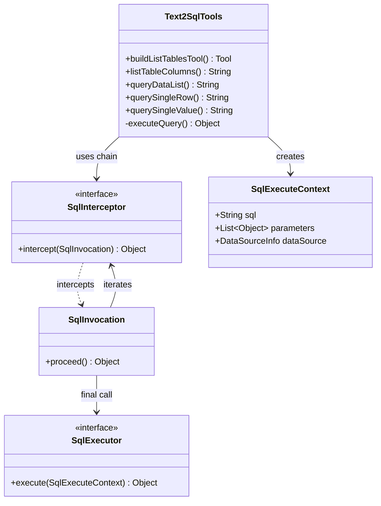

# 智能问数（text2sql）开发文档


## 1. 概述 (Overview)

智能问数（Text2SQL）模块是 Agents-Flex 生态中用于实现自然语言到数据库查询转换的核心组件。它通过提供一组标准化的 AI Tools（工具），引导大语言模型（LLM）以 **渐进式披露（Progressive Disclosure）** 的方式，安全、准确地完成数据查询任务。

### 1.1 核心设计理念

1.  **渐进式披露 (Progressive Disclosure)**:
    *   LLM 不会一次性获取所有数据库元数据（避免 Context Window 溢出和注意力分散）。
    *   **Step 1**: 获取数据源列表 (`listTables`)。
    *   **Step 2**: 获取指定表的详细 Schema (`listTableColumns`)。
    *   **Step 3**: 生成并执行 SQL (`queryDataList`/`querySingleRow`/`querySingleValue`)。
2.  **软失败原则 (Soft Failure)**:
    *   所有工具调用失败时，不抛出异常中断流程，而是返回 `"Error: xxx"` 字符串。
    *   LLM 接收到错误信息后，可根据提示自我修正（Self-Correction），重新生成参数或 SQL。
3.  **安全第一 (Security First)**:
    *   **只读保护**: 内置 SQL 验证器，严禁 `INSERT`, `UPDATE`, `DELETE`, `DROP` 等写操作。
    *   **参数化查询**: 强制使用 `?` 占位符，防止 SQL 注入。
    *   **拦截器链**: 支持自定义 SQL 拦截器（如自动添加 `LIMIT`、租户隔离、审计日志）。


## 2. 架构设计 (Architecture)

### 2.1 核心类图关系



### 2.2 执行流程

1.  **用户提问**: "查询上个月销售额最高的前10个产品"。
2.  **Agent 决策**: 调用 `listTables` 获取可用表。
3.  **Agent 决策**: 调用 `listTableColumns` 获取 `orders` 和 `products` 表结构。
4.  **Agent 生成 SQL**: `SELECT p.name, SUM(o.amount) ... GROUP BY p.name ORDER BY ... LIMIT 10`。
5.  **Agent 调用工具**: 调用 `queryDataList`。
6.  **内部处理**:
    *   `validateSqlReadOnly`: 检查是否包含危险关键字。
    *   `SqlInterceptor Chain`:
        *   `LimitSqlInterceptor`: 确保有 `LIMIT`。
        *   `TenantSqlInterceptor`: 添加 `AND tenant_id = ?`。
        *   `SqlAuditInterceptor`: 记录日志。
    *   `JdbcQueryUtil`: 执行 JDBC 查询。
7.  **返回结果**: JSON 格式数据返回给 LLM。
8.  **LLM 回答**: 整理数据，用自然语言回答用户。


## 3. 快速开始 (Quick Start)

### 3.1 Maven 依赖

确保项目中已引入 Agents-Flex 核心包及 Text2SQL 模块。

```xml
<dependency>
    <groupId>com.agentsflex</groupId>
    <artifactId>agents-flex-text2sql</artifactId>
    <version>${agents-flex.version}</version>
</dependency>
```

### 3.2 代码示例

```java
import com.agentsflex.text2sql.Text2SqlTools;
import com.agentsflex.text2sql.entity.JdbcDataSourceInfo;
import com.agentsflex.core.model.chat.tool.Tool;
import com.agentsflex.text2sql.interceptor.LimitSqlInterceptor;
import com.agentsflex.text2sql.interceptor.SqlAuditInterceptor;

import java.util.List;

public class Text2SqlDemo {

    public static void main(String[] args) {
        // 1. 配置数据源
        JdbcDataSourceInfo ds = new JdbcDataSourceInfo();
        ds.setName("my_db");
        ds.setDescription("生产环境订单数据库");
        ds.setJdbcUrl("jdbc:mysql://localhost:3306/mydb");
        ds.setUsername("root");
        ds.setPassword("password");

        // 自动加载表结构元数据
        ds.buildTables();

        // 2. 配置拦截器链 (可选)
        List<SqlInterceptor> interceptors = List.of(
            new SqlAuditInterceptor(),      // 审计日志
            new LimitSqlInterceptor(100)    // 强制最大返回100条
        );

        // 3. 构建 Tools
        List<Tool> tools = Text2SqlTools.builder()
            .addDataSourceInfo(ds)
            .addSqlInterceptors(interceptors)
            .buildTools();

        // 4. 将 tools 注册到你的 Agent/LLM 客户端
        // myAgent.registerTools(tools);
    }
}
```


## 4. 核心 API 详解 (API Reference)

`Text2SqlTools` 提供了四个核心 Tool，遵循严格的调用顺序。

### 4.1 Step 1: `listTables`

**功能**: 获取指定数据源下的所有表名及简要描述。
**触发场景**: 用户询问数据，但 Agent 不知道具体涉及哪些表时。

*   **参数**:
    *   `dataSourceName` (String, Required): 数据源名称，必须与配置中的名称完全匹配。
*   **返回格式**: Markdown 表格。
*   **渐进式披露策略**: 仅返回表名和描述，**不返回字段信息**，减少 Token 消耗。

### 4.2 Step 2: `listTableColumns`

**功能**: 获取指定表的完整 Schema（字段名、类型、主键、注释）。
**触发场景**: 确定要查询的表后，编写 SQL 前必须调用此工具。

*   **参数**:
    *   `dataSourceName` (String, Required): 数据源名称。
    *   `tableName` (String, Required): 表名，必须来自 `listTables` 的结果。
*   **返回格式**: Markdown 表格，包含 `Field Name`, `Type`, `Primary Key`, `Comment` 等。
*   **注意**: LLM 必须使用返回的 `Field Name` 编写 SQL，严禁臆造字段名。

### 4.3 Step 3: 执行查询

根据预期返回结果的形态，选择以下三个工具之一：

#### A. `queryDataList` (多行结果)
*   **适用**: 列表查询、分页查询。
*   **返回**: JSON Array 字符串。
*   **SQL 要求**: 建议包含 `LIMIT`。

#### B. `querySingleRow` (单行结果)
*   **适用**: 根据 ID 查询详情、唯一约束查询。
*   **返回**: JSON Object 字符串。
*   **SQL 要求**: 建议包含 `LIMIT 1`。

#### C. `querySingleValue` (单值结果)
*   **适用**: 聚合函数 (`COUNT`, `SUM`, `AVG`)、存在性检查。
*   **返回**: 纯文本字符串（如 `"100"` 或 `"NULL"`）。
*   **SQL 要求**: SQL 必须只返回一列一行。

**通用参数规则 (Strict)**:
1.  `dataSourceName`: 顶层参数，**绝不**放入 `parameters` 数组。
2.  `sql`: 必须使用 `?` 作为占位符。
3.  `parameters`: 与 `?` 一一对应的值数组。若无占位符，传空数组 `[]`。


## 5. 安全与拦截器机制 (Security & Interceptors)

### 5.1 内置安全验证

在 `executeQuery` 方法中，首先执行 `validateSqlReadOnly`：
*   **禁止关键字**: `INSERT`, `UPDATE`, `DELETE`, `DROP`, `TRUNCATE`, `ALTER`, `CREATE`, `GRANT`, `REVOKE`, `EXEC`。
*   **起始检查**: SQL 必须以 `SELECT` 或 `WITH` 开头。
*   **失败处理**: 直接返回 `"Error: Security restriction..."`，阻止执行。

### 5.2 拦截器链 (SqlInterceptor Chain)

通过实现 `SqlInterceptor` 接口，可以在 SQL 执行前后插入自定义逻辑。

#### 标准接口
```java
public interface SqlInterceptor {
    Object intercept(SqlInvocation invocation) throws Exception;
}
```

#### 常见实现案例

**1. 自动添加 LIMIT (防止全表扫描)**
```java
public class LimitSqlInterceptor implements SqlInterceptor {
    private final int maxLimit;

    @Override
    public Object intercept(SqlInvocation invocation) throws Exception {
        SqlExecuteContext ctx = invocation.getContext();
        String sql = ctx.getSql().toUpperCase();
        // 简单判断，生产环境建议使用 SQL Parser
        if (!sql.contains("LIMIT")) {
            ctx.setSql(ctx.getSql() + " LIMIT " + maxLimit);
        }
        return invocation.proceed(); // 继续下一个拦截器或执行
    }
}
```

**2. 多租户隔离 (Tenant Isolation)**
```java
public class TenantSqlInterceptor implements SqlInterceptor {
    @Override
    public Object intercept(SqlInvocation invocation) throws Exception {
        SqlExecuteContext ctx = invocation.getContext();
        Long tenantId = (Long) ctx.getAttribute("tenantId");
        if (tenantId != null) {
            // 注意：生产环境应使用参数化占位符 '?' 而非字符串拼接
            ctx.setSql(ctx.getSql() + " AND tenant_id = " + tenantId);
        }
        return invocation.proceed();
    }
}
```

**3. SQL 审计日志**
```java
public class SqlAuditInterceptor implements SqlInterceptor {
    @Override
    public Object intercept(SqlInvocation invocation) throws Exception {
        SqlExecuteContext ctx = invocation.getContext();
        System.out.println("Executing SQL: " + ctx.getSql());
        long start = System.currentTimeMillis();
        try {
            Object result = invocation.proceed();
            System.out.println("Cost: " + (System.currentTimeMillis() - start) + "ms");
            return result;
        } catch (Exception e) {
            System.err.println("SQL Error: " + e.getMessage());
            throw e;
        }
    }
}
```


## 6. 最佳实践 (Best Practices)

### 6.1 针对 LLM 的 Prompt 优化

在 `listTables` 和 `listTableColumns` 的 Description 中，我们嵌入了**严格执行协议 (STRICT EXECUTION PROTOCOL)**。这利用了渐进式披露的心理暗示，强制 LLM 按步骤思考：

> "You MUST follow this workflow: Step 1 → Call listTables, Step 2 → Call listTableColumns, Step 3 → Call query..."

**建议**: 不要修改这些 Tool 的 Description，它们是经过精心调试的 Prompt Engineering 产物。

### 6.2 数据源元数据管理

*   **懒加载 vs 预加载**: `JdbcDataSourceInfo.buildTables()` 会连接数据库读取元数据。建议在应用启动时预加载，避免首次查询延迟。
*   **动态刷新**: 如果数据库结构频繁变更，需定期调用 `buildTables()` 刷新缓存。

### 6.3 错误处理与自愈

*   **不要捕获 Error 前缀**: Agent 框架应直接将 `"Error: ..."` 返回给 LLM。
*   **LLM 自愈**: LLM 看到 `"Error: Table 'usr' does not exist, available tables: 'user', 'order'"` 后，会自动修正表名为 `user` 并重试。这是 Text2SQL 成功的关键。

### 6.4 性能优化

*   **避免 SELECT ***: 在 Tool Description 中多次强调使用明确字段名。
*   **索引友好**: 确保数据库常用查询字段有索引。
*   **拦截器顺序**:
    1.  `Validator` (内置，不可改)
    2.  `Rewriter` (如 Tenant, Limit) - 修改 SQL
    3.  `Auditor` (日志) - 记录最终 SQL
    4.  `Executor` (JDBC)


## 7. 常见问题 (FAQ)

**Q: 为什么 LLM 总是忘记调用 `listTableColumns` 直接写 SQL？**
A: 检查 `listTables` 的返回结果中是否包含了明确的 Tip。此外，可以在 System Prompt 中再次强调："Writing SQL without knowing the schema is forbidden."

**Q: 如何支持非 JDBC 数据源（如 MongoDB, Elasticsearch）？**
A: 目前 `Text2SqlTools` 强依赖 JDBC。对于 NoSQL，建议实现类似的 `NoSqlTools`，遵循相同的渐进式披露模式（List Collections -> Get Mapping -> Query）。

**Q: `parameters` 参数为什么不能包含表名？**
A: JDBC 预编译语句 (`PreparedStatement`) 的占位符 `?` 只能替换**值**，不能替换**标识符**（表名、列名）。表名必须在 SQL 字符串中硬编码（由 LLM 从 Schema 中获取）。

**Q: 如何处理复杂的 JOIN 查询？**
A: LLM 在 Step 2 获取多个表的 Schema 后，有能力生成 JOIN SQL。确保 `listTableColumns` 返回的注释中包含外键关系提示（如 `user_id references users(id)`），这将大幅提高 JOIN 准确率。


## 8. 附录：实体类说明

*   `DataSourceInfo`: 数据源抽象，包含名称、描述、表列表。
*   `TableInfo`: 表元数据，包含表名、描述、列列表。
*   `ColumnInfo`: 列元数据，包含字段名、类型、是否主键、注释。
*   `SqlExecuteContext`: 执行上下文，贯穿拦截器链，携带 SQL、参数、扩展属性。

