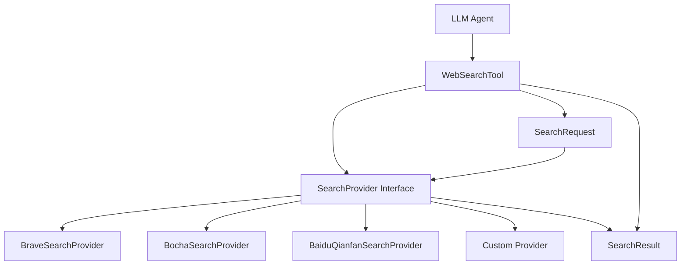
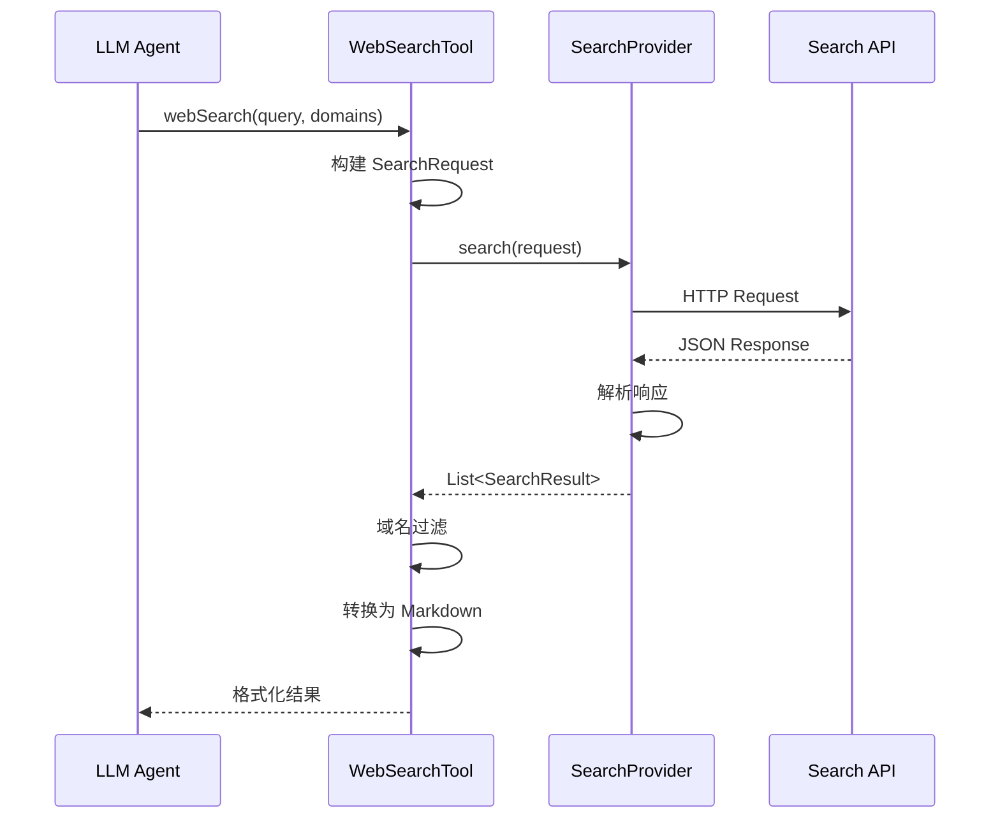

# WebSearch 开发文档

## 目录
- [1. 概述](#1-概述)
- [2. 架构设计](#2-架构设计)
- [3. 核心组件](#3-核心组件)
- [4. 快速开始](#4-快速开始)
- [5. 自定义搜索引擎提供商](#5-自定义搜索引擎提供商)
- [6. API 参考](#6-api-参考)
- [7. 最佳实践](#7-最佳实践)
- [8. 常见问题](#8-常见问题)


## 1. 概述

### 1.1 模块简介

`agents-flex-websearch` 是 Agents-Flex 框架的网络搜索功能模块，为 AI Agent 提供实时网络内容检索能力。该模块采用 SPI（Service Provider Interface）设计模式，支持多种搜索引擎提供商的灵活切换和扩展。

### 1.2 核心特性

- **多提供商支持**：内置 百度千帆、Bocha、Brave等主流搜索引擎支持
- **领域过滤**：支持白名单（allowedDomains）和黑名单（blockedDomains）域名过滤
- **结果格式化**：自动将搜索结果转换为 Markdown 格式，便于 LLM 理解
- **Builder 模式**：提供流畅的 API 构建方式
- **Tool 集成**：无缝集成 Agents-Flex 的 Tool Calling 机制

### 1.3 技术栈

- **Java 版本**：Java 8+
- **HTTP 客户端**：OkHttp3
- **JSON 处理**：FastJSON2
- **依赖模块**：`agents-flex-core`


## 2. 架构设计

### 2.1 整体架构




### 2.2 设计模式

- **策略模式（Strategy Pattern）**：通过 `SearchProvider` 接口实现不同搜索引擎的可插拔设计
- **建造者模式（Builder Pattern）**：`WebSearchTool.Builder` 和 `SearchResult.Builder` 提供对象构建
- **模板方法模式（Template Method）**：统一的搜索流程，具体的解析逻辑由子类实现

### 2.3 数据流




## 3. 核心组件

### 3.1 SearchProvider（接口）

**路径**：`com.agentsflex.websearch.SearchProvider`

搜索引擎提供商的核心接口，所有具体的搜索引擎实现都必须实现此接口。

```java
public interface SearchProvider {
    /**
     * 执行搜索并返回结果
     *
     * @param query 搜索请求对象
     * @return 搜索结果列表
     */
    List<SearchResult> search(SearchRequest query);
}
```


**职责**：
- 接收搜索请求
- 调用外部搜索引擎 API
- 解析响应数据
- 返回标准化的搜索结果

### 3.2 SearchRequest（请求对象）

**路径**：`com.agentsflex.websearch.SearchRequest`

封装搜索请求的参数。

| 字段 | 类型 | 默认值 | 说明 |
|------|------|--------|------|
| query | String | - | 搜索查询字符串（必填） |
| maxResults | Integer | 10 | 最大返回结果数 |
| allowedDomains | List\<String\> | null | 允许的域名白名单 |
| blockedDomains | List\<String\> | null | 禁止的域名黑名单 |

**使用示例**：
```java
SearchRequest request = new SearchRequest();
request.setQuery("Java Spring Boot tutorial");
request.setMaxResults(5);
request.setAllowedDomains(Arrays.asList("spring.io", "baeldung.com"));
```


### 3.3 SearchResult（结果对象）

**路径**：`com.agentsflex.websearch.SearchResult`

表示单个搜索结果，继承自 `Metadata` 以支持元数据存储。

| 字段 | 类型 | 说明 |
|------|------|------|
| title | String | 结果标题 |
| url | String | 结果链接 |
| description | String | 结果描述/摘要 |
| frontMatter | Map\<String, Object\> | 额外的元数据（YAML front matter 格式） |

**核心方法**：
- `toMarkdown()`：将结果转换为 Markdown 格式
- `builder()`：创建 Builder 实例用于链式构建

**Markdown 输出格式**：
```markdown
---
author: John Doe
date: 2024-01-01
---
# Article Title

URL: https://example.com/article

This is the description of the article...
```


### 3.4 WebSearchTool（工具类）

**路径**：`com.agentsflex.websearch.WebSearchTool`

提供给 LLM Agent 调用的工具类，封装了搜索逻辑和结果处理。

**核心注解**：
- `@ToolDef`：定义工具名称和描述
- `@ToolParam`：定义参数及其描述（用于 LLM 理解）

**主要方法**：

```java
@ToolDef(
    name = "web_search",
    description = "Search web content and return relevant results with optional domain filtering"
)
public String webSearch(
    @ToolParam(name = "query", description = "search query", required = true) String query,
    @ToolParam(name = "allowed_domains", description = "Only include search results from these domains") List<String> allowedDomains,
    @ToolParam(name = "blocked_domains", description = "Never include search results from these domains") List<String> blockedDomains
)
```


**域名过滤逻辑**：
1. **白名单匹配**：如果指定了 `allowedDomains`，只保留来自这些域名的结果
2. **黑名单匹配**：如果指定了 `blockedDomains`，排除来自这些域名的结果
3. **子域名支持**：规则同时匹配主域名和子域名（如 `example.com` 匹配 `blog.example.com`）


## 4. 快速开始

### 4.1 添加依赖

在项目的 `pom.xml` 中添加：

```xml
<dependency>
    <groupId>com.agentsflex</groupId>
    <artifactId>agents-flex-websearch</artifactId>
    <version>${agents-flex.version}</version>
</dependency>
```


### 4.2 基础使用示例

#### 示例 1：使用 Brave Search

```java
import com.agentsflex.websearch.WebSearchTool;
import com.agentsflex.websearch.brave.BraveSearchProvider;

// 创建搜索引擎提供商（需要 API Key）
BraveSearchProvider provider = new BraveSearchProvider("your-brave-api-key");

// 创建搜索工具
WebSearchTool searchTool = new WebSearchTool(provider);

// 直接调用搜索
String results = searchTool.webSearch(
    "Java 17 new features",
    null,  // 不限制域名
    null   // 不屏蔽域名
);

System.out.println(results);
```


#### 示例 2：使用 Builder 模式配置

```java
WebSearchTool searchTool = WebSearchTool.builder()
    .provider(new BraveSearchProvider("your-api-key"))
    .maxResults(5)
    .build();

String results = searchTool.webSearch(
    "Spring Boot best practices",
    Arrays.asList("spring.io", "baeldung.com"),  // 只搜索这两个域名
    Collections.emptyList()
);
```


#### 示例 3：使用 Tavily Search

```java
import com.agentsflex.websearch.WebSearchTool;
import com.agentsflex.websearch.tavily.TavilySearchProvider;

// 创建 Tavily 搜索引擎提供商（需要 API Key）
TavilySearchProvider provider = new TavilySearchProvider(
    System.getenv("TAVILY_API_KEY")
);

// 创建搜索工具
WebSearchTool searchTool = new WebSearchTool(provider);

// 直接调用搜索
String results = searchTool.webSearch(
    "Java 17 new features",
    null,  // 不限制域名
    null   // 不屏蔽域名
);

System.out.println(results);
```

#### 示例 4：与 LLM Agent 集成

```java
import com.agentsflex.core.agent.Agent;
import com.agentsflex.core.model.chat.ChatModel;
import com.agentsflex.chat.qwen.QwenChatModel;

// 创建聊天模型
ChatModel chatModel = QwenChatModel.builder()
    .apiKey(System.getenv("QWEN_API_KEY"))
    .build();

// 创建搜索工具
WebSearchTool searchTool = new WebSearchTool(
    new BraveSearchProvider(System.getenv("BRAVE_API_KEY"))
);

// 创建 Agent 并注册工具
Agent agent = Agent.builder()
    .chatModel(chatModel)
    .tools(searchTool)  // 注册 WebSearchTool
    .build();

// Agent 会自动决定何时调用搜索工具
String response = agent.chat("帮我查找最新的 Java 21 新特性");
System.out.println(response);
```


### 4.3 环境配置

推荐将 API Key 存储在环境变量中：

```bash
# ~/.zshrc 或 ~/.bashrc
export BRAVE_API_KEY="your-brave-search-api-key"
export BOCHA_API_KEY="your-bocha-api-key"
export BAIDU_QIANFAN_API_KEY="your-baidu-api-key"
export TAVILY_API_KEY="your-tavily-api-key"
```


## 5. 自定义搜索引擎提供商

### 5.1 实现步骤

要实现自定义的搜索引擎提供商，需要完成以下步骤：

1. 实现 `SearchProvider` 接口
2. 处理 HTTP 请求和响应
3. 解析 JSON 响应为 `SearchResult` 对象
4. （可选）添加 Builder 模式支持

### 5.2 完整实现示例

以下是一个实现 Google Custom Search 的示例：

```java
package com.agentsflex.websearch.google;

import com.agentsflex.core.model.client.OkHttpClientUtil;
import com.agentsflex.core.util.StringUtil;
import com.agentsflex.websearch.SearchProvider;
import com.agentsflex.websearch.SearchRequest;
import com.agentsflex.websearch.SearchResult;
import com.alibaba.fastjson2.JSON;
import com.alibaba.fastjson2.JSONArray;
import com.alibaba.fastjson2.JSONObject;
import okhttp3.*;

import java.io.IOException;
import java.util.ArrayList;
import java.util.Collections;
import java.util.List;

public class GoogleSearchProvider implements SearchProvider {

    private static final String BASE_URL = "https://www.googleapis.com/customsearch/v1";

    private final String apiKey;
    private final String cx;  // Custom Search Engine ID
    private final OkHttpClient httpClient;

    public GoogleSearchProvider(String apiKey, String cx) {
        this(apiKey, cx, OkHttpClientUtil.buildDefaultClient());
    }

    public GoogleSearchProvider(String apiKey, String cx, OkHttpClient httpClient) {
        if (StringUtil.noText(apiKey)) {
            throw new IllegalArgumentException("apiKey must not be empty");
        }
        if (StringUtil.noText(cx)) {
            throw new IllegalArgumentException("cx must not be empty");
        }
        if (httpClient == null) {
            throw new IllegalArgumentException("OkHttpClient must not be null");
        }

        this.apiKey = apiKey;
        this.cx = cx;
        this.httpClient = httpClient;
    }

    @Override
    public List<SearchResult> search(SearchRequest request) {
        if (request == null || StringUtil.noText(request.getQuery())) {
            return Collections.emptyList();
        }

        try {
            String body = execute(request.getQuery(), request.getMaxResults());

            if (StringUtil.noText(body)) {
                return Collections.emptyList();
            }

            JSONObject root = JSON.parseObject(body);
            JSONArray items = root.getJSONArray("items");

            return parse(items);
        } catch (Exception e) {
            e.printStackTrace();
            return Collections.emptyList();
        }
    }

    private String execute(String query, int num) throws IOException {
        HttpUrl base = HttpUrl.get(BASE_URL);
        if (base == null) {
            return "";
        }

        HttpUrl url = base.newBuilder()
            .addQueryParameter("key", apiKey)
            .addQueryParameter("cx", cx)
            .addQueryParameter("q", query)
            .addQueryParameter("num", String.valueOf(Math.min(num, 10)))
            .build();

        Request request = new Request.Builder()
            .url(url)
            .get()
            .build();

        try (Response response = httpClient.newCall(request).execute()) {
            if (!response.isSuccessful()) {
                return "";
            }
            ResponseBody body = response.body();
            return body != null ? body.string() : "";
        }
    }

    private List<SearchResult> parse(JSONArray array) {
        if (array == null || array.isEmpty()) {
            return Collections.emptyList();
        }

        List<SearchResult> results = new ArrayList<>();

        for (int i = 0; i < array.size(); i++) {
            JSONObject item = array.getJSONObject(i);
            if (item == null) continue;

            String title = item.getString("title");
            String url = item.getString("link");
            String snippet = item.getString("snippet");

            if (isBlank(title) || isBlank(url)) {
                continue;
            }

            SearchResult result = SearchResult.builder()
                .title(title)
                .url(url)
                .description(snippet)
                .build();

            results.add(result);
        }

        return results;
    }

    private boolean isBlank(String s) {
        return !StringUtil.hasText(s);
    }
}
```


### 5.3 使用自定义提供商

```java
// 创建自定义提供商
GoogleSearchProvider googleProvider = new GoogleSearchProvider(
    System.getenv("GOOGLE_API_KEY"),
    System.getenv("GOOGLE_CX")
);

// 使用自定义提供商
WebSearchTool tool = new WebSearchTool(googleProvider);
String results = tool.webSearch("Kubernetes deployment guide", null, null);
```


### 5.4 现有提供商参考

项目已实现的提供商可作为参考：

| 提供商 | 文件路径 | API 文档                                                       |
|--------|----------|--------------------------------------------------------------|
| 百度千帆 | `baidu/BaiduQianfanSearchProvider.java` | https://cloud.baidu.com/doc/WENXINWORKSHOP/index.html        |
| Bocha | `bocha/BochaSearchProvider.java` | https://bocha-ai.feishu.cn/wiki/HmtOw1z6vik14Fkdu5uc9VaInBb  |
| Brave | `brave/BraveSearchProvider.java` | https://api.search.brave.com/app/documentation               |
| Tavily | `tavily/TavilySearchProvider.java` | https://docs.tavily.com                                      |


## 6. API 参考

### 6.1 SearchProvider 接口

```java
public interface SearchProvider {
    /**
     * 执行搜索
     *
     * @param request 搜索请求，包含查询字符串、结果数量限制等
     * @return 搜索结果列表，失败时返回空列表而非 null
     */
    List<SearchResult> search(SearchRequest request);
}
```


### 6.2 SearchRequest 类

```java
public class SearchRequest {
    // Getter/Setter 方法
    public String getQuery();
    public void setQuery(String query);

    public Integer getMaxResults();
    public void setMaxResults(Integer maxResults);

    public List<String> getAllowedDomains();
    public void setAllowedDomains(List<String> allowedDomains);

    public List<String> getBlockedDomains();
    public void setBlockedDomains(List<String> blockedDomains);
}
```


### 6.3 SearchResult 类

```java
public class SearchResult extends Metadata {
    // Getter/Setter 方法
    public String getTitle();
    public void setTitle(String title);

    public String getUrl();
    public void setUrl(String url);

    public String getDescription();
    public void setDescription(String description);

    public Map<String, Object> getFrontMatter();
    public void setFrontMatter(Map<String, Object> frontMatter);

    // 转换为 Markdown 格式
    public String toMarkdown();

    // Builder 模式
    public static Builder builder();

    public static class Builder {
        public Builder title(String title);
        public Builder url(String url);
        public Builder description(String description);
        public Builder frontMatter(String key, Object value);
        public SearchResult build();
    }
}
```


### 6.4 WebSearchTool 类

```java
public class WebSearchTool {
    // 构造函数
    public WebSearchTool(SearchProvider provider);

    // Getter/Setter
    public SearchProvider getProvider();
    public int getMaxResults();
    public void setMaxResults(int maxResults);

    // 核心搜索方法（供 LLM 调用）
    public String webSearch(
        String query,
        List<String> allowedDomains,
        List<String> blockedDomains
    );

    // Builder 模式
    public static Builder builder();

    public static class Builder {
        public Builder provider(SearchProvider provider);
        public Builder maxResults(int maxResults);
        public WebSearchTool build();
    }
}
```


## 7. 最佳实践

### 7.1 性能优化

#### 1. 复用 OkHttpClient 实例

```java
// ✅ 推荐：共享 HTTP 客户端
OkHttpClient sharedClient = OkHttpClientUtil.buildDefaultClient();

BraveSearchProvider provider1 = new BraveSearchProvider(apiKey1, sharedClient);
BraveSearchProvider provider2 = new BraveSearchProvider(apiKey2, sharedClient);

// ❌ 避免：每次创建新的客户端
BraveSearchProvider provider = new BraveSearchProvider(apiKey);
```


#### 2. 合理设置结果数量

```java
// ✅ 根据实际需求设置
WebSearchTool tool = WebSearchTool.builder()
    .maxResults(5)  // 不需要太多结果时减少数量
    .build();

// ❌ 避免：总是使用默认值 10
```


### 7.2 错误处理

#### 1. 防御性编程

```java
// ✅ 检查 null 和空值
if (request == null || StringUtil.noText(request.getQuery())) {
    return Collections.emptyList();
}

// ✅ 捕获异常并返回空列表
try {
    // 搜索逻辑
} catch (Exception e) {
    log.error("Search failed", e);
    return Collections.emptyList();
}
```


#### 2. 超时配置

```java
// 配置合理的超时时间
OkHttpClient client = new OkHttpClient.Builder()
    .connectTimeout(10, TimeUnit.SECONDS)
    .readTimeout(30, TimeUnit.SECONDS)
    .writeTimeout(10, TimeUnit.SECONDS)
    .build();
```


### 7.3 域名过滤技巧

#### 1. 使用白名单提高质量

```java
// 技术搜索时限定高质量站点
List<String> qualityDomains = Arrays.asList(
    "stackoverflow.com",
    "github.com",
    "medium.com",
    "dev.to"
);

String results = tool.webSearch("React hooks tutorial", qualityDomains, null);
```


#### 2. 屏蔽低质量或不相关域名

```java
// 屏蔽内容农场或广告站点
List<String> blockedDomains = Arrays.asList(
    "pinterest.com",
    "quora.com",
    "reddit.com"
);

String results = tool.webSearch("Python best practices", null, blockedDomains);
```


### 7.4 安全建议

#### 1. API Key 管理

```java
// ✅ 从环境变量读取
String apiKey = System.getenv("BRAVE_API_KEY");

// ❌ 硬编码密钥（绝对避免）
String apiKey = "sk-1234567890abcdef";
```


#### 2. URL 转义

`SearchResult.toMarkdown()` 已自动处理特殊字符转义，确保 Markdown 格式正确：

```java
// 自动转义括号、空格等特殊字符
// "https://example.com/page (1)" → "https://example.com/page%20%281%29"
String markdown = result.toMarkdown();
```


### 7.5 LLM 集成建议

#### 1. 提供清晰的工具描述

当自定义工具时，确保描述清晰：

```java
@ToolDef(
    name = "web_search",
    description = "Search the web for current information about technology, news, or any topic. " +
                  "Use this when you need up-to-date information beyond your training data."
)
```


#### 2. 结果后处理

```java
// 可以在获取结果后进行额外处理
String rawResults = tool.webSearch(query, null, null);

// 提取关键信息、去重、排序等
String processedResults = postProcess(rawResults);
```


## 8. 常见问题


### Q1: 搜索结果返回空列表怎么办？

**A:** 检查以下几点：
1. API Key 是否有效且未过期
2. 网络连接是否正常
3. 查询字符串是否为空
4. 查看控制台是否有异常堆栈
5. 验证 API 配额是否用完

```java
// 调试示例
List<SearchResult> results = provider.search(request);
System.out.println("Results count: " + results.size());
```


### Q2: 如何实现搜索结果缓存？

**A:** 可以包装 `SearchProvider` 实现缓存层：

```java
public class CachedSearchProvider implements SearchProvider {

    private final SearchProvider delegate;
    private final Cache<String, List<SearchResult>> cache;

    public CachedSearchProvider(SearchProvider delegate, long ttlMinutes) {
        this.delegate = delegate;
        this.cache = Caffeine.newBuilder()
            .expireAfterWrite(ttlMinutes, TimeUnit.MINUTES)
            .maximumSize(1000)
            .build();
    }

    @Override
    public List<SearchResult> search(SearchRequest request) {
        String cacheKey = request.getQuery() + ":" + request.getMaxResults();

        return cache.get(cacheKey, key -> delegate.search(request));
    }
}
```


### Q3: 支持并发搜索吗？

**A:** 是的，`OkHttpClient` 天然支持并发。但需要注意：
- 共享同一个 `OkHttpClient` 实例
- 注意 API 提供商的速率限制
- 考虑使用信号量控制并发数

```java
Semaphore semaphore = new Semaphore(5);  // 最多 5 个并发

public List<SearchResult> search(SearchRequest request) {
    semaphore.acquire();
    try {
        return delegate.search(request);
    } finally {
        semaphore.release();
    }
}
```


### Q4: 域名过滤支持正则表达式吗？

**A:** 当前版本仅支持精确匹配和子域名匹配。如需正则表达式，可以扩展 `WebSearchTool.filter()` 方法：

```java
private boolean matchWithRegex(String domain, Set<String> patterns) {
    for (String pattern : patterns) {
        if (domain.matches(pattern)) {
            return true;
        }
    }
    return false;
}
```

