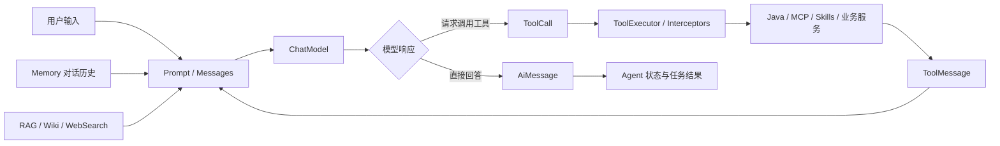
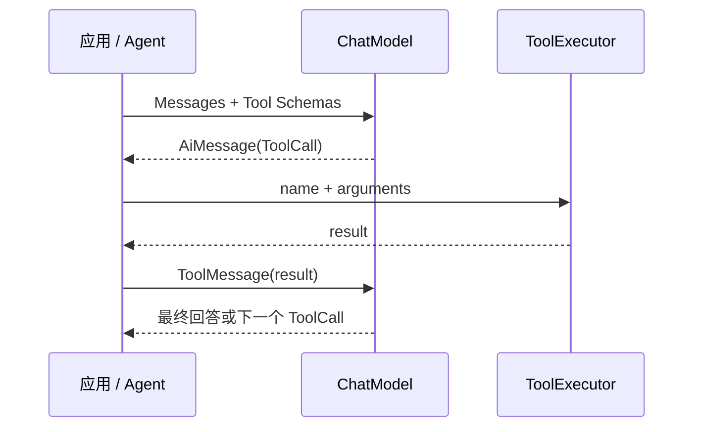

# 核心概念

Agents-Flex 把一个 AI 智能体系统拆成模型、消息、提示词、记忆、工具、知识、智能体与工程基础设施等相互独立的部分。

理解这些概念的边界，比记住某个 API 更重要。模型负责生成，Prompt 负责组织输入，Memory 负责保存历史，Tool 负责连接行动，Agent 负责推进任务，RAG 负责引入外部知识。它们可以组合，但不是同一个东西。

如果你还不了解 Agents-Flex 的整体能力，建议先阅读 [Agents-Flex 是什么](./what-is-agentsflex.md)；如果希望立即运行代码，可以直接进入 [对话模型快速开始](../chat/getting-started.md)。

## 一次智能体请求是怎样完成的

下面这张图展示了 Agents-Flex 中最常见的执行关系：



一次简单问答只需要 `Prompt -> ChatModel -> AiMessage`。一个能完成任务的 Agent 则可能多次经过工具调用、知识检索与模型推理，直到得到最终结果或需要用户补充信息。

## 核心对象速览

| 概念 | Agents-Flex 中的主要抽象 | 负责什么 | 不负责什么 |
| --- | --- | --- | --- |
| 模型 | `ChatModel`、`EmbeddingModel`、`RerankModel` 等 | 调用具体 AI 模型 | 不自动管理完整任务 |
| 消息 | `SystemMessage`、`UserMessage`、`AiMessage`、`ToolMessage` | 表达一次对话中的角色和内容 | 不负责调用模型 |
| 提示词 | `Prompt`、`SimplePrompt`、`MemoryPrompt` | 把消息、工具和元数据组织成模型输入 | 不等同于一段字符串 |
| 记忆 | `ChatMemory` | 保存和读取会话历史 | 不等同于模型上下文窗口 |
| 工具 | `Tool`、`ToolCall`、`ToolExecutor` | 把外部能力暴露给模型并执行 | 不负责决定整个任务流程 |
| 智能体 | `IAgent`、`ReActAgent`、`RoutingAgent` | 推进多步骤任务和状态 | 不等同于 ChatModel |
| 文档 | `Document`、`DocumentSplitter` | 表示和切分可检索知识 | 不负责生成回答 |
| 向量检索 | `EmbeddingModel`、`VectorStore`、`SearchWrapper` | 将语义转成向量并召回候选知识 | 不保证最终排序和答案质量 |
| 重排 | `RerankModel` | 对召回结果做更精确的相关性排序 | 不替代向量数据库 |
| 模型路由 | `RoutedChatModel`、`RoutedEmbeddingModel` | 在多个模型节点间选择、重试和熔断 | 不负责业务意图路由 |

## 模型：系统的生成与感知能力

### ChatModel

`ChatModel` 是当前 Agents-Flex 对对话模型的统一抽象。它接受 `String` 或 `Prompt`，返回模型消息，并同时提供同步和流式 API：

```java
String answer = chatModel.chat("什么是 Tool Calling？");

AiMessageResponse response = chatModel.chat(prompt);

chatModel.chatStream(prompt, listener);
```

OpenAI、Qwen、DeepSeek、Ollama、LiteLLM 以及兼容 OpenAI 协议的服务都可以接入这一抽象。上层业务依赖 `ChatModel`，模型厂商的 Endpoint、鉴权、请求格式与响应解析则由具体模块处理。

需要特别区分：

- **模型**负责根据输入产生响应；
- **Agent**负责决定下一步做什么、是否调用工具、何时结束；
- 调用一次 `chat()` 不会自动变成一个能够持续行动的 Agent。

### 其他模型类型

Agents-Flex 不把所有 AI 能力都塞进 `ChatModel`，而是为不同任务提供独立接口：

| 模型接口 | 输入与输出 | 典型用途 |
| --- | --- | --- |
| `EmbeddingModel` | 文本或文档 -> 向量 | 语义检索、聚类、RAG |
| `RerankModel` | 查询 + 文档列表 -> 重排后的文档 | 提升检索结果相关性 |
| `ImageModel` | 图片生成请求 -> 图片结果 | 文生图、图像生成任务 |
| `VideoModel` | 视频生成请求 -> 视频任务或结果 | 文生视频、图生视频 |
| `TextToSpeechModel` | 文本 -> 音频 | 语音播报、实时语音交互 |
| `SpeechToTextModel` | 音频 -> 文本 | 语音识别、会议转写 |

这些接口可以单独使用，也可以组合成多模态 Agent。例如，STT 把用户语音转成文字，ChatModel 进行理解和决策，再由 TTS 生成语音回复。

### Model Config、Client 与协议适配

模型配置对象保存 `provider`、`endpoint`、`apiKey`、`model` 等参数。对于聊天模型，框架进一步拆分了两个扩展点：

- `ChatRequestSpecBuilder`：把 Prompt 和配置转换成厂商需要的 URL、Header 与 Body；
- `ChatClient`：负责实际通信与响应生命周期；
- `ChatMessageSerializer` / `AiMessageParser`：负责消息序列化和响应解析。

因此，“支持一个新模型”不一定意味着复制整套框架。OpenAI 兼容服务通常只需配置；协议存在差异时，可以替换请求构建、客户端或解析器中的一层。详见 [ChatModel](../chat/chat-model.md)、[ChatConfig](../chat/chat-config.md) 和 [ChatClient](../chat/chat-client.md)。

## Message：模型真正看到的对话单元

对话不是一个不断增长的字符串，而是按角色排列的消息序列。

| 消息类型 | 含义 | 常见内容 |
| --- | --- | --- |
| `SystemMessage` | 定义模型角色、规则和行为边界 | “你是一名订单客服，只能查询当前用户的订单” |
| `UserMessage` | 用户输入 | 文本，也可以包含图片、音频、视频或文件地址 |
| `AiMessage` | 模型响应 | 文本、推理内容、Token 统计、Tool Calls |
| `ToolMessage` | 工具执行结果 | 查询结果、执行状态或错误信息 |

`AiMessage` 在流式场景中还区分：

- `content`：当前回调收到的增量文本；
- `fullContent`：截至当前已经合并的完整文本；
- `finalDelta`：是否为流式响应的最终消息；
- `toolCalls`：模型请求执行的工具列表。

消息都可以携带 Metadata，用于附加来源、业务 ID、追踪信息等数据。详细说明见 [Message 消息](../chat/message.md)。

## Prompt：一次模型调用的完整输入

在日常语言里，Prompt 常指“一段提示词”；在 Agents-Flex 中，`Prompt` 是更完整的输入容器，它可以同时包含：

- System、User、AI 与 Tool 消息；
- 多轮对话历史；
- 可供模型选择的工具定义；
- `toolChoice` 等调用约束；
- 多模态内容和自定义 Metadata。

框架提供两种主要实现：

### SimplePrompt

`SimplePrompt` 适合单轮、无状态调用。`chatModel.chat("你好")` 内部就是把字符串包装为一个 `SimplePrompt`。

```java
SimplePrompt prompt = new SimplePrompt("分析这张图片中的内容");
prompt.setSystemMessage(new SystemMessage("你是一名图像审核员"));
prompt.addImageUrl("https://example.com/image.png");
```

能否处理图片最终取决于所选模型及其配置声明，而不是 Prompt 本身。

### MemoryPrompt

`MemoryPrompt` 适合多轮对话。它从 `ChatMemory` 读取历史消息，将 System Message 放在消息序列开头，还可以附加仅参与当前请求、使用后即清除的临时消息。

```java
MemoryPrompt prompt = new MemoryPrompt();
prompt.setSystemMessage("你是一名 Java 架构师");
prompt.addUserMessage("设计一个订单缓存方案");

AiMessageResponse response = chatModel.chat(prompt);
prompt.addMessage(response.getMessage());
```

模型响应不会自动写回 `MemoryPrompt`，应用需要明确决定哪些 AI 消息、工具结果或中间过程值得保存。

### PromptTemplate

`PromptTemplate` 用于把变量填入文本模板：

```java
PromptTemplate template = PromptTemplate.of(
    "请为 {{product.name}} 生成一段面向 {{audience}} 的介绍"
);

String text = template.format(data);
```

它解决的是文本复用和变量替换问题。模板生成的文本通常还会被放入 `SimplePrompt`、`UserMessage` 或 `SystemMessage`；因此 `PromptTemplate` 与 `Prompt` 不是同一层抽象。

更多配置见 [Prompt 提示词](../chat/prompt.md)、[PromptTemplate](../chat/prompt-template.md) 和 [Memory 记忆](../chat/memory.md)。

## Memory、上下文窗口与 Token

这三个概念经常被混为一谈：

- **Memory** 是应用保存的历史数据，可以位于 JVM、Redis 或数据库中；
- **上下文窗口**是一次请求中模型能够接收的 Token 上限；
- **Token** 是模型处理文本的计量单位，也通常影响延迟与费用。

Memory 中保存了 1000 条消息，不代表一次请求应该发送 1000 条。应用需要按模型窗口、成本和任务相关性选择历史内容。常见策略包括：

- 只携带最近若干条消息；
- 截断过长消息；
- 把较早对话压缩成摘要；
- 将长期事实提取到用户画像或知识库；
- 对工具返回的大段数据只保留结论或引用。

Token 不是固定字数。不同模型使用不同 Tokenizer，中英文、代码和标点的切分方式也不同，不应使用固定的“一个 Token 等于几个字符”作为精确估算。Agents-Flex 提供本地 Token 计数工具，但计费和窗口判断仍应以目标模型服务返回的数据为准。

## Tool Calling：让模型从生成文本走向执行动作

Tool Calling，也叫 Function Calling，是模型输出结构化调用意图的一种协议。一次完整的工具闭环包含：

1. 应用把工具名称、描述和参数 Schema 随 Prompt 发给模型；
2. 模型返回 `ToolCall`，说明要调用哪个工具以及参数；
3. `ToolExecutor` 解析参数并经过工具拦截器链执行 `Tool`；
4. 应用把执行结果封装为 `ToolMessage` 加入对话；
5. 模型读取工具结果，继续调用其他工具或生成最终回答。



这里有两个重要边界：

- 模型只是**请求**调用工具，真正执行发生在你的 Java 进程或配置的 Runtime 中；
- 一次模型响应可能只完成闭环的一步，应用或 Agent 需要负责继续循环。

Agents-Flex 支持通过 `@ToolDef` / `@ToolParam` 扫描 Java 方法，也支持 Builder 动态构建工具。`ToolInterceptor` 可以在执行前后加入鉴权、审批、限流、审计和可观测性。详见 [Tool 工具调用](../chat/tool.md)、[Tool 构建](../chat/tool-build.md) 和 [Tool 拦截器](../chat/tool-interceptor.md)。

## Agent：围绕目标持续推进任务

Agent 不是某种特定大模型，而是一种运行方式：它持有目标和状态，根据模型响应决定下一步，必要时调用工具、检索知识、询问用户，并在满足终止条件后交付结果。

Agents-Flex 当前提供的核心 Agent 能力包括：

### ReAct Agent

[ReAct Agent](../agent/react-agent.md) 在 Reasoning 与 Acting 之间循环。它可以直接回答简单问题；遇到需要外部信息的任务时选择工具；缺少必要信息时向用户请求澄清。执行状态可以保存并在之后恢复。

### Routing Agent

[Routing Agent](../agent/routing-agent.md) 根据关键词或 LLM 判断，把输入交给合适的专业 Agent。它解决的是**业务意图路由**，而 Model Router 解决的是**模型节点的负载均衡和高可用**，两者不要混淆。

### Subagent

[Subagent](../chat/subagent.md) 让主 Agent 把任务委托给拥有不同说明和执行器的子 Agent。任务可以同步执行，也可以在后台运行并通过任务 ID 获取结果。它适合研究、代码审查、数据分析等能够清晰划分职责的复杂任务。

并不是所有需求都应该使用 Agent。固定步骤、结果确定的业务流程通常更适合普通 Java 代码或工作流；只有当下一步依赖语义判断、环境反馈或动态工具选择时，Agent 循环才真正产生价值。

## MCP、Skills 与 Tool 的区别

这三个概念最终都能扩展模型能力，但扩展方式不同：

| 概念 | 本质 | 最适合的场景 |
| --- | --- | --- |
| Tool | Agents-Flex 内部统一的可调用能力接口 | 暴露 Java 方法、API 或一个确定的动作 |
| MCP | 连接外部工具服务的标准协议 | 跨进程、跨语言复用标准化工具生态 |
| Skills | 包含说明、脚本、模板和资源的能力包 | 封装需要方法论、文件和多步骤执行的复杂能力 |

### MCP

[MCP](../chat/mcp.md) 客户端管理外部 MCP Server，并把 MCP Tool 自动适配为 Agents-Flex 的 `Tool`。支持 Stdio、HTTP SSE 与 Streamable HTTP。MCP 解决的是“如何以标准协议发现和调用外部能力”，并不自动提供任务规划。

MCP 模块依赖官方 Java SDK，因此需要 JDK 17 或更高版本。

### Skills

[Skills](../chat/skills.md) 采用文件系统组织能力。`SKILL.md` 描述使用条件和流程，Skill 目录还可以包含脚本、参考资料与模板。框架按需向模型披露 Skill 内容，避免把所有说明一次塞入上下文。

`SkillRuntime` 决定脚本和文件操作发生在哪里：

- `LocalSkillRuntime`：直接使用宿主机环境，没有安全隔离；
- OpenSandbox Runtime：在 OpenSandbox 管理的隔离环境执行；
- AIO Sandbox Runtime：通过远端 Sandbox API 执行。

因此，Skill 不只是 Prompt，也是可版本化的执行资产；Runtime 则是必须明确配置的安全边界。

## RAG：让模型使用外部知识

大模型参数中的知识可能过时，也不了解企业私有数据。RAG（Retrieval-Augmented Generation，检索增强生成）先从外部知识源检索相关内容，再将内容作为上下文交给 ChatModel。

一个完整的 RAG 系统通常分为两个阶段。

### 知识入库

```text
文件或网页 -> 文本提取 -> Document -> 切分 -> Embedding -> VectorStore
```

- `File2TextService`：从 PDF、Word、Excel、PowerPoint、HTML、纯文本等内容中提取文本；
- `Document`：包含 ID、标题、正文、向量、分数和 Metadata 的知识单元；
- `DocumentSplitter`：按长度、Token、正则、Markdown 标题或 AI 语义切分长文档；
- `EmbeddingModel`：把文档语义映射为 `float[]` 向量；
- `VectorStore` / `DocumentStore`：持久化文档、向量与 Metadata。

切分不是越小越好。过大的块会混入无关内容，过小的块会丢失上下文。合理的切分方式取决于文档结构、查询粒度和目标模型窗口。

### 在线检索与生成

```text
用户问题 -> Embedding -> 向量召回 + Metadata 过滤 -> Rerank -> 上下文 -> ChatModel
```

- `SearchWrapper` 描述查询文本、结果数、最低分数、过滤条件和返回字段；
- Vector Store 使用查询向量召回语义相近的候选文档；
- `RerankModel` 同时阅读查询与候选文档，重新计算相关性顺序；
- 应用把最相关的内容、来源和回答约束加入 Prompt。

Embedding 负责“把语义变成可检索的向量”，Vector Store 负责“快速找到候选”，Rerank 负责“在候选中做更精细的排序”。三者互相协作，但不能替代彼此。

Agents-Flex 已提供 Redis、Milvus、Elasticsearch、OpenSearch、PgVector、Qdrant、Chroma 等存储适配。详见 [Document](../rag/document.md)、[文件转文本](../rag/file2text.md)、[文档切分](../rag/splitter.md)、[Embedding](../models/embedding.md)、[Vector Store](../rag/vector-store.md) 与 [Rerank](../models/rerank.md)。

## 面向特定场景的知识与工具

并非所有外部信息都应该先进入向量数据库。Agents-Flex 还提供了针对不同数据形态的模块：

- [WebSearch](../chat/websearch.md)：通过 Tavily、Brave、博查、百度千帆、Firecrawl 等服务搜索实时互联网；
- [WebFetch](../chat/webfetch.md)：获取和提取指定网页内容；
- [LLM Wiki](../chat/llm-wiki.md)：把结构化的领域知识树按需暴露给模型；
- [Text2SQL](../chat/text2sql.md)：渐进式读取数据表结构，生成并执行只读参数化 SQL；
- Tool 与 MCP：查询业务 API、内部系统或外部 SaaS。

选择方式取决于数据：稳定的大规模文档适合 RAG，层次清晰的权威知识适合 Wiki，实时公开信息适合 WebSearch，结构化业务数据适合 Text2SQL。

## 模型路由、Agent 路由与负载均衡

“路由”在智能体系统中可能指三件不同的事：

| 路由类型 | 根据什么选择 | 选择的目标 |
| --- | --- | --- |
| Model Router | 标签、权重、活跃请求、节点健康 | 某个 Chat 或 Embedding 模型节点 |
| Routing Agent | 用户关键词、对话上下文、LLM 判断 | 某个业务 Agent |
| Tool Choice | Prompt 中的工具描述和模型判断 | 某个 Tool |

[Model Router](./model-router.md) 提供最少活跃与加权随机负载均衡、自动重试、熔断、半开恢复和标签过滤。上层仍然使用普通 `ChatModel` 或 `EmbeddingModel` 接口，因此模型节点变化不会侵入业务代码。

## Interceptor、Context 与 Observability

生产系统往往需要在模型与工具调用前后执行公共逻辑。Agents-Flex 通过责任链提供两个主要扩展面：

- `ChatInterceptor`：拦截同步或流式模型调用；
- `ToolInterceptor`：拦截工具执行。

拦截器可以读取对应的 `ChatContext` 或 `ToolContext`，实现重试、鉴权、限流、缓存、审计、内容安全、成本统计或自定义路由，而不修改模型与业务工具本身。

框架内置 OpenTelemetry 可观测能力，对模型调用和 Tool 执行记录 Trace 与 Metrics，并按 provider、model、operation、tool 等维度标记。可观测性告诉你“一次请求发生了什么”，模型路由则根据运行状态决定“下一次请求应该去哪里”。详见 [对话拦截器](../chat/chat-interceptor.md)、[工具拦截器](../chat/tool-interceptor.md) 与 [可观测性](../observability/observability.md)。

## 最容易混淆的概念

### ChatModel 与 Agent

`ChatModel` 完成一次生成；Agent 围绕目标执行零次或多次模型调用与工具调用。

### Prompt 与 Message

Message 是一个角色的一条消息；Prompt 是一次模型请求的完整输入容器，内部包含有序 Message、Tools 和 Metadata。

### Memory 与模型上下文

Memory 是应用保存的数据；模型上下文是本次请求实际发送的数据。Memory 可以很大，但必须经过选择、裁剪或摘要后进入上下文窗口。

### Tool、MCP 与 Skills

Tool 是统一调用接口；MCP 是连接外部 Tool 服务的协议；Skills 是包含方法、脚本和资源的能力包。MCP Tool 与 Skills Tool 最终都可以进入同一套 Tool Calling 流程。

### Embedding、Vector Store 与 Rerank

Embedding 生成向量，Vector Store 召回候选，Rerank 精排候选。只接入其中一个不能自动构成完整 RAG。

### RAG 与模型训练

RAG 在请求时提供外部上下文，不会改变模型参数；微调或继续训练会改变模型行为或参数，但不适合频繁更新事实知识。企业知识问答通常先考虑 RAG。

## 建议的学习顺序

1. 通过 [快速开始](../chat/getting-started.md) 完成同步和流式模型调用；
2. 阅读 [Message](../chat/message.md)、[Prompt](../chat/prompt.md) 与 [Memory](../chat/memory.md)，理解上下文如何构造；
3. 使用 [Tool](../chat/tool.md) 让模型调用一个真实 Java 方法；
4. 根据任务选择 [ReAct Agent](../agent/react-agent.md)、[MCP](../chat/mcp.md)、[Skills](../chat/skills.md) 或 [Subagent](../chat/subagent.md)；
5. 需要企业知识时接入 [RAG](../rag/document.md)、[LLM Wiki](../chat/llm-wiki.md) 或 [Text2SQL](../chat/text2sql.md)；
6. 上线前补齐 [模型路由](./model-router.md)、拦截器、安全控制与 [可观测性](../observability/observability.md)。

掌握这些边界后，Agents-Flex 就不再是一串零散 API，而是一组可以按任务复杂度逐步组合的 Java AI 构件。
