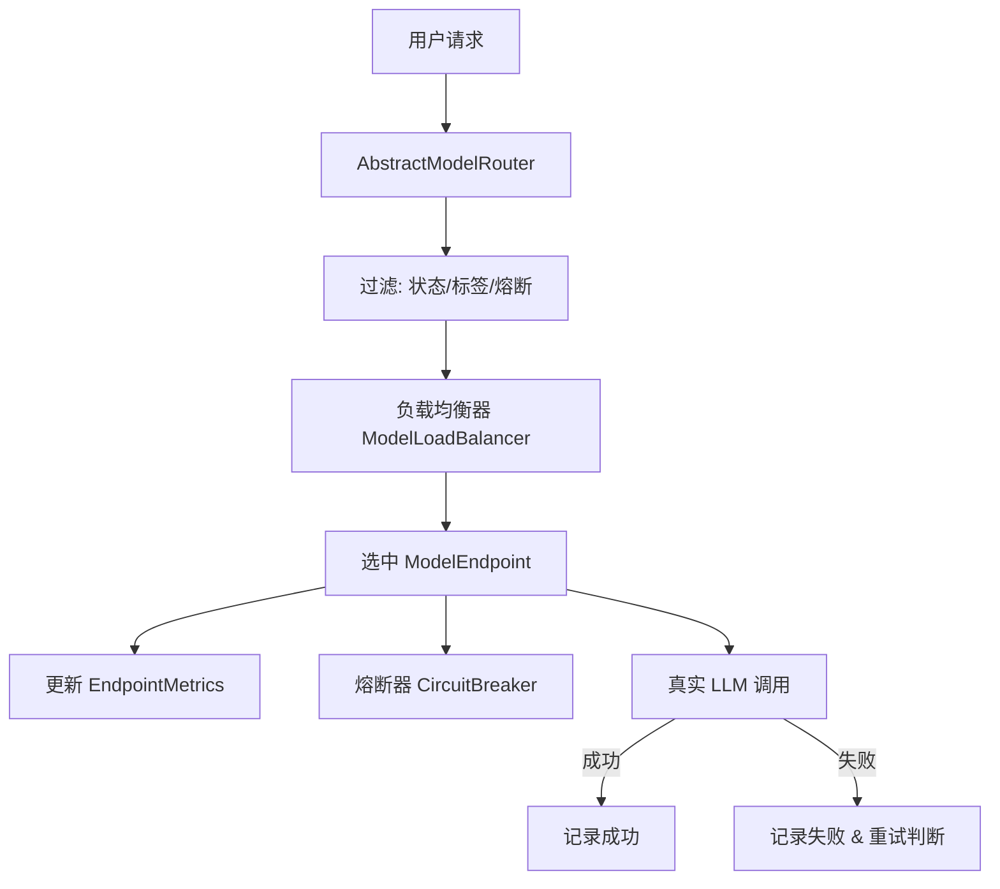
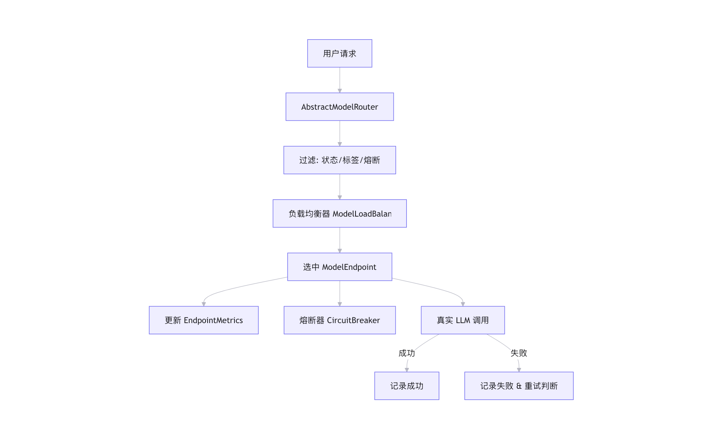

<div v-pre>

# Agents-Flex 模型路由 与 高可用机制


## 1. 概述 (Overview)

在构建基于大语言模型（LLM）的企业级应用时，单一模型往往无法满足所有场景需求（如成本、速度、能力差异）。同时，外部模型服务可能存在不稳定性。

**Agents-Flex** 提供了一套生产就绪的 **Model Router（模型路由）** 机制，旨在解决以下核心问题：
1.  **多模型管理**：统一接入 OpenAI, Qwen, DeepSeek, Claude 等不同厂商的模型。
2.  **智能负载均衡**：根据实时负载、权重或随机策略分发请求。
3.  **高可用保障**：通过熔断器（Circuit Breaker）防止故障节点拖垮系统。
4.  **自动重试**：在遇到临时故障时自动切换节点或重试。
5.  **标签路由**：根据业务需求（如“需要视觉能力”、“需要低成本”）动态选择模型。

本文档将深入解析 `模型路由` 与 `高可用机制` 包下的核心设计与实现。


## 2. 核心架构 (Core Architecture)

模型路由的核心由以下四个组件协同工作：

1.  **ModelEndpoint**: 模型节点的抽象，包含真实模型实例、运行时指标、状态和标签。
2.  **EndpointMetrics**: 轻量级、无锁的运行时指标统计（活跃数、成功率、延迟等）。
3.  **ModelLoadBalancer**: 负载均衡策略接口及实现。
4.  **CircuitBreaker**: 熔断器，保护系统免受持续失败的模型影响。
5.  **AbstractModelRouter**: 路由执行引擎，整合上述组件完成请求调度。






## 3. 核心组件详解

### 3.1 ModelEndpoint (模型节点)

`ModelEndpoint<T>` 是路由系统的基本单元，代表一个具体的模型实例。

**关键属性：**
*   `model`: 真实的模型对象（如 `ChatModel`, `EmbeddingModel）。
*   `metrics`: `EndpointMetrics` 实例，记录该节点的实时运行数据。
*   `status`: `EndpointStatus` (UP, DOWN, HALF_OPEN)，当前节点健康状态。
*   `weight`: 权重，用于加权随机负载均衡。
*   `tags`: 标签集合，用于功能匹配（如 `vision`, `reasoning`, `cheap`）。
*   `consecutiveFailures`: 连续失败次数，用于熔断判断。

**代码示例：**
```java
// 创建一个带有标签和权重的节点
ModelEndpoint<ChatModel> endpoint = new ModelEndpoint<>(myQwenModel);
endpoint.setWeight(10);
endpoint.addTags(Set.of("cheap", "fast"));
```

### 3.2 EndpointMetrics (运行时指标)

为了追求极低开销和高并发安全，`EndpointMetrics` 完全基于 JVM 内存态原子类 (`AtomicInteger`, `AtomicLong`)实现，**不依赖** Prometheus 或 OpenTelemetry 等重型观测系统。

**核心指标：**
*   `activeRequests`: 当前正在执行的请求数（用于最少活跃负载均衡）。
*   `totalRequests`: 总请求数。
*   `successRequests` / `failedRequests`: 成功/失败计数。
*   `totalLatencyMs`: 总延迟毫秒数。

**计算方法：**
*   `successRate()`: 成功率 (0.0 - 1.0)。
*   `avgLatencyMs()`: 平均响应延迟。

**注意：**
*   `beginRequest()` 必须在调用模型前执行。
*   `endRequest()` 必须在 `finally` 块中执行，确保活跃计数正确释放。
*   `recordSuccess(latency)` 和 `recordFailure(latency)` 用于更新统计和熔断状态。

### 3.3 EndpointStatus (节点状态机)

节点状态遵循标准的熔断状态流转：

1.  **UP**: 正常状态，接受请求。
2.  **DOWN**: 熔断状态，拒绝请求。当连续失败次数达到阈值时进入此状态。
3.  **HALF_OPEN**: 半开状态，尝试恢复。当熔断冷却时间结束后进入此状态，允许少量请求探测。若成功则转为 UP，若失败则回到 DOWN。

### 3.4 ModelLoadBalancer (负载均衡器)

接口定义：
```java
public interface ModelLoadBalancer<T> {
    ModelEndpoint<T> select(List<ModelEndpoint<T>> endpoints);
}
```

#### 内置实现：

1.  **LeastActiveLoadBalancer (推荐)**
    *   **原理**: 选择当前 `activeRequests` 最小的节点。若相同，则选择平均延迟最低的。
    *   **适用场景**: AI 模型推理耗时差异大，此策略能最好地平衡后端压力，避免慢节点堆积请求。
    *   **代码逻辑**:
        ```java
        endpoints.stream()
            .min(Comparator.comparingInt(e -> e.getMetrics().activeRequests())
                           .thenComparingLong(e -> e.getMetrics().avgLatencyMs()))
        ```

2.  **WeightedRandomLoadBalancer**
    *   **原理**: 根据 `weight` 属性进行加权随机选择。
    *   **适用场景**: 希望按比例分配流量（例如：80% 流量给便宜模型，20% 给高质量模型）。

*(注：RoundRobin 和 LowestLatency 也可通过实现接口轻松扩展)*

### 3.5 CircuitBreaker (熔断器)

接口定义：
```java
public interface CircuitBreaker<T> {
    boolean allowRequest(ModelEndpoint<T> endpoint);
    void recordSuccess(ModelEndpoint<T> endpoint);
    void recordFailure(ModelEndpoint<T> endpoint);
}
```

#### DefaultCircuitBreaker 默认实现：

*   **配置参数**:
    *   `failureThreshold`: 连续失败阈值（默认 5 次）。
    *   `recoverMs`: 熔断后的冷却/恢复时间（默认 30,000 ms）。
*   **逻辑**:
    *   **allowRequest**: 若状态为 UP，允许；若为 DOWN，检查是否超过 `recoverMs`，若是则转为 HALF_OPEN 并允许；否则拒绝。
    *   **recordSuccess**: 清空连续失败计数，状态重置为 UP。
    *   **recordFailure**: 增加连续失败计数，若达到阈值，状态设为 DOWN。

### 3.6 RetryPolicy (重试策略)

*   **DefaultRetryPolicy**: 简单基于最大重试次数。
*   **扩展性**: 开发者可实现更复杂的策略（如指数退避、特定异常不重试等）。


## 4. 路由执行流程 (Execution Flow)

`AbstractModelRouter.execute()` 方法是核心入口，其执行逻辑如下：

1.  **过滤候选节点 (`filterEndpoints`)**:
    *   排除状态为 `DOWN` 的节点。
    *   调用 `circuitBreaker.allowRequest()` 排除处于熔断冷却期的节点。
    *   根据请求携带的 `tags` 进行标签匹配 (`matchTags`)。
2.  **检查可用性**: 若无候选节点，抛出 `RouterException`。
3.  **负载均衡**: 调用 `loadBalancer.select()` 选择一个最佳 `ModelEndpoint`。
4.  **开始计时**: 调用 `endpoint.getMetrics().beginRequest()`。
5.  **执行调用**: 通过 `ModelInvoker` 执行真实模型调用。
6.  **结果处理**:
    *   **成功**:
        *   计算延迟。
        *   `metrics.recordSuccess(latency)`。
        *   `circuitBreaker.recordSuccess(endpoint)`。
        *   返回结果。
    *   **失败**:
        *   计算延迟。
        *   `metrics.recordFailure(latency)`。
        *   `circuitBreaker.recordFailure(endpoint)`。
        *   捕获异常。
7.  **重试判断**:
    *   若 `retryPolicy.shouldRetry()` 返回 true，且还有重试机会，回到步骤 1（重新过滤和选择，可能切换到其他节点）。
    *   若不可重试，跳出循环。
8.  **最终清理**: `finally` 块中调用 `endpoint.getMetrics().endRequest()`。
9.  **异常抛出**: 若所有尝试均失败，抛出包含最后异常的 `RouterException`。


## 5. 使用指南 (Usage Guide)

### 5.1 快速开始：使用默认配置

`RoutedChatModel` 提供了便捷的构造函数，自动配置最少活跃负载均衡、3次重试和默认熔断器。

```java
import com.agentsflex.core.model.router.RoutedChatModel;
import com.agentsflex.llm.chat.ChatModel;
import java.util.List;

// 假设已有多个 ChatModel 实例
ChatModel qwenModel = ...;
ChatModel gptModel = ...;
ChatModel deepseekModel = ...;

List<ChatModel> models = List.of(qwenModel, gptModel, deepseekModel);

// 创建路由模型
ChatModel routedModel = new RoutedChatModel(models);

// 像使用普通模型一样使用它
AiMessageResponse response = routedModel.chat(prompt, options);
```

### 5.2 高级配置：自定义策略

若需精细控制负载均衡、熔断阈值或标签路由，请使用全参构造函数。

```java
import com.agentsflex.core.model.router.endpoint.ModelEndpoint;
import com.agentsflex.core.model.router.balance.WeightedRandomLoadBalancer;
import com.agentsflex.core.model.router.breaker.DefaultCircuitBreaker;
import com.agentsflex.core.model.router.retry.DefaultRetryPolicy;
import java.util.Set;

// 1. 创建 Endpoints 并配置权重和标签
ModelEndpoint<ChatModel> ep1 = new ModelEndpoint<>(qwenModel);
ep1.setWeight(5);
ep1.addTags(Set.of("cheap"));

ModelEndpoint<ChatModel> ep2 = new ModelEndpoint<>(gptModel);
ep2.setWeight(1);
ep2.addTags(Set.of("high-quality", "vision"));

List<ModelEndpoint<ChatModel>> endpoints = List.of(ep1, ep2);

// 2. 配置组件
// 使用加权随机负载均衡
WeightedRandomLoadBalancer<ChatModel> lb = new WeightedRandomLoadBalancer<>();
// 连续失败 3 次即熔断，冷却 10 秒
DefaultCircuitBreaker<ChatModel> cb = new DefaultCircuitBreaker<>(3, 10000);
// 最多重试 2 次
DefaultRetryPolicy retry = new DefaultRetryPolicy(2);

// 3. 创建路由模型
RoutedChatModel routedModel = new RoutedChatModel(endpoints, lb, retry, cb);

// 4. 调用时指定标签（可选）
ChatOptions options = ChatOptions.builder()
    .metadata("modelTags", Set.of("high-quality")) // 只选择 gptModel
    .build();

AiMessageResponse response = routedModel.chat(prompt, options);
```

### 5.3 Embedding 模型路由

`RoutedEmbeddingModel` 的使用方式与 Chat 模型类似：

```java
List<EmbeddingModel> embeddingModels = List.of(modelA, modelB);
EmbeddingModel routedEmbedding = new RoutedEmbeddingModel(embeddingModels);

VectorData vectors = routedEmbedding.embed(document, options);
```


## 6. 扩展开发 (Extension)

### 6.1 自定义负载均衡器

实现 `ModelLoadBalancer<T>` 接口：

```java
public class MyCustomLoadBalancer<T> implements ModelLoadBalancer<T> {
    @Override
    public ModelEndpoint<T> select(List<ModelEndpoint<T>> endpoints) {
        // 你的选择逻辑
        return endpoints.get(0);
    }
}
```

### 6.2 自定义熔断器

实现 `CircuitBreaker<T>` 接口，可集成 Sentinel 或 Resilience4j 等成熟框架：

```java
public class SentinelCircuitBreaker<T> implements CircuitBreaker<T> {
    @Override
    public boolean allowRequest(ModelEndpoint<T> endpoint) {
        // 调用 Sentinel API 判断
        return true;
    }

    @Override
    public void recordSuccess(ModelEndpoint<T> endpoint) {
        // 记录成功
    }

    @Override
    public void recordFailure(ModelEndpoint<T> endpoint) {
        // 记录失败
    }
}
```

### 6.3 自定义重试策略

实现 `RetryPolicy` 接口：

```java
public class ExponentialBackoffRetryPolicy implements RetryPolicy {
    private final int maxRetries;

    public ExponentialBackoffRetryPolicy(int maxRetries) {
        this.maxRetries = maxRetries;
    }

    @Override
    public boolean shouldRetry(int retryCount, Throwable throwable) {
        if (retryCount >= maxRetries) return false;

        // 可选：根据异常类型决定是否重试
        // if (throwable instanceof TimeoutException) return true;

        try {
            Thread.sleep((long) Math.pow(2, retryCount) * 1000);
        } catch (InterruptedException e) {
            Thread.currentThread().interrupt();
        }
        return true;
    }
}
```


## 7. 最佳实践 (Best Practices)

1.  **首选 LeastActiveLoadBalancer**: 对于 LLM 这种响应时间波动大的服务，最少活跃连接数比轮询更能保证整体吞吐量。
2.  **合理设置熔断阈值**:
    *   `failureThreshold`: 建议设为 3-5。太小容易误杀，太大反应迟钝。
    *   `recoverMs`: 建议设为 10s-60s。给下游服务足够的恢复时间。
3.  **利用标签路由**: 为模型打上 `vision`, `code`, `cheap`, `fast` 等标签，在业务层根据需求动态指定，实现精细化的成本控制和质量保障。
4.  **监控 Metrics**: 虽然 `EndpointMetrics` 是内存态的，但建议定期采集 `successRate` 和 `avgLatencyMs` 并上报到监控系统（如 Prometheus），以便观察模型健康度。
5.  **线程安全**: `ModelEndpoint` 和 `EndpointMetrics` 内部已做并发处理，可在多线程环境下安全使用。


## 8. 常见问题 (FAQ)

**Q: 为什么不用 RoundRobin？**

A: LLM 的推理时间差异巨大（从几百毫秒到几十秒）。RoundRobin 会导致慢节点堆积大量请求，而快节点空闲。LeastActive 能更好地平衡实际负载。

**Q: 熔断后如何自动恢复？**

A: `DefaultCircuitBreaker` 会在 `recoverMs` 时间后自动将状态从 DOWN 转为 HALF_OPEN，并允许一次试探请求。若成功则恢复 UP，若失败则继续 DOWN。

**Q: 如何区分不同业务的模型需求？**

A: 使用 `tags`。例如，代码生成任务要求 `tags=["code"]`，闲聊任务要求 `tags=["cheap"]`。Router 会自动过滤出符合标签的节点池再进行负载均衡。

**Q: Metrics 数据会丢失吗？**

A: 是的，`EndpointMetrics` 是 JVM 内存态的，重启应用后会重置。如需持久化历史数据，需自行对接外部监控系统。


</div>
