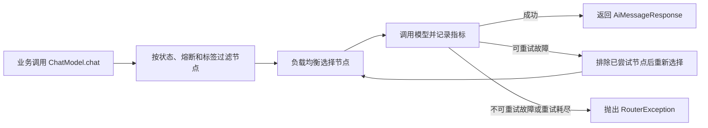

# 模型路由与高可用

`RoutedChatModel` 将多个可替代的 `ChatModel` 包装成一个普通的 `ChatModel`。上层的 Agent、ChatMemory、Web 接口和业务代码只调用这一个对象；节点选择、失败重试、备用节点切换及运行指标由 Router 在内部完成。

它解决的是“这次模型请求应该由哪个可用节点完成”，不是业务意图路由，也不是跨进程的服务发现。

## 为什么需要它

真实环境中的模型调用常见以下问题：

- 一个模型账号或 Endpoint 被临时限速，另一个可用节点仍可完成请求。
- 同一个模型部署在多个区域或网关，需要按并发量分流。
- 需要按能力选择模型，例如图像问题只进入带 `vision` 标签的节点，普通对话优先使用 `cheap` 节点。
- 主模型短时过载时，希望在不修改 Agent 代码的前提下切换到兼容的备用模型。

不需要高可用或只有单一模型节点时，直接使用原始 `ChatModel` 更简单。Router 不会把不兼容的模型变得兼容：同一组节点应能处理同一种 Prompt、工具调用协议、输出格式和上下文长度要求。

## 一次同步调用如何执行


```mermaid
flowchart LR
    A["业务调用 ChatModel.chat"] --> B["按状态、熔断和标签过滤节点"]
    B --> C["负载均衡选择节点"]
    C --> D["调用模型并记录指标"]
    D -->|"成功"| E["返回 AiMessageResponse"]
    D -->|"可重试故障"| F["排除已尝试节点后重新选择"]
    F --> C
    D -->|"不可重试故障或重试耗尽"| G["抛出 RouterException"]
```

例如节点 A 返回 429 限速、节点 B 正常时，Router 会把 A 的错误响应转换为 `ModelRateLimitException`，记录失败后尝试 B。对上层而言仍然只是一次 `chat(...)` 调用。

一个故障转移周期内，同一节点只会尝试一次：`A -> B -> C`。所有候选都失败后，若重试次数尚未耗尽，才开始新一轮选择，避免负载均衡器连续命中刚失败的节点。

## 快速开始

最简单的方式是传入多个 `ChatModel`。此构造方式默认使用最少活跃请求负载均衡、`DefaultRetryPolicy(3)` 和默认熔断器：

```java
ChatModel primary = new OpenAIChatModel(primaryConfig);
ChatModel backup = new OpenAIChatModel(backupConfig);

ChatModel chatModel = new RoutedChatModel(Arrays.asList(primary, backup));

AiMessageResponse response = chatModel.chat(prompt, options);
```

`3` 表示最多三次额外重试，不包含首次请求。因此持续发生可重试故障时，单次调用最多尝试四次。

对于 Agent，不需要特殊接入：将这个 `chatModel` 传给 Agent 或 AgentRunner 原本使用 `ChatModel` 的位置即可。

## 自定义节点与策略

当需要指定标签、权重或熔断阈值时，显式创建 `ModelEndpoint`：

```java
ModelEndpoint<ChatModel> fast = new ModelEndpoint<>(fastModel);
fast.setWeight(5);
fast.addTags(Collections.singleton("fast"));

ModelEndpoint<ChatModel> vision = new ModelEndpoint<>(visionModel);
vision.addTags(Collections.singleton("vision"));

ChatModel chatModel = new RoutedChatModel(
    Arrays.asList(fast, vision),
    new WeightedRandomLoadBalancer<>(),
    new DefaultRetryPolicy(2),
    new DefaultCircuitBreaker<>(3, 10_000)
);
```

| 对象 | 作用 |
| --- | --- |
| `ModelEndpoint<T>` | 保存模型实例、标签、权重、节点状态和内存运行指标。 |
| `ModelLoadBalancer<T>` | 从当前候选节点中选择一个节点。 |
| `RetryPolicy` | 根据已经重试次数和异常类型决定是否再尝试。 |
| `CircuitBreaker<T>` | 根据连续失败控制节点是否继续接收请求。 |
| `RoutedChatModel` | 对外提供标准 `ChatModel` 接口，并协调以上能力。 |

## 标签路由

请求可以在 `ChatOptions` 的 metadata 中声明必需能力：

```java
ChatOptions options = new ChatOptions();
options.putMetadata("modelTags", new HashSet<>(Arrays.asList("vision")));

AiMessageResponse response = chatModel.chat(prompt, options);
```

`modelTags` 必须是 `Set<String>`。节点必须包含全部请求标签才能成为候选节点，例如请求 `vision` 和 `reasoning` 时，只有同时带有这两个标签的 Endpoint 可以被选择。没有符合条件的节点会抛出 `RouterException`。

典型用法包括：

- `vision`：图像理解或图片输入请求。
- `reasoning`：需要较强推理能力的复杂任务。
- `cheap`：对成本敏感的批量摘要、分类或抽取任务。
- `regional-cn`：只允许在特定区域或网关处理的数据。

标签只是选择约束，不会自动修改 Prompt、模型参数或工具集。

## 重试、切换与熔断

默认重试策略只重试通常可恢复的临时故障：

| 异常 | 默认行为 | 原因 |
| --- | --- | --- |
| `ModelRateLimitException` | 重试并优先尝试其他节点 | 节点或账号可能只是暂时限速。 |
| `ModelOverloadedException` | 重试并优先尝试其他节点 | 服务端短时过载通常可恢复。 |
| 网络连接异常、超时 | 重试 | 可能是瞬时网络或网关问题。 |
| `TokenLimitExceededException` | 不重试、不自动切换 | 原 Prompt 超出上下文；应压缩历史或降低输出限制。 |
| `ModelQuotaExceededException` | 不重试、不自动切换 | 额度耗尽不是短时故障。 |
| 其他 `ModelException` | 不重试 | 通常是鉴权、参数或请求内容问题。 |

限速和过载会记录为节点失败，可推动熔断；Token 超限、额度耗尽和其他请求级错误不会污染节点健康状态。默认熔断器连续失败 5 次后将节点标记为不可用，成功调用会清零连续失败计数。

Router 重试会与具体 ChatModel 客户端的网络重试叠加。生产环境应同时检查两层配置，按最坏情况估算请求数、延迟与费用，并为 429 场景配置合适的退避策略。

## 流式调用的故障切换

流式响应无法像同步调用一样在任意时刻切换。原因是文本一旦已经发送给浏览器，备用模型从头生成会造成重复内容；如果两个模型的输出不同，还会形成混合答案。

`RoutedChatModel.chatStream(...)` 的规则如下：

1. 连接建立、首个文本分片、推理片段或 Tool Call 之前发生可重试错误：Router 自动切换备用节点。
2. 已向业务监听器发送任意 `onMessage(...)` 后发生错误：不切换，继续通过原监听器触发 `onError(...)`，然后按正常生命周期触发 `onClose(...)`。
3. Router 会延迟转发 `onOpen(...)`，使“第一个节点立即失败、第二个节点成功”的场景对业务监听器只表现为一次流打开。

```java
chatModel.chatStream(prompt, new StreamResponseListener() {
    @Override
    public void onMessage(StreamContext context, AiMessageResponse response) {
        // 将增量内容推送到 SSE 或 WebSocket。
    }

    @Override
    public void onError(StreamContext context, Throwable error) {
        // 已经有内容时，提示用户本次生成中断；不要在这里拼接另一模型的完整回答。
    }
}, options);
```

如果产品需要“中途失败后继续回答”，应由业务层显式展示中断状态并让用户重新生成，或者根据已输出内容构造新的 Prompt 发起一次新的对话。不要把这种恢复误认为 Router 的透明切换。

## Embedding 路由

`RoutedEmbeddingModel` 复用相同的节点选择、标签、重试和熔断机制：

```java
EmbeddingModel embeddingModel = new RoutedEmbeddingModel(
    Arrays.asList(embeddingA, embeddingB)
);
```

也可以显式指定负载均衡、重试和熔断策略：

```java
EmbeddingModel embeddingModel = new RoutedEmbeddingModel(
    Arrays.asList(
        new ModelEndpoint<>(embeddingA),
        new ModelEndpoint<>(embeddingB)
    ),
    new LeastActiveLoadBalancer<>(),
    new DefaultRetryPolicy(2),
    new DefaultCircuitBreaker<>(3, 10_000)
);
```

Embedding Router 只选择节点，不会校验或转换向量空间。因此同一向量索引中的模型必须输出相同维度，
并使用相同或兼容的距离度量、归一化方式和语义空间。不要把不同 Embedding 模型的向量混写入同一索引，
否则检索质量会不可预测。切换供应商或模型版本时，应先重建索引或在业务侧按模型版本隔离索引。

## 生产检查清单

1. 每组可切换 ChatModel 的工具能力、结构化输出、多模态能力和上下文长度满足同一业务要求。
2. 为限速、过载、Token 超限、全部节点不可用、标签无匹配以及流式中途失败编写集成测试。
3. 结合日志或 OpenTelemetry 观察每个 Endpoint 的延迟、失败率和活跃请求数。
4. 多实例部署时，Endpoint 指标和熔断状态默认仅保存在当前 JVM；需要全局一致状态时应接入业务侧的共享健康检查或配置系统。
5. 备用模型不是“免费保险”：确认其成本、数据区域、模型版本和合规要求。

## 常见问题

### Router 会自动处理超长上下文吗？

不会。`TokenLimitExceededException` 会直接返回给上层。业务应压缩 ChatMemory、缩短 Prompt、减少工具定义或降低 `maxTokens` 后重新调用。

### Router 会按价格自动挑选最便宜模型吗？

不会。可以通过标签把低成本节点隔离出来，再由业务在 `ChatOptions` 中显式传递 `modelTags`；也可以实现自定义 `ModelLoadBalancer` 按成本、区域或实时配额选择。

### 为什么流式内容已经输出后没有切换备用节点？

这是为了保证输出完整性。已发送内容无法撤回，切换会导致重复或混合回答。此时应把错误呈现给用户，并由业务决定是否重新生成。

## 下一步

- [错误重试](../chat/retry.md)
- [ChatModel](../chat/chat-model.md)
- [ChatConfig](../chat/chat-config.md)
