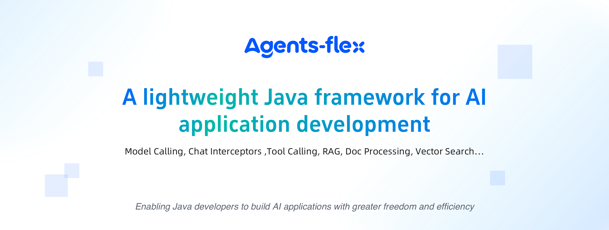
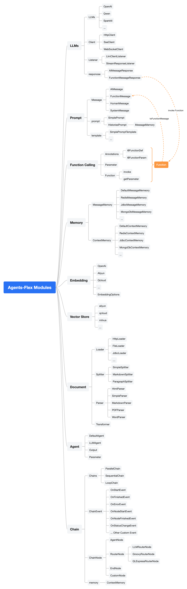

<h4 align="right"><a href="./readme.md">English</a> | <strong>简体中文</strong> | <a href="./readme_ja.md">日本語</a></h4>

<p align="center">
    
</p>


# Agents-Flex： 一个基于 Java 的 LLM（大语言模型）应用开发框架。

---

## 基本能力

- LLM 的访问能力
- Prompt、Prompt Template 定义加载的能力
- Function Calling 定义、调用和执行等能力
- 记忆的能力（Memory）
- Embedding
- Vector Store
- 文档处理
  - 加载器（Loader）
    - Http
    - FileSystem
  - 分割器（Splitter）
  - 解析器（Parser）
    - PoiParser
    - PdfBoxParser
- Chain 执行链
    - SequentialChain 顺序执行链
    - ParallelChain 并发（并行）执行链
    - LoopChain 循环执行连
    - ChainNode
        - AgentNode Agent 执行节点
        - EndNode 终点节点


## 简单对话

使用 OpenAI 大语言模型:

```java
 @Test
public void testChat() {
    OpenAILlmConfig config = new OpenAILlmConfig();
    config.setApiKey("sk-rts5NF6n*******");

    Llm chatModel = new OpenAILlm(config);
    String response = chatModel.chat("请问你叫什么名字");

    System.out.println(response);
}
```

使用 “通义千问” 大语言模型:

```java
@Test
public void testChat() {
    QwenLlmConfig config = new QwenLlmConfig();
    config.setApiKey("sk-28a6be3236****");
    config.setModel("qwen-turbo");

    Llm chatModel = new QwenLlm(config);
    String response = chatModel.chat("请问你叫什么名字");

    System.out.println(response);
}
```

使用 “讯飞星火” 大语言模型:

```java
@Test
public void testChat() {
    SparkLlmConfig config = new SparkLlmConfig();
    config.setAppId("****");
    config.setApiKey("****");
    config.setApiSecret("****");

    Llm chatModel = new SparkLlm(config);
    String response = chatModel.chat("请问你叫什么名字");

    System.out.println(response);
}
```

## 历史对话示例


```java
public static void main(String[] args) {
    SparkLlmConfig config = new SparkLlmConfig();
    config.setAppId("****");
    config.setApiKey("****");
    config.setApiSecret("****");

    Llm chatModel = new SparkLlm(config);

    HistoriesPrompt prompt = new HistoriesPrompt();

    System.out.println("您想问什么？");
    Scanner scanner = new Scanner(System.in);
    String userInput = scanner.nextLine();

    while (userInput != null) {

        prompt.addMessage(new HumanMessage(userInput));

        chatModel.chatStream(prompt, (context, response) -> {
            System.out.println(">>>> " + response.getMessage().getContent());
        });

        userInput = scanner.nextLine();
    }
}
```


## Function Calling

- 第一步: 通过注解定义本地方法

```java
public class WeatherUtil {

    @FunctionDef(name = "get_the_weather_info", description = "get the weather info")
    public static String getWeatherInfo(
        @FunctionParam(name = "city", description = "the city name") String name
    ) {
        //在这里，我们应该通过第三方接口调用 api 信息
        return name + "的天气是阴转多云。 ";
    }
}
```

- 第二步: 通过 Prompt、Functions 传入给大模型，然后得到结果

```java
 public static void main(String[] args) {

    OpenAILlmConfig config = new OpenAILlmConfig();
    config.setApiKey("sk-rts5NF6n*******");

    OpenAILlm chatModel = new OpenAILlm(config);

    FunctionPrompt prompt = new FunctionPrompt("今天北京的天气怎么样", WeatherUtil.class);
    FunctionResultResponse response = chatModel.chat(prompt);

    Object result = response.getFunctionResult();

    System.out.println(result);
    //"北京的天气是阴转多云。 "
}
```

## 生态支持

### 大语言模型


| 大语言模型名称                       | 支持情况   | 描述    |
|-------------------------------|--------|-------|
| ChatGPT                       | ✅ 已支持  | -     |
| Ollama 部署模型                   | ✅ 已支持  | -     |
| 星火大模型                         | ✅ 已支持  | -     |
| 通义千问                          | ✅ 已支持  | -     |
| 智普 ChatGLM                    | ✅ 已支持  | -     |
| 月之暗面 Moonshot                 | ✅ 已支持  | -     |
| 扣子 Coze                       | ✅ 已支持  | -     |
| GiteeAI - Qwen2-7B-Instruct   | ✅ 已支持  | -     |
| GiteeAI - Qwen2-72B-Instruct  | ✅ 已支持  | -     |
| GiteeAI - Yi-1.5-34B-Chat     | ✅ 已支持  | -     |
| GiteeAI - glm-4-9b-chat       | ✅ 已支持  | -     |
| 文心一言                          | 计划中... | 期待 PR |


### 图片生成模型


| 大语言模型名称                                     | 支持情况   | 描述    |
|---------------------------------------------|--------|-------|
| Openai                                      | ✅ 已支持  | -     |
| Stability                                   | ✅ 已支持  | -     |
| GiteeAI - stable-diffusion-3-medium         | ✅ 已支持  | -     |
| GiteeAI - FLUX.1-schnell                    | ✅ 已支持  | -     |
| GiteeAI - stable-diffusion-xl-base-1.0      | ✅ 已支持  | -     |
| GiteeAI - Kolors                            | ✅ 已支持  | -     |
| SiliconFlow - Flux.1-schnell                | ✅ 已支持  | -     |
| SiliconFlow - Stable Diffusion 3            | ✅ 已支持  | -     |
| SiliconFlow - Stable Diffusion XL           | ✅ 已支持  | -     |
| SiliconFlow - Stable Diffusion 2.1          | ✅ 已支持  | -     |
| SiliconFlow - Stable Diffusion Turbo        | ✅ 已支持  | -     |
| SiliconFlow - Stable Diffusion XL Turbo     | ✅ 已支持  | -     |
| SiliconFlow - Stable Diffusion XL Lighting  | ✅ 已支持  | -     |
| 更多                                          |计划中... | 期待 PR |


### Function Calling 方法调用

| 大语言模型名称                     | 支持情况   | 描述    |
|-----------------------------|--------|-------|
| Openai                      | ✅ 已支持  | -     |
| 星火大模型                       | ✅ 已支持  | -     |
| 智普 ChatGLM                  | ✅ 已支持  | -     |
| Ollama                      | ✅ 已支持  | -     |
| 通义千问                        | ✅ 已支持  | -     |
| 更多                          |计划中... | 期待 PR |


### 多模态

| 大语言模型名称                     | 支持情况   | 描述    |
|-----------------------------|--------|-------|
| Openai                      | ✅ 已支持  | -     |
| Ollama                      | ✅ 已支持  | -     |
| 更多                          |计划中... | 期待 PR |


### 向量化模型

| 大语言模型名称                     | 支持情况   | 描述    |
|-----------------------------|--------|-------|
| Openai                      | ✅ 已支持  | -     |
| 星火大模型                       | ✅ 已支持  | -     |
| 智普 ChatGLM                  | ✅ 已支持  | -     |
| Ollama                      | ✅ 已支持  | -     |
| 通义千问                        | ✅ 已支持  | -     |
| GiteeAI - bge-small-zh-v1.5 | ✅ 已支持  | -     |
| GiteeAI - bge-large-zh-v1.5 | ✅ 已支持  | -     |
| GiteeAI - bge-m3            | ✅ 已支持  | -     |
| 更多                          |计划中... | 期待 PR |


### 向量存储（向量数据库）

| 向量数据库名称       | 支持情况   | 描述 |
|---------------|--------|----|
| Milvus        | ✅ 已支持  | -  |
| 阿里云向量数据存储服务   | ✅ 已支持  | -  |
| 腾讯云向量数据存储服务   | ✅ 已支持  | -  |
| OpenSearch    | ✅ 已支持  | -  |
| ElasticSearch | ✅ 已支持  | -  |
| Redis         | ✅ 已支持  | -  |
| Chroma        | ✅ 已支持  | -  |
| Cassandra     | 计划中... | 期待 PR  |
| Gemfire       | 计划中... | 期待 PR  |
| Weaviate      | 计划中... | 期待 PR  |


### 文档解析器


| 向量数据库名称       | 支持情况   | 描述           |
|---------------|--------|--------------|
| PDFBox        | ✅ 已支持  | 用于解析 PDF 文档  |
| POI           | ✅ 已支持  | 用于解析 Word 文档 |
| OmniParse     | ✅ 已支持  | 更丰富的解析能力     |
| 更多           |计划中... | 期待 PR |


## Star 用户专属交流群


## 模块构成


