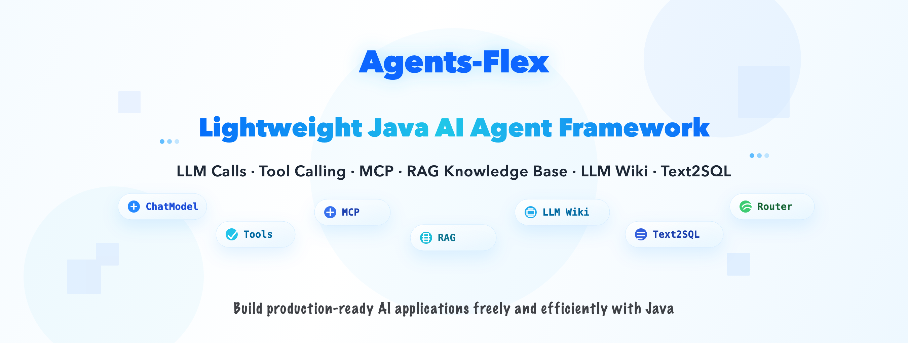

<h4 align="right"><strong>English</strong> | <a href="./readme_zh.md">简体中文</a></h4>

<p align="center">
  
</p>

# Agents-Flex

Agents-Flex is a lightweight AI application development framework for the Java ecosystem. It organizes LLM calls, Tool Calling, Agents, RAG, vector stores, Embedding, image generation, audio, MCP, Skills, Text2SQL, and related capabilities into clear modules, so developers can compose only what they need without being locked into a specific runtime or application framework.

It is suitable for building intelligent customer service, enterprise knowledge bases, natural-language data analysis, Agent workflows, model gateways, AI-assisted office tools, plugin-based tool systems, and Java services that need to connect to multiple model providers at the same time.

## Highlights

- **Java native**: Core modules are compatible with Java 8+ and can run in plain Java, Spring Boot, or other JVM stacks.
- **Unified model abstractions**: `ChatModel`, `EmbeddingModel`, `ImageModel`, `RerankModel`, and other interfaces wrap provider-specific capabilities.
- **Consistent sync and streaming APIs**: The same Prompt, Options, interceptor, and context mechanisms work for both normal chat and streaming output.
- **Complete Tool Calling flow**: Supports annotation-based scanning, programmatic tool building, tool execution, tool message feedback, and tool-level observability.
- **Built-in Agent capabilities**: Includes ReAct Agent, Routing Agent, Subagent, Skills, and other mechanisms for complex tasks.
- **Full RAG building blocks**: Includes document models, parsing, splitting, Embedding, vector stores, retrieval, and Rerank support.
- **Production-oriented design**: Includes model routing, retry, load balancing, circuit breaking, OpenTelemetry observability, and Text2SQL safety interceptors.

## Modules

| Module | Description |
| --- | --- |
| `agents-flex-core` | Core abstractions: Chat, Prompt, Message, Tool, Memory, Agent, Document, Store, Router, Observability |
| `agents-flex-chat` | Chat model integrations: OpenAI-compatible APIs, Qwen, Ollama, DeepSeek, LiteLLM |
| `agents-flex-embedding` | Embedding model integrations: OpenAI, Ollama, Qwen |
| `agents-flex-image` | Image model integrations: OpenAI, Qwen, Alibaba Cloud, Gitee, Qianfan, SiliconFlow, Stability, Tencent, Volcengine |
| `agents-flex-video` | Asynchronous video generation and editing: Alibaba Cloud Model Studio and Volcengine Ark |
| `agents-flex-audio` | Speech-to-text and text-to-speech: Alibaba Cloud, Tencent Cloud, Volcengine |
| `agents-flex-store` | Vector stores: Redis, Qdrant, Chroma, Pgvector, Milvus, OpenSearch, Elasticsearch, Alibaba Cloud, Tencent Cloud, VectoRex |
| `agents-flex-search-engine` | Search engine wrappers: Lucene, Elasticsearch, and search service interfaces |
| `agents-flex-rerank` | Rerank models: default implementation and Gitee Rerank |
| `agents-flex-tool` | Common tools: file system, Shell, Grep, Glob, WebFetch, Python, JavaScript |
| `agents-flex-mcp` | MCP client that converts external MCP tools into Agents-Flex `Tool` instances |
| `agents-flex-skills` | File-system-based Skills loading with progressive disclosure |
| `agents-flex-skills-sandbox` | Sandbox runtime integrations for isolated Skills execution |
| `agents-flex-skills-open-sandbox` | Isolated Skills execution through the OpenSandbox runtime |
| `agents-flex-skills-aio-sandbox` | Isolated Skills execution through an AIO Sandbox service |
| `agents-flex-subagent` | Subagent definitions, background task execution, and output retrieval tools |
| `agents-flex-text2sql` | Natural-language data analysis tools with progressive schema disclosure, read-only SQL checks, and interceptor chains |
| `agents-flex-websearch` | Web search tools with Brave, Bocha, Baidu Qianfan, and custom search providers |
| `agents-flex-wiki` | LLM Wiki support: organize knowledge as a navigable hierarchical Wiki tree with path-based recursive reading and progressive disclosure |
| `agents-flex-spring-boot-starter` | Spring Boot auto-configuration for common models and vector stores |
| `demos` | Example projects |

## Requirements

- Most modules: JDK 8+
- `agents-flex-mcp`: JDK 17+
- Build tool: Maven

The current repository version is defined by the `revision` property in the root `pom.xml`; it is currently `2.2.2`.

## Installation

For plain Java projects, you can use the aggregate dependency:

```xml
<dependency>
    <groupId>com.agentsflex</groupId>
    <artifactId>agents-flex-bom</artifactId>
    <version>2.2.2</version>
</dependency>
```

For Spring Boot projects, use the starter:

```xml
<dependency>
    <groupId>com.agentsflex</groupId>
    <artifactId>agents-flex-spring-boot-starter</artifactId>
    <version>2.2.2</version>
</dependency>
```

You can also depend on only the modules you need:

```xml
<dependency>
    <groupId>com.agentsflex</groupId>
    <artifactId>agents-flex-chat-openai</artifactId>
    <version>2.2.2</version>
</dependency>

<dependency>
    <groupId>com.agentsflex</groupId>
    <artifactId>agents-flex-store-redis</artifactId>
    <version>2.2.2</version>
</dependency>
```

## Quick Start

The following example uses an OpenAI-compatible API. Replace `endpoint`, `model`, and `apiKey` with your own model service configuration.

```java
import com.agentsflex.core.model.chat.ChatModel;
import com.agentsflex.model.chat.openai.OpenAIChatConfig;

public class ChatDemo {
    public static void main(String[] args) {
        ChatModel chatModel = OpenAIChatConfig.builder()
            .endpoint("https://ai.gitee.com")
            .provider("GiteeAI")
            .model("Qwen3-32B")
            .apiKey(System.getenv("GITEE_API_KEY"))
            .buildModel();

        String reply = chatModel.chat("Introduce Agents-Flex in one sentence.");
        System.out.println(reply);
    }
}
```

Streaming output:

```java
import com.agentsflex.core.model.chat.StreamResponseListener;
import com.agentsflex.core.model.chat.response.AiMessageResponse;
import com.agentsflex.core.model.client.StreamContext;

chatModel.chatStream("Explain the Chain of Responsibility pattern in Java.", new StreamResponseListener() {
    @Override
    public void onMessage(StreamContext context, AiMessageResponse response) {
        System.out.print(response.getMessage().getContent());
    }
});
```

## Tool Calling

Business methods can be exposed as tools with annotations:

```java
import com.agentsflex.core.model.chat.tool.annotation.ToolDef;
import com.agentsflex.core.model.chat.tool.annotation.ToolParam;

public class WeatherTools {
    @ToolDef(name = "get_weather", description = "Query the weather for a given city")
    public static String getWeather(
        @ToolParam(name = "city", description = "City name", required = true) String city
    ) {
        return city + ": sunny";
    }
}
```

After registering the tool on a Prompt, the model can call it when needed:

```java
import com.agentsflex.core.model.chat.response.AiMessageResponse;
import com.agentsflex.core.prompt.SimplePrompt;

SimplePrompt prompt = new SimplePrompt("What is the weather in Beijing today?");
prompt.addToolsFromClass(WeatherTools.class);

AiMessageResponse response = chatModel.chat(prompt);
if (response.hasToolCalls()) {
    prompt.setToolMessages(response.executeToolCallsAndGetToolMessages());
    System.out.println(chatModel.chat(prompt).getMessage().getContent());
}
```

If tools come from runtime configuration, a plugin system, or workflow nodes, you can also build them dynamically with `Tool.builder()`.

## Agents And Orchestration

Agents-Flex includes several mechanisms for complex tasks:

- `ReActAgent`: Executes multi-step tasks with Thought / Action / Observation.
- `RoutingAgent`: Routes requests to a more suitable Agent.
- `SubagentTools`: Lets a parent Agent create subtasks with synchronous or background execution.
- `SkillsTool`: Reads local Skills directories and loads specialized capability instructions and resources on demand.
- `McpClientManager`: Connects to MCP Servers and wraps remote tools as `Tool` instances.

These capabilities are built on the same `Tool`, `Prompt`, and `ChatModel` abstractions, making them easy to combine and replace.

## RAG And Knowledge Bases

RAG-related capabilities are distributed across multiple modules:

- Document models: `Document`, `VectorData`, `Metadata`
- Text processing: Loader, Parser, Splitter, File2Text
- Vectorization: OpenAI, Ollama, and Qwen Embedding
- Vector stores: Redis, Qdrant, Chroma, Pgvector, Milvus, OpenSearch, Elasticsearch, and more
- Retrieval: `SearchWrapper`, `DocumentStore`, `VectorStore`
- Relevance optimization: Rerank models

A typical flow is: load documents, split text, generate Embeddings, write them to a vector store, retrieve relevant passages for a user question, and then let a ChatModel generate the final answer.

## LLM Wiki

LLM Wiki can be understood as a hierarchical knowledge base designed for Agents. Instead of slicing knowledge only into flat chunks, it organizes content as a Wiki tree with paths, titles, summaries, page bodies, and child pages. An Agent first sees summaries of available pages, then calls tools to read more specific child pages only when needed, enabling step-by-step navigation with less context.

`agents-flex-wiki` provides the basic abstractions for this pattern: `Wiki`, `WikiProvider`, and `WikiTool`. `WikiTool` exposes the available child Wikis of the root or current node to the model, and reads content by path through `get_wiki_content(path)`. It is useful for documentation systems with clear chapter structures, where you want an Agent to browse knowledge like a table of contents. It can also be combined with traditional RAG, WebSearch, and Skills.

## MCP, Skills, And Text2SQL

`agents-flex-mcp` supports `stdio`, `http-sse`, and `http-stream` transports. It can load MCP services from `mcp-servers.json` and convert MCP tools into Agents-Flex tools.

`agents-flex-skills` supports file-system-based Skills, which are useful for packaging repeatable professional tasks such as code review, document generation, file processing, and local knowledge retrieval.

`agents-flex-text2sql` targets natural-language data analysis. It provides tools for listing data sources, inspecting table schemas, and executing SQL, with built-in read-only SQL checks, parameterized-query constraints, `LIMIT` control, tenant isolation, and audit extension points.

## Model Routing And Observability

The framework includes model routing, allowing multiple model instances to be combined into one `RoutedChatModel` or `RoutedEmbeddingModel`. It supports:

- Least-active load balancing
- Weighted random load balancing
- Tag-based routing
- Automatic retry
- Circuit breaking and half-open recovery
- Runtime metrics

Observability is based on OpenTelemetry and supports tracing and metrics collection. You can switch between Logging, OTLP, or custom exporters with system properties:

```bash
-Dagentsflex.otel.enabled=true
-Dagentsflex.otel.exporter.type=otlp
-Dagentsflex.otel.metric.export.interval=30
```

## Spring Boot

`agents-flex-spring-boot-starter` provides auto-configuration for:

- Chat: OpenAI, Qwen, Ollama, DeepSeek
- Store: Alibaba Cloud, Chroma, Elasticsearch, OpenSearch, Tencent Cloud

It is designed for quickly integrating models and vector stores into existing Spring Boot services.

## Repository Structure

```text
agents-flex-core/                 Core APIs and base implementations
agents-flex-chat/                 Chat model integrations
agents-flex-embedding/            Embedding model integrations
agents-flex-image/                Image model integrations
agents-flex-video/                Video model integrations
agents-flex-audio/                Audio model integrations
agents-flex-store/                Vector store integrations
agents-flex-search-engine/        Search engine integrations
agents-flex-tool/                 Common tools
agents-flex-mcp/                  MCP client
agents-flex-skills/               Skills capability system
agents-flex-skills-sandbox/       Sandbox runtimes for Skills
├── agents-flex-skills-open-sandbox/
└── agents-flex-skills-aio-sandbox/
agents-flex-subagent/             Subagents and background tasks
agents-flex-text2sql/             Natural-language data analysis
agents-flex-websearch/            Web search
agents-flex-spring-boot-starter/  Spring Boot auto-configuration
demos/                            Example projects
docs/                             Chinese and English documentation
```

## Local Build

```bash
mvn clean install
```

To build or test a single module with its dependencies:

```bash
mvn -pl agents-flex-chat/agents-flex-chat-openai -am test
```

## Documentation

- Chinese documentation home: `docs/zh/index.md`
- English documentation home: `docs/en/index.md`
- Quick start: `docs/zh/chat/getting-started.md`
- Maven dependencies: `docs/zh/intro/maven.md`
- MCP: `docs/zh/chat/mcp.md`
- Skills: `docs/zh/chat/skills.md`
- Subagent: `docs/zh/chat/subagent.md`
- Text2SQL: `docs/zh/chat/text2sql.md`
- WebSearch: `docs/zh/chat/websearch.md`

## License

Agents-Flex is open source under the Apache License 2.0. See `LICENSE` for details.

## Contributors


