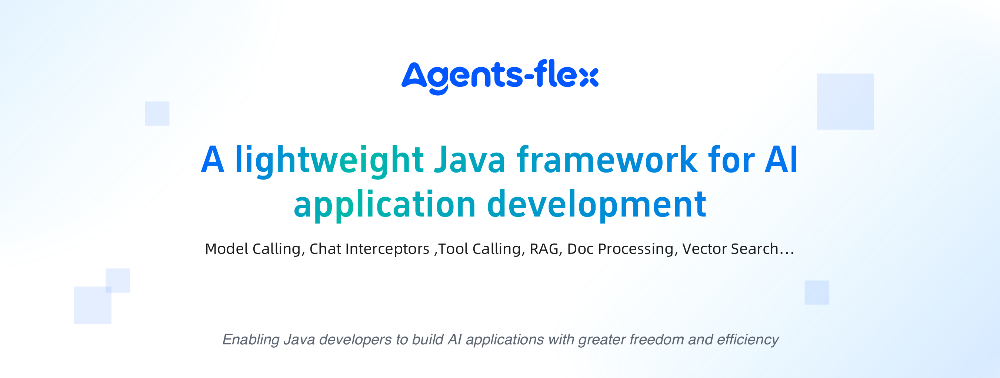

<p align="center">
    
</p>


<p align="center">
    <strong>An Elegant Java Framework for LLM Application Development | Truly Open Source · Easy Integration · Production Ready</strong>
</p>


## 🚀 Core Features

Agents-Flex is designed for Java engineers and architects, delivering a **lightweight, modular, and extensible** AI agent development experience to help enterprises rapidly build production-grade LLM applications.

### ✨ New Core Capabilities (v2.0+)

| Feature | Description | Use Cases |
|---------|-------------|-----------|
| **MCP Support** | Native integration with Model Context Protocol for standardized connection to external data sources and tools | Cross-system context sharing, tool orchestration |
| **AI Skills** | Encapsulate business capabilities into reusable, composable Skill units | Rapid domain Agent construction, skill marketplace |
| **Text2SQL / Smart Data Query** | Built-in Text2SQL and natural language data analysis capabilities | Zero-code querying for business users, data insights |

### 🔧 Core Capabilities Matrix

```
🧠 Model Integration    🔌 Tool Invocation        📚 Knowledge Enhancement
├─ Mainstream LLMs      ├─ Function Calling        ├─ Multi-format Document Loading
├─ Ollama Local Deploy  ├─ MCP Tool Protocol       ├─ Intelligent Text Splitting
├─ HTTP/SSE/WS Protocols├─ Local Method Reflection ├─ Vector Store Integration
├─ Multi-Provider Mgmt  ├─ Execution Interceptors  ├─ Custom Embedding Support

⚙️ Engineering Support  🔍 Observability          🛡️ Enterprise-Grade Assurance
├─ Prompt Template Engine├─ OpenTelemetry Integration├─ Sensitive Data Masking
├─ Multi-turn Memory    ├─ Distributed Tracing    ├─ Safe Resource Shutdown
├─ Async/Streaming Resp ├─ Structured Logging     ├─ Apache 2.0 License
```

> 💡 **Design Principles**: Zero-Intrusion Integration · Interface-Driven Extension · Configuration Over Code · Production-Friendly


## ⚡ Quick Start

### 1️⃣ Add Dependencies (Maven)

```xml
<dependency>
    <groupId>com.agentsflex</groupId>
    <artifactId>agents-flex-core</artifactId>
    <version>2.0.8</version>
</dependency>
<!-- Optional: Add extension modules as needed -->
<dependency>
    <groupId>com.agentsflex</groupId>
    <artifactId>agents-flex-mcp</artifactId>
    <version>2.0.8</version>
</dependency>
```

### 2️⃣ Hello World

```java
public class QuickStart {
    public static void main(String[] args) {
        // 1. Configure the model (supports GiteeAI / OpenAI / Ollama, etc.)
        OpenAIChatModel chatModel = OpenAIChatConfig.builder()
            .provider("GiteeAI")
            .endpoint("https://ai.gitee.com")
            .requestPath("/v1/chat/completions")
            .apiKey(System.getenv("GITEE_AI_KEY")) // ✅ Recommended: load from environment variable
            .model("Qwen3-32B")
            .buildModel();

        // 2. Start a conversation (sync/streaming/async all supported)
        String response = chatModel.chat("Explain what humor is in a way that Java developers can understand?");

        // 3. Output the result
        System.out.println("🤖 Agents-Flex: " + response);
    }
}
```

**Console Output Example**:
```text
[Agents-Flex] >>> [GiteeAI/Qwen3-32B] Request: {"model":"Qwen3-32B","messages":[...]}
[Agents-Flex] <<< [GiteeAI/Qwen3-32B] Response: 200 OK (1.2s)
🤖 Agents-Flex: Humor is like elegant exception handling in code—seemingly unexpected, yet meticulously designed...
```

> 📝 The `[Agents-Flex]` log prefix can be customized or disabled via `application.properties`. For production environments, SLF4J integration is recommended.


## 📦 Module Overview

```
agents-flex/
├── agents-flex-bom                    # 📦 BOM dependency management for unified versioning
├── agents-flex-core                   # 🧱 Core abstractions: Model/Prompt/Memory/Tool SPI
├── agents-flex-chat                   # 💬 Chat engine: sync/streaming/async invocation
├── agents-flex-tool                   # 🔧 Function Calling engine: method definition/parsing/execution
├── agents-flex-mcp                    # 🔗 MCP protocol support: standardized context & tool connection (New)
├── agents-flex-skills                 # 🎯 AI Skills: capability encapsulation & dynamic loading (New)
├── agents-flex-text2sql                   # 📊 Text2SQL & natural language data analysis (New)
├── agents-flex-embedding              # 🔢 Embedding service: model integration & vector generation
├── agents-flex-store                  # 🗄️ Storage extensions: VectorStore/Memory persistence implementations
├── agents-flex-search-engine          # 🔍 Search engine integration: ES/DB/custom retrieval sources
├── agents-flex-rerank                 # 📈 Re-ranking service: improve RAG retrieval relevance
├── agents-flex-image                  # 🖼️ Image capabilities: text-to-image / image-to-text model integration
├── agents-flex-spring-boot-starter   # ⚙️ Spring Boot auto-configuration (Production Recommended)
├── demos/                             # 🧪 Sample projects: MCP / Skills / Text2SQL demos
├── docs/                              # 📚 Documentation source (VitePress)
└── testresource/                      # 🧪 Test resource files
```

✅ **Production-Ready Recommendations**:
- Use `agents-flex-spring-boot-starter` with a configuration center for API key management in production
- Inject sensitive information (API Keys / DB passwords) via `@Value("${xxx}")` + encrypted configuration
- Enable `management.endpoints.web.exposure.include=metrics,trace` for monitoring integration
- For RAG scenarios, combine: `data` + `embedding` + `store` + `rerank` modules


## 📚 Documentation & Resources

| Type | Link | Description |
|------|------|-------------|
| 📘 Chinese Docs | [https://agentsflex.com](https://agentsflex.com) | Complete API guide + best practices |
| 🧪 Sample Projects | [/demos](./demos) | MCP integration / Skills orchestration / Text2SQL demos |
| 📋 Changelog | [/changes.md](./changes.md) | Version history and migration guide |
| 🐛 Issue Tracker | [GitHub Issues](https://github.com/agents-flex/agents-flex/issues) | Bug reports / feature requests |
| 💬 Community | [Join Discussion](https://github.com/agents-flex/agents-flex/discussions) | Q&A, ideas, and community support |


## 🤝 Contributing

We follow the [Apache Way](https://apache.org/theapacheway) and [Contributor Covenant](https://www.contributor-covenant.org/) guidelines:

1. Fork the repo → Create a feature branch (`feature/xxx`)
2. Code style: Run `mvn spotless:apply` for auto-formatting (Google Java Style)
3. Add unit tests: Aim for ≥ 80% coverage on core modules
4. Submit a PR linked to an issue, describing the motivation and impact of changes

> 🌟 Especially welcome: Java 8/11/17 compatibility tests, enterprise use cases, and documentation translations

---

## 📜 License

Agents-Flex is released under the **Apache License 2.0**. You are free to:

- ✅ Use commercially in your projects
- ✅ Modify and deploy privately
- ✅ Contribute code to grow the ecosystem

> Please retain the original copyright notice and indicate modifications when distributing. See [LICENSE](./LICENSE) for details.
