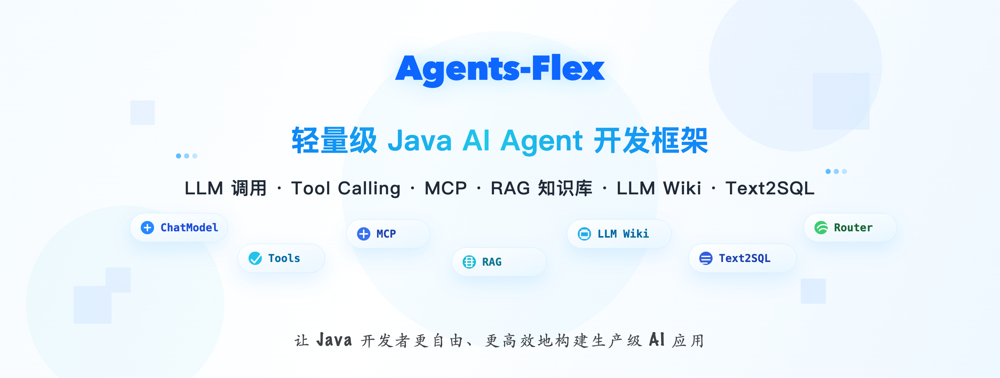

<h4 align="right"><a href="./readme.md">English</a> | <strong>简体中文</strong></h4>

<p align="center">
  
</p>

# Agents-Flex

Agents-Flex 是一个面向 Java 生态的轻量级 AI 应用开发框架。它把大模型调用、Tool Calling、Agent、RAG、向量存储、Embedding、图像、音频、MCP、Skills、Text2SQL 等能力拆成清晰的模块，让开发者可以按需组合，而不是被某个固定运行时或应用框架绑定。

项目适合用于构建智能客服、企业知识库、智能问数、Agent 工作流、模型网关、AI 辅助办公、插件式工具系统，以及需要同时接入多个模型厂商的 Java 服务。

## 核心特点

- **Java 原生**：核心模块兼容 Java 8+，可以运行在普通 Java、Spring Boot 或其他 JVM 技术栈中。
- **多模型统一抽象**：通过 `ChatModel`、`EmbeddingModel`、`ImageModel`、`RerankModel` 等接口封装不同厂商能力。
- **同步与流式一致**：同一套 Prompt、Options、拦截器和上下文机制可用于普通对话与流式输出。
- **Tool Calling 完整链路**：支持注解扫描、编程式构建、工具执行、工具消息回传和工具级可观测。
- **Agent 能力内置**：提供 ReAct Agent、Routing Agent、Subagent、Skills 等面向复杂任务的能力。
- **RAG 组件齐全**：包含文档、解析、切分、Embedding、向量存储、检索、Rerank 等常用模块。
- **企业场景友好**：内置模型路由、重试、负载均衡、熔断、OpenTelemetry 可观测、Text2SQL 安全拦截器等能力。

## 模块概览

| 模块 | 说明 |
| --- | --- |
| `agents-flex-core` | 核心抽象：Chat、Prompt、Message、Tool、Memory、Agent、Document、Store、Router、Observability |
| `agents-flex-chat` | 聊天模型适配：OpenAI 兼容接口、Qwen、Ollama、DeepSeek、LiteLLM |
| `agents-flex-embedding` | Embedding 模型适配：OpenAI、Ollama、Qwen |
| `agents-flex-image` | 图像模型适配：阿里云、Gitee、Volcengine |
| `agents-flex-video` | 异步视频生成与编辑模型适配：阿里云百炼、火山引擎方舟 |
| `agents-flex-audio` | 语音识别与语音合成：阿里云、腾讯云、火山引擎 |
| `agents-flex-store` | 向量存储：Redis、Qdrant、Chroma、Pgvector、Milvus、OpenSearch、Elasticsearch、阿里云、腾讯云、VectoRex |
| `agents-flex-search-engine` | 搜索引擎封装：Lucene、Elasticsearch、搜索服务接口 |
| `agents-flex-rerank` | Rerank 模型：默认实现、Gitee Rerank |
| `agents-flex-tool` | 通用工具：文件系统、Shell、Grep、Glob、WebFetch、Python、JavaScript |
| `agents-flex-mcp` | MCP 客户端，可把外部 MCP 工具转换为 Agents-Flex `Tool` |
| `agents-flex-skills` | 基于文件系统的 Skills 加载与渐进式披露机制 |
| `agents-flex-skills-sandbox` | Skills 隔离执行的 Sandbox runtime 聚合模块 |
| `agents-flex-skills-open-sandbox` | 通过 OpenSandbox runtime 隔离执行 Skills 脚本 |
| `agents-flex-skills-aio-sandbox` | 通过 AIO Sandbox 服务隔离执行 Skills 脚本 |
| `agents-flex-subagent` | 子 Agent 定义、后台任务执行与结果获取工具 |
| `agents-flex-text2sql` | 智能问数工具集，支持表结构渐进披露、只读 SQL 校验和拦截器链 |
| `agents-flex-websearch` | 网络搜索工具，支持 Brave、Bocha、百度千帆与自定义搜索提供商 |
| `agents-flex-wiki` | LLM Wiki 能力：把知识组织为可导航的层级 Wiki 树，支持按路径递归读取与渐进式披露 |
| `agents-flex-spring-boot-starter` | Spring Boot 自动配置，覆盖常用模型与向量存储 |
| `demos` | 示例工程 |

## 环境要求

- 大部分模块：JDK 8+
- `agents-flex-mcp`：JDK 17+
- 构建工具：Maven

当前仓库版本见根 `pom.xml` 的 `revision` 属性，目前为 `2.2.3`。

## 安装

普通 Java 项目可以直接引入聚合依赖：

```xml
<dependency>
    <groupId>com.agentsflex</groupId>
    <artifactId>agents-flex-bom</artifactId>
    <version>2.2.3</version>
</dependency>
```

Spring Boot 项目可以使用 Starter：

```xml
<dependency>
    <groupId>com.agentsflex</groupId>
    <artifactId>agents-flex-spring-boot-starter</artifactId>
    <version>2.2.3</version>
</dependency>
```

也可以只引入需要的子模块，例如：

```xml
<dependency>
    <groupId>com.agentsflex</groupId>
    <artifactId>agents-flex-chat-openai</artifactId>
    <version>2.2.3</version>
</dependency>

<dependency>
    <groupId>com.agentsflex</groupId>
    <artifactId>agents-flex-store-redis</artifactId>
    <version>2.2.3</version>
</dependency>
```

## 快速开始

下面示例使用 OpenAI 兼容接口。你可以把 `endpoint`、`model`、`apiKey` 替换成自己的模型服务配置。

```java
import com.agentsflex.core.model.chat.ChatModel;
import com.agentsflex.model.chat.openai.OpenAIChatConfig;

public class ChatDemo {
    public static void main(String[] args) {
        ChatModel chatModel = OpenAIChatConfig.builder()
            .endpoint("https://ai.gitee.com")
            .provider("GiteeAI")
            .model("Qwen3-32B")
            .apiKey(System.getenv("GITEE_API_KEY"))
            .buildModel();

        String reply = chatModel.chat("用一句话介绍 Agents-Flex");
        System.out.println(reply);
    }
}
```

流式输出：

```java
import com.agentsflex.core.model.chat.StreamResponseListener;
import com.agentsflex.core.model.chat.response.AiMessageResponse;
import com.agentsflex.core.model.client.StreamContext;

chatModel.chatStream("解释一下 Java 中的责任链模式", new StreamResponseListener() {
    @Override
    public void onMessage(StreamContext context, AiMessageResponse response) {
        System.out.print(response.getMessage().getContent());
    }
});
```

## Tool Calling

业务方法可以通过注解暴露为工具：

```java
import com.agentsflex.core.model.chat.tool.annotation.ToolDef;
import com.agentsflex.core.model.chat.tool.annotation.ToolParam;

public class WeatherTools {
    @ToolDef(name = "get_weather", description = "查询指定城市的天气")
    public static String getWeather(
        @ToolParam(name = "city", description = "城市名称", required = true) String city
    ) {
        return city + "：晴";
    }
}
```

注册到 Prompt 后，模型即可按需调用：

```java
import com.agentsflex.core.model.chat.response.AiMessageResponse;
import com.agentsflex.core.prompt.SimplePrompt;

SimplePrompt prompt = new SimplePrompt("今天北京天气怎么样？");
prompt.addToolsFromClass(WeatherTools.class);

AiMessageResponse response = chatModel.chat(prompt);
if (response.hasToolCalls()) {
    prompt.setToolMessages(response.executeToolCallsAndGetToolMessages());
    System.out.println(chatModel.chat(prompt).getMessage().getContent());
}
```

如果工具来自运行时配置、插件系统或工作流节点，也可以使用 `Tool.builder()` 动态构建。

## Agent 与任务编排

Agents-Flex 内置多种面向复杂任务的机制：

- `ReActAgent`：通过 Thought / Action / Observation 方式执行多步骤任务。
- `RoutingAgent`：把请求分发给更适合的 Agent。
- `SubagentTools`：让主 Agent 创建子任务，支持同步执行和后台任务。
- `SkillsTool`：读取本地 Skills 目录，按需加载专业能力说明和资源。
- `McpClientManager`：连接 MCP Server，并把远程工具封装成 `Tool`。

这些能力都建立在同一个 `Tool`、`Prompt`、`ChatModel` 抽象之上，便于组合和替换。

## RAG 与知识库

RAG 相关能力分布在多个模块中：

- 文档模型：`Document`、`VectorData`、`Metadata`
- 文本处理：Loader、Parser、Splitter、File2Text
- 向量化：OpenAI、Ollama、Qwen Embedding
- 向量存储：Redis、Qdrant、Chroma、Pgvector、Milvus、OpenSearch、Elasticsearch 等
- 检索增强：`SearchWrapper`、`DocumentStore`、`VectorStore`
- 排序优化：Rerank 模型

典型流程是：加载文档、切分文本、生成 Embedding、写入向量库、按用户问题检索相关片段，再交给 ChatModel 生成回答。

## LLM Wiki

LLM Wiki 可以理解为一种面向 Agent 的层级知识库：知识不只是被切成扁平片段，而是被组织成带路径、标题、摘要、正文和子页面的 Wiki 树。Agent 先看到当前可用页面的摘要，再按需要调用工具读取更具体的子页面，从而用较少上下文完成逐级导航。

`agents-flex-wiki` 提供的 `Wiki`、`WikiProvider` 和 `WikiTool` 正是这个方向的基础封装：`WikiTool` 会把根节点或当前节点的可用子 Wiki 暴露给模型，并通过 `get_wiki_content(path)` 按路径读取内容。它适合文档体系清晰、章节关系明确、希望 Agent 像读文档目录一样逐步查资料的场景，也可以和传统 RAG、WebSearch、Skills 一起使用。

## MCP、Skills 与智能问数

`agents-flex-mcp` 支持 `stdio`、`http-sse`、`http-stream` 三类传输方式，可以从 `mcp-servers.json` 加载 MCP 服务，并将 MCP 工具转换为 Agents-Flex 工具。

`agents-flex-skills` 支持基于文件系统的 Skills 机制，适合封装重复性的专业任务，例如代码审查、文档生成、文件处理和本地知识检索。

`agents-flex-text2sql` 面向智能问数场景，提供数据源列表、表字段查询、SQL 执行等工具，并内置只读 SQL 校验、参数化查询约束、`LIMIT` 控制、租户隔离和审计扩展点。

## 模型路由与可观测

框架内置模型路由能力，可以把多个模型实例组合成一个 `RoutedChatModel` 或 `RoutedEmbeddingModel`。它支持：

- 最少活跃数负载均衡
- 加权随机负载均衡
- 标签路由
- 自动重试
- 熔断与半开恢复
- 运行时指标统计

可观测能力基于 OpenTelemetry，支持链路追踪与指标采集。可以通过系统属性切换 Logging、OTLP 或自定义 Exporter：

```bash
-Dagentsflex.otel.enabled=true
-Dagentsflex.otel.exporter.type=otlp
-Dagentsflex.otel.metric.export.interval=30
```

## Spring Boot

`agents-flex-spring-boot-starter` 提供自动配置，目前覆盖：

- Chat：OpenAI、Qwen、Ollama、DeepSeek
- Store：阿里云、Chroma、Elasticsearch、OpenSearch、腾讯云

适合在已有 Spring Boot 服务中快速接入模型与向量存储配置。

## 仓库结构

```text
agents-flex-core/                 核心 API 与基础实现
agents-flex-chat/                 聊天模型适配
agents-flex-embedding/            Embedding 模型适配
agents-flex-image/                图像模型适配
agents-flex-video/                视频模型适配
agents-flex-audio/                语音模型适配
agents-flex-store/                向量存储适配
agents-flex-search-engine/        搜索引擎适配
agents-flex-tool/                 通用工具集
agents-flex-mcp/                  MCP 客户端
agents-flex-skills/               Skills 能力系统
agents-flex-skills-sandbox/       Skills Sandbox runtime 聚合模块
├── agents-flex-skills-open-sandbox/
└── agents-flex-skills-aio-sandbox/
agents-flex-subagent/             子 Agent 与后台任务
agents-flex-text2sql/             智能问数
agents-flex-websearch/            网络搜索
agents-flex-spring-boot-starter/  Spring Boot 自动配置
demos/                            示例工程
docs/                             中英文文档
```

## 本地构建

```bash
mvn clean install
```

如果只想构建某个模块，可以使用 Maven 的 `-pl` 和 `-am`：

```bash
mvn -pl agents-flex-chat/agents-flex-chat-openai -am test
```

## 文档

- 中文文档入口：`docs/zh/index.md`
- 快速开始：`docs/zh/chat/getting-started.md`
- Maven 依赖：`docs/zh/intro/maven.md`
- MCP：`docs/zh/chat/mcp.md`
- Skills：`docs/zh/chat/skills.md`
- Subagent：`docs/zh/chat/subagent.md`
- Text2SQL：`docs/zh/chat/text2sql.md`
- WebSearch：`docs/zh/chat/websearch.md`

## 许可证

Agents-Flex 使用 Apache License 2.0 协议开源，详见 `LICENSE`。

## 贡献用户


## Star 用户专属交流群


